# 🔌 Arduino Projects

[](https://docs.arduino.cc/hardware/uno-rev3/)
[](#projects)
[](#build-status)
[](../LICENSE)

> Part of [Yamen Agha's portfolio](../README.md)

Hands-on electronics projects built with an Arduino Uno and the parts of an "Upgraded Learning Kit". Each project folder contains the sketch (in a folder with the same name, so it opens directly in the Arduino IDE) and a README with a parts list, wiring table, wiring diagram, code walkthrough and troubleshooting.

## Projects

| Project | What it does | Key parts | Libraries | Wiring diagram | Photo |
|---|---|---|---|:-:|:-:|
| [📈 Desktop Financial Ticker](desktop-ticker/README.md) | Live gold, silver, EUR/USD, BTC, NVDA, AAPL prices on an LCD, chosen with a keypad; Python bridge to Yahoo Finance | 1602A LCD, 4x4 keypad, 10 kΩ pot | Keypad, LiquidCrystal | <a href="desktop-ticker/README.md#wiring">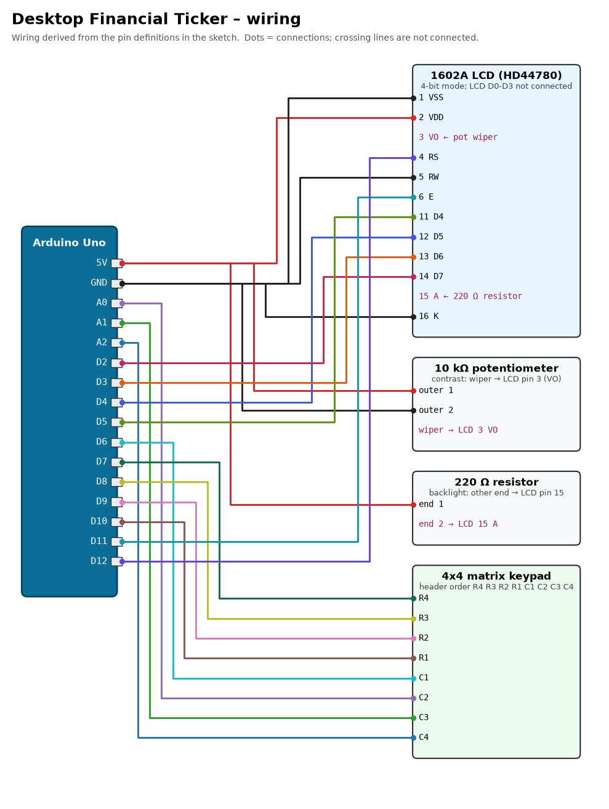</a> | 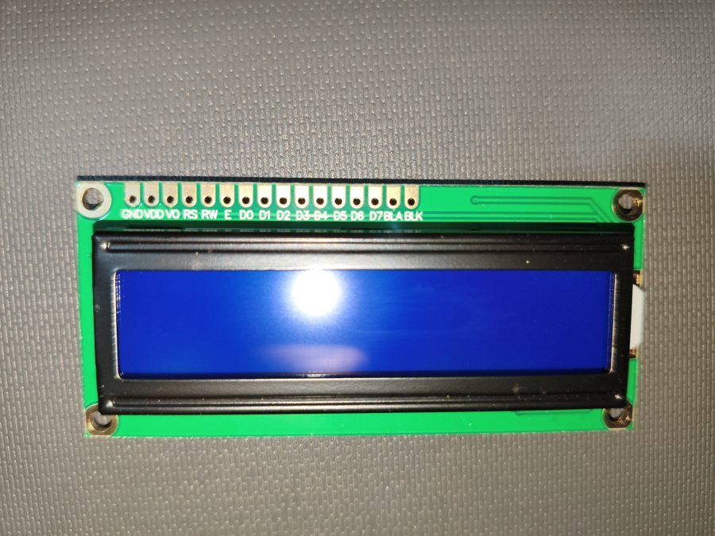 |
| [🪪 RFID Access Indicator](rfid-access-rgb/README.md) | Learns one RFID tag (saved in EEPROM): green + OK beep for it, red + denied beeps for others | RC522, RGB LED, buzzer | MFRC522 | <a href="rfid-access-rgb/README.md#wiring">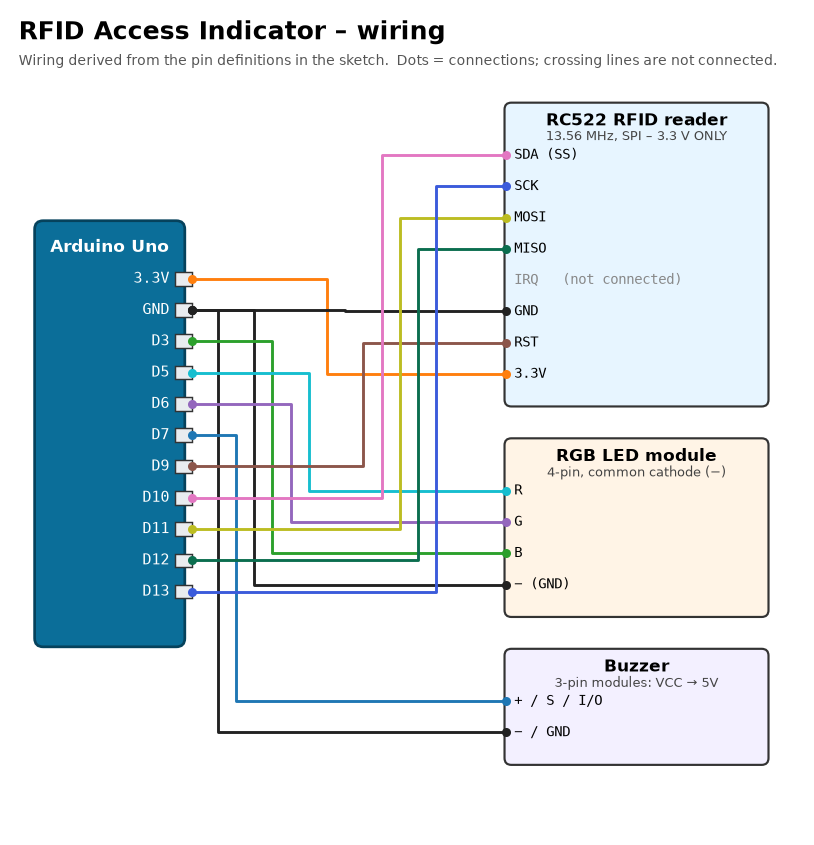</a> | 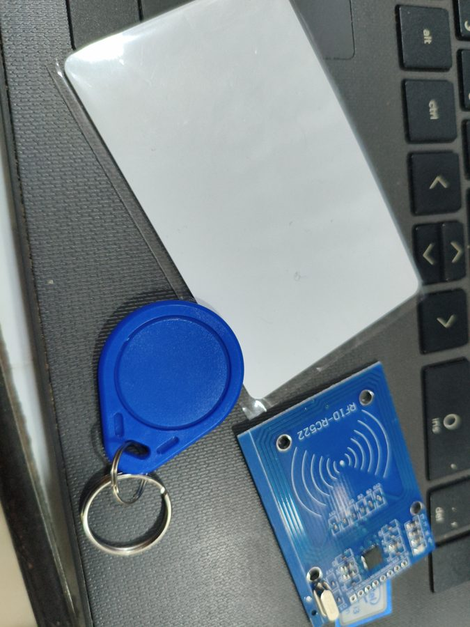 |
| [🕹️ Joystick Stepper Turntable](joystick-stepper-turntable/README.md) | Joystick turns a stepper left/right with proportional, ramped speed; button locks it | 28BYJ-48, ULN2003, joystick | none | <a href="joystick-stepper-turntable/README.md#wiring">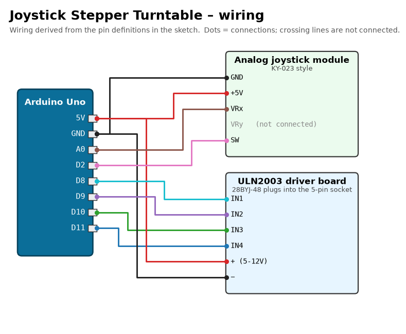</a> | 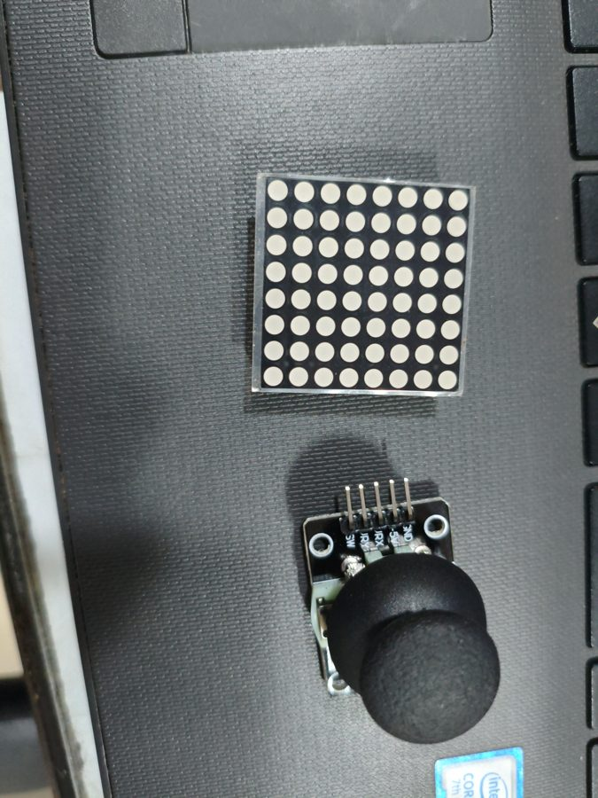 |
| [⚙️ Stepper Motor Test](stepper-motor-test/README.md) | One revolution forward, one back, forever: checks the motor and driver | 28BYJ-48, ULN2003 | none | <a href="stepper-motor-test/README.md#wiring">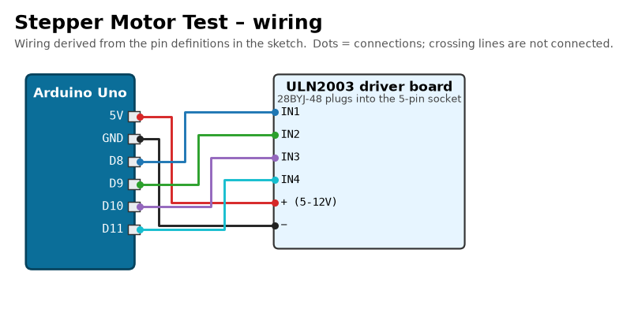</a> | 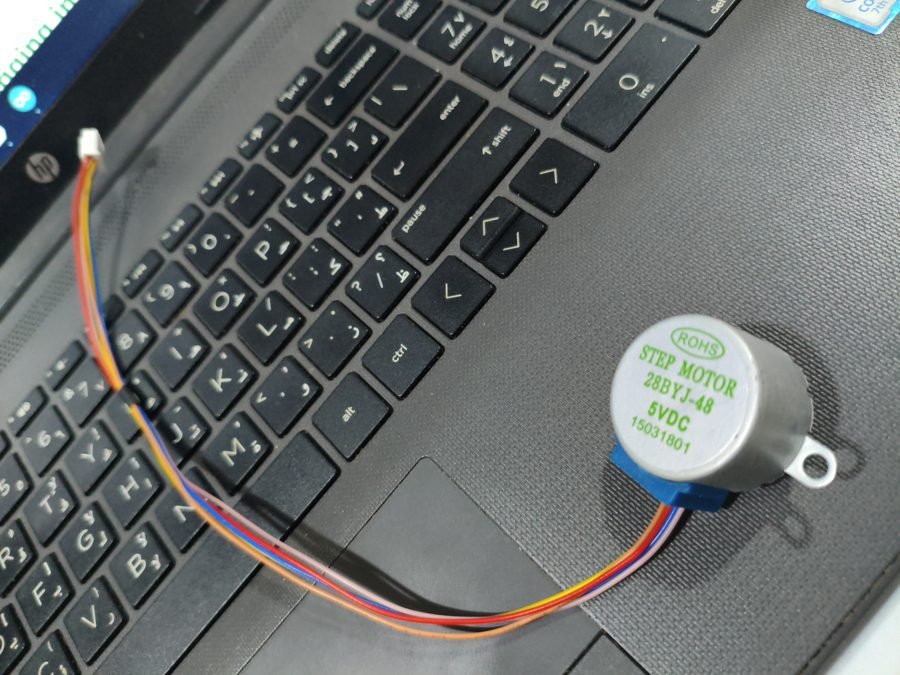 |
| [👏 Clap Light](clap-light/README.md) | Clap = on/off, double clap = next of 6 colours | sound sensor, RGB LED | none | <a href="clap-light/README.md#wiring">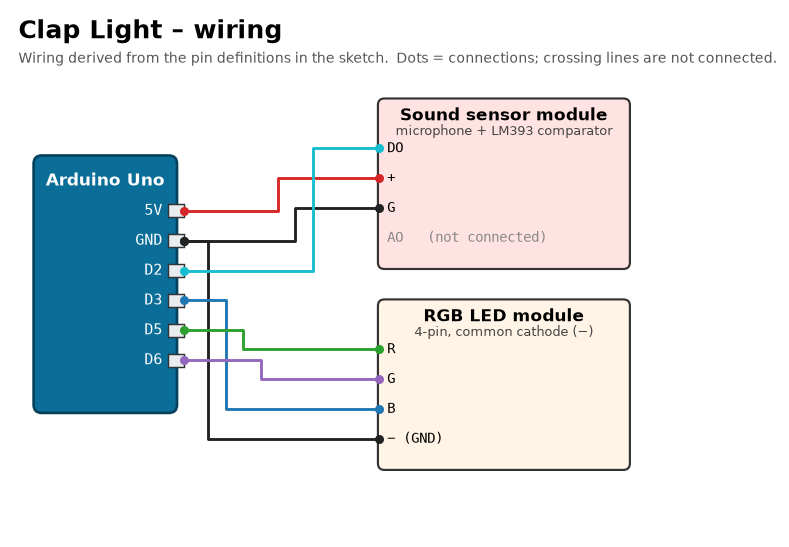</a> | 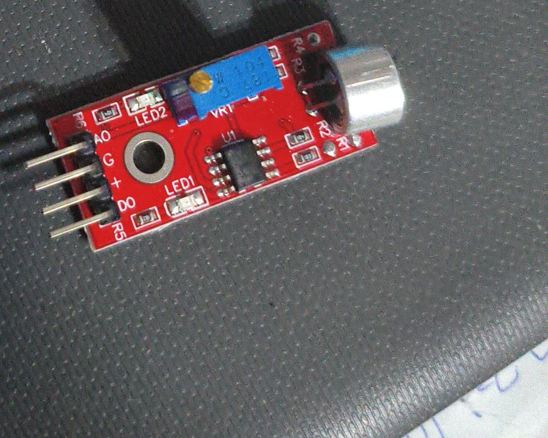 |
| [🔥 Fire Alarm](fire-alarm/README.md) | Self-calibrating IR flame detector with red flashing LED and siren | IR flame diode, buzzer, RGB LED | none | <a href="fire-alarm/README.md#wiring">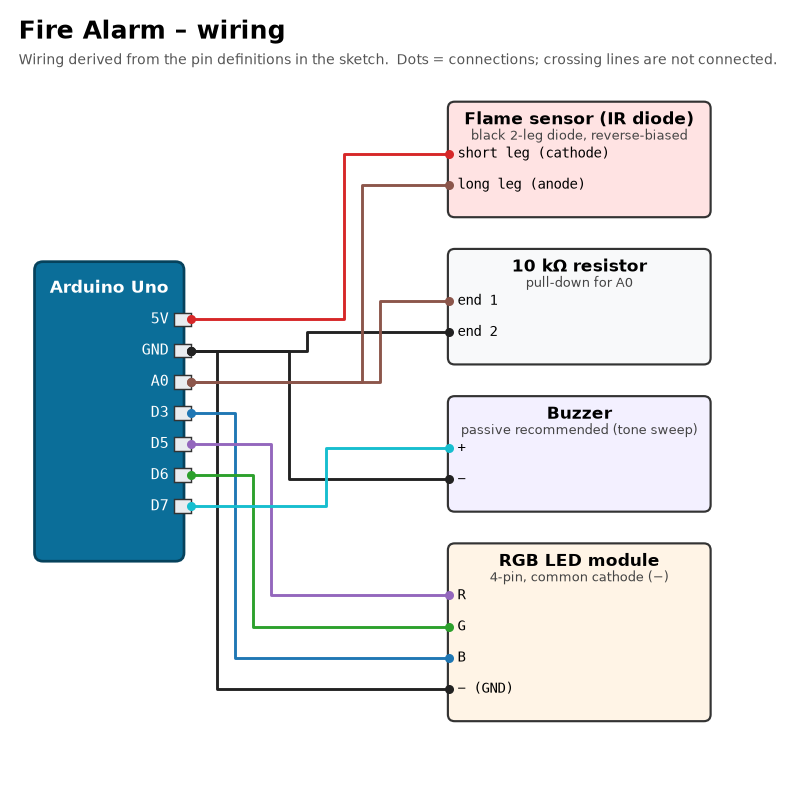</a> | 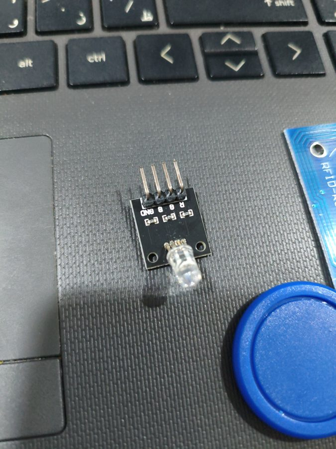 |
| [💧 Water Level Indicator](water-level-indicator/README.md) | Off / red / yellow / green for dry / low / half / full; sensor powered only while reading | water sensor, RGB LED | none | <a href="water-level-indicator/README.md#wiring">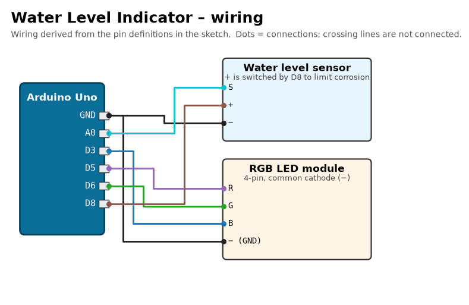</a> | 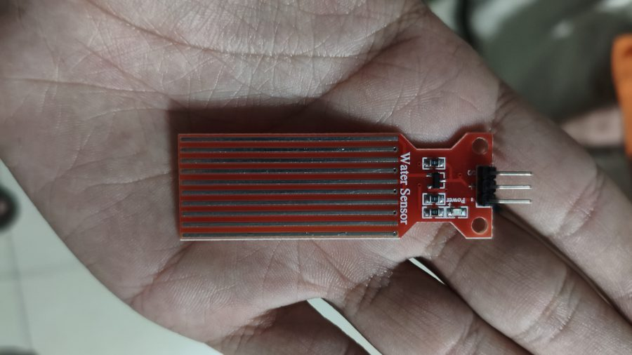 |

Photos show the actual parts used (component photos, not finished builds).

## Common parts

Several projects share the same modules and pins, so they can be rebuilt quickly on one breadboard:

| Module | Pins used in every project that has it |
|---|---|
| RGB LED module (common cathode) | R → D5, G → D6, B → D3, − → GND |
| Buzzer | + → D7, − → GND |
| ULN2003 stepper driver | IN1-IN4 → D8-D11, + → 5V, − → GND |

## Required libraries (third-party)

These are **not** included in this repository; install them with the Arduino Library Manager (**Sketch → Include Library → Manage Libraries…**) or `arduino-cli lib install "<name>"`.

| Library | Used by | Tested version |
|---|---|---|
| [MFRC522](https://github.com/miguelbalboa/rfid) | RFID Access Indicator | 1.4.12 |
| [Keypad](https://github.com/Chris--A/Keypad) | Desktop Ticker | 3.1.1 |
| [LiquidCrystal](https://github.com/arduino-libraries/LiquidCrystal) (bundled with the IDE) | Desktop Ticker | 1.0.7 |

## Build status

All sketches were compile-checked with `arduino-cli 1.5.1` and the `arduino:avr 1.8.8` core for **Arduino Uno** (`--fqbn arduino:avr:uno`) on 1 Oct 2026:

| Sketch | Result | Flash | RAM |
|---|:-:|--:|--:|
| `ticker_firmware` | ✅ | 9,056 B (28 %) | 513 B (25 %) |
| `rfid_rgb` | ✅ | 7,644 B (23 %) | 243 B (11 %) |
| `joystick_stepper` | ✅ | 3,654 B (11 %) | 224 B (10 %) |
| `motor_test` | ✅ | 2,332 B (7 %) | 209 B (10 %) |
| `clap_light` | ✅ | 2,948 B (9 %) | 291 B (14 %) |
| `fire_alarm` | ✅ | 4,284 B (13 %) | 259 B (12 %) |
| `water_level` | ✅ | 2,900 B (8 %) | 266 B (12 %) |

Re-run it yourself:

```bash
arduino-cli core install arduino:avr
arduino-cli lib install MFRC522 Keypad LiquidCrystal
for d in */*/; do [ -f "$d$(basename "$d").ino" ] && arduino-cli compile --fqbn arduino:avr:uno "$d"; done
```

## Wiring diagrams

The diagrams (`<project>/docs/wiring.svg` and `.png`) are generated from the pin definitions of each sketch by [`tools/wiring_diagrams.py`](../tools/wiring_diagrams.py):

```bash
python3 -m venv .venv && .venv/bin/pip install matplotlib
.venv/bin/python tools/wiring_diagrams.py
```
