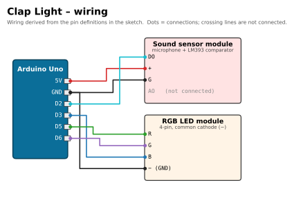

# 👏 Clap Light

[](https://docs.arduino.cc/hardware/uno-rev3/)
[](clap_light/clap_light.ino)
[](#upload-and-use)
[](#required-libraries)
[](../../LICENSE)

> Part of [Yamen Agha's portfolio](../../README.md) · [Arduino projects](../README.md)

## Overview

A sound-activated lamp. One clap turns an RGB LED on, the next clap turns it off, and a **double clap** (two claps within 0.6 s) switches to the next colour. It uses a digital sound-sensor module and a 4-pin RGB LED module, with no extra libraries.

## Features

- Single clap toggles the light **on / off**.
- Double clap cycles through **6 colours**: white, red, green, blue, yellow, purple.
- Works with sound sensors whose output goes HIGH *or* LOW on a sound: the sketch learns the "quiet" level at start-up and reacts to any change from it.
- Echo filter: ignores the tail of a clap for 150 ms so one clap is not counted twice.
- Blue flash at power-up = ready. Every event is printed to the Serial Monitor (9600 baud).

## Components (bill of materials)

| Qty | Part | Notes |
|:-:|---|---|
| 1 | Arduino Uno R3 (or compatible) + USB cable | |
| 1 | Sound sensor module (microphone + LM393 comparator, pins `AO G + DO`) | Only the digital output `DO` is used. Has a sensitivity trimmer. |
| 1 | RGB LED module, 4 pins (`R G B −`) | Common-cathode type (the code drives a colour HIGH to light it). |
| ~7 | Male-to-female jumper wires | |

| Sound sensor | RGB LED module |
|:-:|:-:|
|  |  |

## Wiring

| Component | Component pin | Arduino Uno pin | Notes |
|---|---|---|---|
| Sound sensor | `DO` | **D2** | digital output (`SOUND_PIN = 2`) |
| Sound sensor | `+` | **5V** | |
| Sound sensor | `G` | **GND** | |
| Sound sensor | `AO` | not connected | analog output unused |
| RGB module | `R` | **D5** (PWM) | `R_PIN = 5` |
| RGB module | `G` | **D6** (PWM) | `G_PIN = 6` |
| RGB module | `B` | **D3** (PWM) | `B_PIN = 3` |
| RGB module | `−` | **GND** | |



*Source of the wiring: the pin constants and header comment in [`clap_light.ino`](clap_light/clap_light.ino).*

## Required libraries

None. The sketch only uses the Arduino core (`digitalRead`, `analogWrite`, `millis`).

## Upload and use

1. Open `clap_light/clap_light.ino` in the Arduino IDE (the folder name matches the sketch name, as the IDE expects).
2. **Tools → Board → Arduino Uno**, pick the right **Port**, then **Upload**.
3. Keep the room quiet for about one second after reset: the LED flashes blue, then the sketch learns the quiet level.
4. Clap once → light on. Clap once more → off. Clap twice quickly → next colour.
5. Open **Tools → Serial Monitor** at **9600 baud** to see `Clap -> ON`, `Clap -> OFF`, `Double clap -> next color`.

Command-line alternative:

```bash
arduino-cli compile --fqbn arduino:avr:uno clap_light
arduino-cli upload  --fqbn arduino:avr:uno -p /dev/ttyACM0 clap_light   # Windows: -p COM3
```

## How it works

| Function | What it does |
|---|---|
| `setup()` | Sets pin modes, flashes blue, waits 0.5 s, then calls `heardClap()` once so it stores the quiet state of `DO`. |
| `heardClap()` | Keeps the first reading of `DO` in a `static` variable (`quietState`). Returns `true` whenever the current reading differs from it, so it works whether the module is active-HIGH or active-LOW. |
| `waitForQuiet()` | Loops until the input has been quiet for 150 ms, which swallows the echo and bounce of one clap. |
| `loop()` | After a clap, waits up to **600 ms** for a second clap. Second clap → `colorIndex` advances (and the light turns on). No second clap → `lightOn` toggles. Then `showLight()` writes the colour with `analogWrite`. |
| `setColor(r,g,b)` | Writes PWM values 0-255 to the three LED pins. Yellow is mixed as `255, 80, 0` because the green die is much brighter than the red one. |

## Troubleshooting

| Symptom | Likely cause / fix |
|---|---|
| Light toggles by itself | Sensor is too sensitive: turn the blue trimmer on the module until its on-board "DO" LED is off in a quiet room and only blinks on a clap. |
| Nothing happens on a clap | Sensor not sensitive enough (turn the trimmer the other way), or `DO` is not on D2. Watch the Serial Monitor. |
| Was noisy at reset | The quiet state is learned at start-up. Press reset again in a quiet room. |
| Colours wrong (e.g. red shows green) | R/G/B wires swapped; move them or swap the pin numbers in the sketch. |
| LED is on when it should be off | You have a common-**anode** module (common pin to 5V). Use `255 - value` in `setColor()`. |

## Possible improvements

- Use an interrupt on D2 (`attachInterrupt`) instead of polling.
- Read `AO` and use an adjustable threshold instead of the module's fixed comparator.
- Remember the last colour in EEPROM.
- Drive a relay module to switch a real lamp (mains wiring only with proper isolation and supervision).

## Files

```text
clap-light/
├── clap_light/clap_light.ino   # the sketch
├── docs/wiring.svg / .png      # wiring diagram
└── README.md
```
