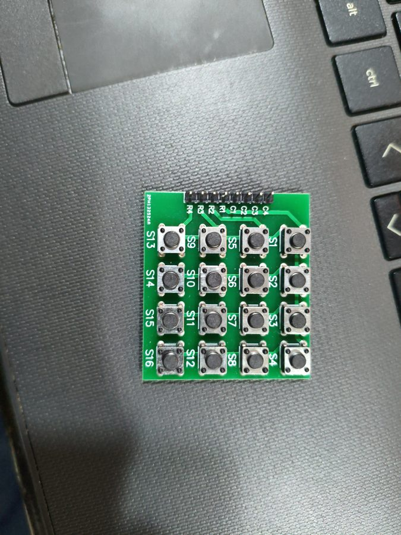
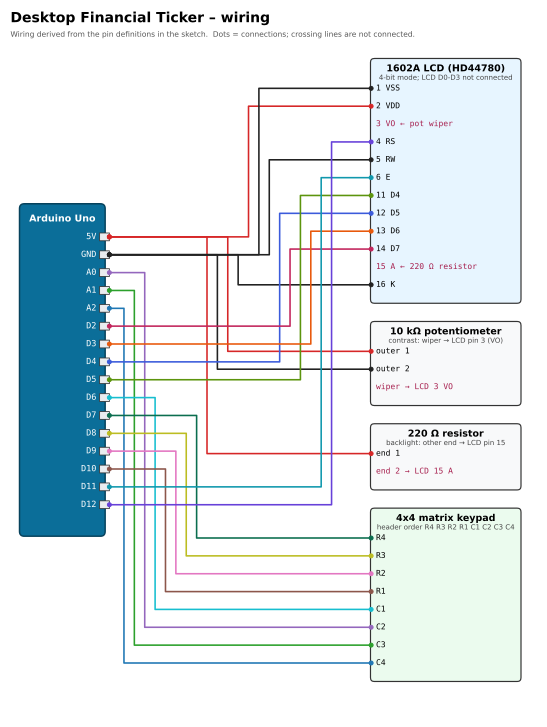

# 📈 Desktop Financial Ticker

[](https://docs.arduino.cc/hardware/uno-rev3/)
[](ticker_firmware/ticker_firmware.ino)
[](ticker_bridge.py)
[](#upload-and-use)
[](#required-libraries)
[](../../LICENSE)

> Part of [Yamen Agha's portfolio](../../README.md) · [Arduino projects](../README.md)
>
> **Beginners:** the full step-by-step guide (soldering, wiring, IDE, bridge, troubleshooting) is in [START_HERE.md](START_HERE.md) ([PDF](START_HERE.pdf) · [HTML](START_HERE.html)). It was written for the original `desktop_ticker.zip`; "the zip" / `desktop_ticker` folder = this folder.

## Overview

A desk gadget that combines finance and electronics: an Arduino with a **16x2 LCD** and a **4x4 keypad** shows live prices for **gold, silver, EUR/USD, Bitcoin, NVIDIA and Apple**. Pick an asset on the keypad; a small Python program on the PC (`ticker_bridge.py`) fetches the quote from Yahoo Finance (via `yfinance`) **only when asked** and sends it to the Arduino over USB.

```
[LCD + keypad] -- wires --> [Arduino] <-- USB serial 115200 --> [ticker_bridge.py] <-- internet --> Yahoo Finance
```

## Features

- Menu of 6 assets (`GC=F`, `SI=F`, `EURUSD=X`, `BTC-USD`, `NVDA`, `AAPL`) plus a **keypad test** screen.
- Ticker screen with price, daily change % and custom ▲ / ▼ arrows, plus a "fresh / old data" dot (fresh = under 60 s).
- On-demand refresh (`*` or `C`); a 10 s reply time-out shows "no reply" instead of freezing.
- Robust firmware: no `delay()` in `loop()`, no `String` class, fixed-size buffers, constant text in flash (`F()` / `PROGMEM`).
- Bridge with caching (at most one fetch per symbol every 2 s), exponential back-off after errors (5 s → 300 s) while serving the last known price, auto-detection of the serial port, and an optional `--auto N` push mode.
- Automated tests: offline self-test, pty loopback test, socat back-off test and a host-side C++ simulation of the sketch.

## Components (bill of materials)

| Qty | Part | Notes |
|:-:|---|---|
| 1 | Arduino Uno R3 (or Nano, same pins) + USB cable | |
| 1 | 1602A 16x2 character LCD (HD44780), parallel (no I2C backpack) | needs a soldered 16-pin header |
| 1 | 4x4 matrix keypad, 8-pin header `R4 R3 R2 R1 C1 C2 C3 C4` | |
| 1 | 10 kΩ potentiometer | LCD contrast (or a 1-2.2 kΩ resistor from VO to GND) |
| 1 | 220 Ω resistor | backlight |
| 1 | Breadboard + ~25 jumper wires | |
| 1 | PC with Python 3 and internet | runs the bridge |

| 1602A LCD | 4x4 keypad |
|:-:|:-:|
|  |  |

## Wiring

D0 and D1 stay free: they are the USB serial link to the PC.

**LCD (4-bit mode)** – `LiquidCrystal lcd(12, 11, 5, 4, 3, 2);`

| LCD pin | Label | Arduino Uno pin | Notes |
|:-:|:-:|---|---|
| 1 | VSS | **GND** | |
| 2 | VDD | **5V** | never swap with pin 1 |
| 3 | VO | pot wiper | pot outer pins to 5V and GND |
| 4 | RS | **D12** | |
| 5 | RW | **GND** | write-only |
| 6 | E | **D11** | |
| 7-10 | D0-D3 | not connected | 4-bit mode |
| 11 | D4 | **D5** | note the crossed order |
| 12 | D5 | **D4** | |
| 13 | D6 | **D3** | |
| 14 | D7 | **D2** | |
| 15 | A (LED+) | **5V via 220 Ω** | |
| 16 | K (LED−) | **GND** | |

**Keypad** – `rowPins = {10, 9, 8, 7}`, `colPins = {6, A0, A1, A2}`

| Header pos. | Label | Arduino Uno pin |
|:-:|:-:|:-:|
| 1 | R4 | **D7** |
| 2 | R3 | **D8** |
| 3 | R2 | **D9** |
| 4 | R1 | **D10** |
| 5 | C1 | **D6** |
| 6 | C2 | **A0** |
| 7 | C3 | **A1** |
| 8 | C4 | **A2** |



*Source of the wiring: the `LiquidCrystal` constructor and `rowPins` / `colPins` in [`ticker_firmware.ino`](ticker_firmware/ticker_firmware.ino), and the project's own [wiring_guide.md](wiring_guide.md) (which also explains how to fix a mirrored or rotated keypad).*

## Required libraries

| Library | Install |
|---|---|
| **Keypad** by Mark Stanley & Alexander Brevig (tested 3.1.1) | IDE: **Sketch → Include Library → Manage Libraries…** → "Keypad" → Install. CLI: `arduino-cli lib install Keypad` |
| **LiquidCrystal** by Arduino (tested 1.0.7) | Bundled with the Arduino IDE. CLI: `arduino-cli lib install LiquidCrystal` |
| Python: `pyserial`, `yfinance` | `pip install -r requirements.txt` (or run `./setup_linux.sh`) |

## Upload and use

```bash
# 1) firmware
arduino-cli lib install Keypad LiquidCrystal
arduino-cli compile --fqbn arduino:avr:uno ticker_firmware
arduino-cli upload  --fqbn arduino:avr:uno -p /dev/ttyACM0 ticker_firmware

# 2) PC bridge (Linux: ./setup_linux.sh does permissions + venv + start)
python3 -m venv venv && venv/bin/pip install -r requirements.txt
venv/bin/python ticker_bridge.py                  # auto-detects the port
venv/bin/python ticker_bridge.py --port COM3      # Windows
venv/bin/python ticker_bridge.py --test           # offline self-test
venv/bin/python ticker_bridge.py --fetch GC=F     # one live price, no Arduino needed
```

Close the Arduino IDE Serial Monitor before starting the bridge (only one program can use the port).

| Screen | Key | Action |
|---|---|---|
| Menu | `2` / `A` | up |
| Menu | `8` / `B` | down |
| Menu | `5` / `#` | select |
| Menu | `1` `3` `4` `6` | open that ticker directly |
| Menu | `7` | key test |
| Ticker | `*` / `C` | refresh |
| Ticker | `D` / `#` | back to the menu |
| Key test | `D` twice | back to the menu |

## How it works

**Protocol** (one request → one reply; the PC never polls unless started with `--auto N`):

| Direction | Message | Example |
|---|---|---|
| Arduino → PC | `READY` on boot | |
| Arduino → PC | `SEL:<yahoo>` when a ticker is chosen | `SEL:SI=F` |
| Arduino → PC | `REQ:<yahoo>` on refresh | `REQ:SI=F` |
| Arduino → PC | `STOP` when returning to the menu | |
| PC → Arduino | `<SYMBOL\|PRICE\|CHANGE_PERCENT\|CURRENCY>` | `<XAG/USD\|61.10\|+0.35\|USD>` |

**Firmware** is a small state machine (`MENU → WAITING → DISPLAY ⇄ REFRESHING`, plus `NOREPLY` and `KEYTEST`). The asset table lives in flash (`PROGMEM`). Incoming bytes are collected between `<` and `>` in a 48-byte buffer, split on `|`, and drawn on the LCD with custom glyphs for up/down/fresh/old.

**Bridge** (`ticker_bridge.py`) opens the port (waits 2 s for the Uno's auto-reset), answers `SEL`/`REQ` with a quote from `yfinance` (change % vs. previous close), caches per symbol, backs off exponentially on errors, and reconnects if the USB cable is unplugged.

**Tests** (`tests/run_all.sh`): offline self-test, virtual serial loopback, back-off/auto-mode test with `socat`, and a host simulation that compiles the `.ino` with stub headers (`g++`).

## Troubleshooting

| Symptom | Fix |
|---|---|
| Backlight on, no text | Turn the contrast pot slowly end to end. |
| One row of solid blocks | LCD not initialised: check RS (D12), E (D11), D4-D7 and that the sketch is uploaded. |
| Garbage characters | D4-D7 swapped (remember LCD D4→D5, D5→D4, D6→D3, D7→D2) or RW not at GND. |
| Wrong keys | Use key test (`7`) and the fixes in [wiring_guide.md](wiring_guide.md). |
| "No reply" on the LCD | Bridge not running, wrong port, or the Serial Monitor is still open. |
| Prices are stale | Yahoo data can be delayed; `yfinance` is unofficial and may be rate-limited. |

More in [START_HERE.md § 9](START_HERE.md).

## Possible improvements

- Let the user choose the assets from the PC (`--symbols`), or add DSE (Damascus Securities Exchange) quotes from a local source.
- Rotate through all assets automatically ("ticker tape" mode).
- Use an ESP8266/ESP32 to fetch prices over Wi-Fi without a PC.
- Switch to an I2C LCD backpack to free 6 pins.

## Files

```text
desktop-ticker/
├── ticker_firmware/ticker_firmware.ino   # Arduino sketch
├── ticker_bridge.py                      # PC bridge (Yahoo Finance → serial)
├── requirements.txt                      # pyserial, yfinance
├── setup_linux.sh                        # Linux setup (permissions, venv, optional upload, start)
├── START_HERE.md / .pdf / .html          # beginner's guide
├── wiring_guide.md                       # pin tables + keypad fixes
├── tests/                                # self-test, loopback, back-off, host simulation
├── docs/wiring.svg / .png                # wiring diagram
└── README.md
```

*Prices are for information only; this is not investment advice.*
