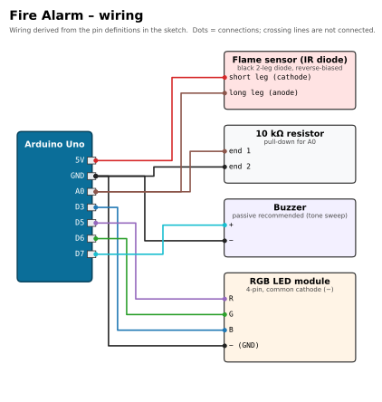

# 🔥 Fire Alarm

[](https://docs.arduino.cc/hardware/uno-rev3/)
[](fire_alarm/fire_alarm.ino)
[](#upload-and-use)
[](#required-libraries)
[](../../LICENSE)

> Part of [Yamen Agha's portfolio](../../README.md) · [Arduino projects](../README.md)

## Overview

A flame detector with a siren. A bare infrared receiver diode from the learning kit (the black, 2-leg "flame sensor") is read on an analog pin. At start-up the sketch measures the normal IR level of the room; when a flame raises the reading clearly above that level, an RGB LED flashes red and a buzzer plays a rising-and-falling siren.

> ⚠️ This is a learning project, **not** a certified smoke or fire alarm. Never rely on it for safety.

## Features

- **Self-calibrating:** learns the room's IR baseline at power-up (20 averaged readings, LED blue while learning).
- Adjustable `SENSITIVITY` threshold (default 60 ADC counts above baseline).
- Noise filtering: every reading is the average of 8 samples.
- Status LED: dim green = watching / safe, flashing red = fire.
- Siren: frequency sweep 800 → 1600 → 800 Hz with `tone()`.
- Live readings on the Serial Monitor (9600 baud) for tuning.

## Components (bill of materials)

| Qty | Part | Notes |
|:-:|---|---|
| 1 | Arduino Uno R3 (or compatible) + USB cable | |
| 1 | IR flame-sensor diode (black, 2 legs, looks like a dark LED) | Used without a module, reverse-biased. |
| 1 | 10 kΩ resistor | Pull-down from A0 to GND. |
| 1 | Buzzer | The code sweeps frequencies with `tone()`, so a **passive** buzzer gives the siren sound. An active buzzer will also beep but cannot change pitch. Which type was used is not recorded. |
| 1 | RGB LED module, 4 pins (`R G B −`) | Common-cathode type. |
| 1 | Breadboard + jumper wires | |


## Wiring

| Component | Component pin | Arduino Uno pin | Notes |
|---|---|---|---|
| Flame diode | short leg (cathode) | **5V** | reverse bias: light makes current flow |
| Flame diode | long leg (anode) | **A0** | `FLAME_PIN = A0` |
| 10 kΩ resistor | one end | **A0** | pull-down, together with the long leg |
| 10 kΩ resistor | other end | **GND** | |
| Buzzer | `+` | **D7** | `BUZZER = 7` |
| Buzzer | `−` | **GND** | |
| RGB module | `R` | **D5** (PWM) | |
| RGB module | `G` | **D6** (PWM) | |
| RGB module | `B` | **D3** (PWM) | |
| RGB module | `−` | **GND** | |



*Source of the wiring: the pin constants and header comment in [`fire_alarm.ino`](fire_alarm/fire_alarm.ino).*

**Why it works:** the diode and the 10 kΩ resistor form a voltage divider. In the dark almost no current flows, so A0 sits near 0 V. Infrared from a flame lets a small photocurrent flow through the reverse-biased diode, which raises the voltage across the resistor and therefore the reading on A0.

## Required libraries

None (Arduino core only: `analogRead`, `analogWrite`, `tone`).

## Upload and use

1. Open `fire_alarm/fire_alarm.ino` in the Arduino IDE, select **Arduino Uno** and the port, then **Upload**.
2. Keep flames and strong lamps away for ~1 s after reset (LED **blue** = learning the room).
3. LED turns **dim green** = watching.
4. Hold a lighter flame 10-30 cm in front of the diode → red flashing + siren. Remove it → back to green.
5. Open the Serial Monitor at **9600 baud** to see `Room level learned: …` and `Reading: … -> safe / FIRE!`.

```bash
arduino-cli compile --fqbn arduino:avr:uno fire_alarm
arduino-cli upload  --fqbn arduino:avr:uno -p /dev/ttyACM0 fire_alarm
```

## How it works

| Part of the code | What it does |
|---|---|
| `readFlame()` | Averages 8 `analogRead(A0)` samples to reduce noise. |
| `setup()` | Blue LED, takes 20 readings 50 ms apart and stores the average as `baseline`, prints it, then sets dim green. |
| `loop()` – alarm branch | If `reading > baseline + SENSITIVITY`: red on, sweep the buzzer up from 800 to 1600 Hz (8 ms per 40 Hz step), LED off, sweep back down. One cycle ≈ 0.3 s, so the LED flashes while the siren wails. |
| `loop()` – safe branch | `noTone()`, dim green, wait 200 ms. |

## Troubleshooting

| Symptom | Likely cause / fix |
|---|---|
| Alarm right after start-up | Sunlight or a halogen/incandescent lamp changed after calibration. Reset in normal light or raise `SENSITIVITY`. |
| Flame never detected | Diode the wrong way round (short leg must go to 5V), resistor missing, or `SENSITIVITY` too high. Watch the readings and lower it (e.g. 30). |
| Readings jump around | Loose breadboard contact on A0, or the resistor value is very high. |
| Buzzer only clicks or gives one tone | Active buzzer: replace it with a passive one for the siren effect. |
| No sound at all | Buzzer polarity (`+` to D7). |

## Possible improvements

- Re-learn the baseline slowly over time (moving average) so day/night light changes don't cause false alarms.
- Add a "silence" push-button and an alarm latch.
- Use a flame-sensor **module** (LM393 with digital output) or a smoke sensor (MQ-2) as a second input.
- Note: on the Uno `tone()` uses Timer 2, which also drives PWM on D3 and D11. The sketch only sets the blue channel to 0 while the siren runs, so this is not a problem here, but moving blue to D9/D10 would avoid the conflict if you later mix colours during the alarm.

## Files

```text
fire-alarm/
├── fire_alarm/fire_alarm.ino   # the sketch
├── docs/wiring.svg / .png      # wiring diagram
└── README.md
```
