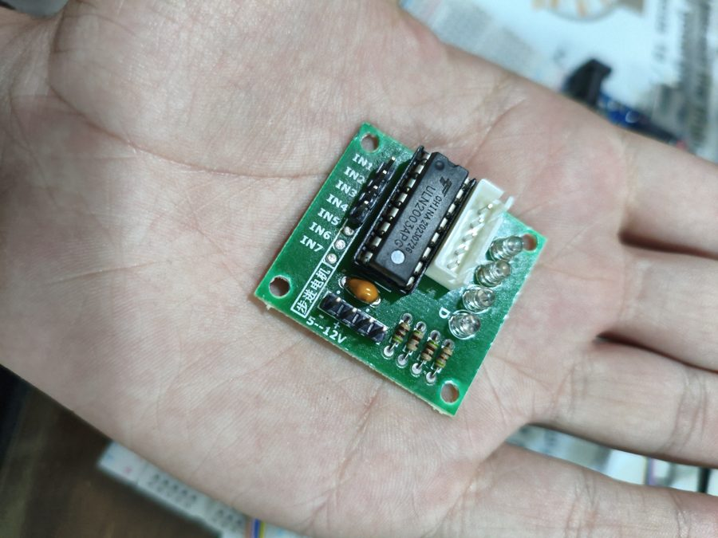
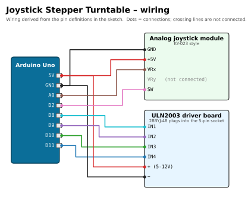

# 🕹️ Joystick Stepper Turntable

[](https://docs.arduino.cc/hardware/uno-rev3/)
[](joystick_stepper/joystick_stepper.ino)
[](#upload-and-use)
[](#required-libraries)
[](../../LICENSE)

> Part of [Yamen Agha's portfolio](../../README.md) · [Arduino projects](../README.md)

## Overview

A motorised turntable controlled with an analog joystick. Push the stick left or right to turn a **28BYJ-48** stepper motor in that direction: the further you push, the faster it turns. Pressing the joystick button **locks** the motor (and switches its coils off). Speed changes are ramped so the small motor does not stall.

## Features

- **Proportional speed:** stick deflection is mapped to a step interval between 12 ms (slow) and 2.2 ms (fast, ≈ 4.5 s per revolution).
- **Auto-calibration:** the joystick's rest position is measured at power-on (32 samples).
- **Dead zone** of ±60 ADC counts so small wobble does not move the motor.
- **Acceleration ramp:** the interval approaches the target gradually, so the motor does not stall at high speed.
- **FREE / LOCKED** toggle on the joystick button (debounced), shown on the Uno's built-in LED (D13).
- **Cool idle:** all coils are switched off when the stick is centred or the motor is locked.
- Non-blocking timing with `micros()`; joystick value printed every 300 ms (9600 baud).

## Components (bill of materials)

| Qty | Part | Notes |
|:-:|---|---|
| 1 | Arduino Uno R3 (or compatible) + USB cable | |
| 1 | 28BYJ-48 5 V stepper motor | |
| 1 | ULN2003 driver board | power jumper fitted |
| 1 | Analog joystick module (`GND +5V VRx VRy SW`) | Only the X axis and the button are used. |
| ~11 | Jumper wires | |
| (opt.) | Disc / cardboard plate on the motor shaft | the "turntable" |

| Joystick | 28BYJ-48 | ULN2003 |
|:-:|:-:|:-:|
|  |  |  |

## Wiring

| Component | Component pin | Arduino Uno pin | Notes |
|---|---|---|---|
| ULN2003 | `IN1` | **D8** | `IN_PINS[0]` |
| ULN2003 | `IN2` | **D9** | |
| ULN2003 | `IN3` | **D10** | |
| ULN2003 | `IN4` | **D11** | |
| ULN2003 | `+` | **5V** | |
| ULN2003 | `−` | **GND** | |
| Joystick | `GND` | **GND** | |
| Joystick | `+5V` | **5V** | |
| Joystick | `VRx` | **A0** | `JOY_X = A0` |
| Joystick | `VRy` | not connected | unused |
| Joystick | `SW` | **D2** | `JOY_BTN = 2`, internal pull-up |
| (on-board LED) | — | D13 / `LED_BUILTIN` | on = LOCKED |

The Uno has only one 5V pin: use a breadboard rail (or a Y-jumper) to feed both the driver and the joystick.



*Source of the wiring: the pin constants and header comment in [`joystick_stepper.ino`](joystick_stepper/joystick_stepper.ino).*

## Required libraries

None.

## Upload and use

1. Open `joystick_stepper/joystick_stepper.ino` in the Arduino IDE, select **Arduino Uno** and the port, **Upload**.
2. **Don't touch the joystick for the first ~0.2 s** after reset: it is measuring the centre. The value is printed as `Joystick center = …`.
3. Push left/right to turn; push further to go faster.
4. Press the stick down to toggle **LOCKED** (built-in LED on, motor off) / **FREE**.

```bash
arduino-cli compile --fqbn arduino:avr:uno joystick_stepper
arduino-cli upload  --fqbn arduino:avr:uno -p /dev/ttyACM0 joystick_stepper
```

## How it works

| Part of the code | What it does |
|---|---|
| `setup()` | Outputs for D8-D11, `INPUT_PULLUP` for the button, averages 32 readings of A0 as `center`, coils off. |
| Button block | Detects a HIGH→LOW edge with a 250 ms debounce and toggles `locked` (+ LED). |
| Dead zone | If locked or `abs(raw − center) < 60`: `motorOff()` and reset the speed to `SLOWEST_US`, so every move starts slowly. |
| Speed mapping | `map(deflection, 60 … max, 12000 µs … 2200 µs)`. `max` is measured separately for each direction because the centre is rarely exactly 512. |
| Ramp | Each step moves the current interval `curUs` 1/20 of the way toward the target: smooth acceleration without stalling. |
| `doStep(dir)` | Full-step sequence `1100 0110 0011 1001` on IN1-IN4, index wraps with `% 4`. |

## Troubleshooting

| Symptom | Likely cause / fix |
|---|---|
| Motor creeps with the stick released | Joystick was touched during calibration: press reset. Or increase `DEADZONE`. |
| Motor buzzes but stalls at full speed | 28BYJ-48 limit at 5 V: raise `FASTEST_US` (e.g. 2600). |
| Wrong direction | Swap the sign of `dir`, or turn the joystick 180°. |
| Button does nothing | `SW` must go to D2; some modules need the `+5V` pin connected for the button to work. |
| Speed only changes in one direction | `VRy` wired instead of `VRx`, or the module is rotated 90°. |

## Development notes

Earlier versions of this sketch (found on the box) show how it evolved: v1 used **half-step** drive with a 1-8 ms interval range; v2 switched to the stronger **full-step** sequence (2-12 ms); the current version adds the **acceleration ramp**, a slightly slower top speed (2.2 ms) that the motor can reach reliably at 5 V, and the Serial debug output.

## Possible improvements

- Use VRy for a second motor or a fine-speed mode.
- Show speed/direction on an LCD or OLED.
- Count steps to display the turntable angle and add "go to 0°".
- Replace the motor with a NEMA-17 + A4988 driver for a heavier turntable.

## Files

```text
joystick-stepper-turntable/
├── joystick_stepper/joystick_stepper.ino   # the sketch
├── docs/wiring.svg / .png                  # wiring diagram
└── README.md
```
