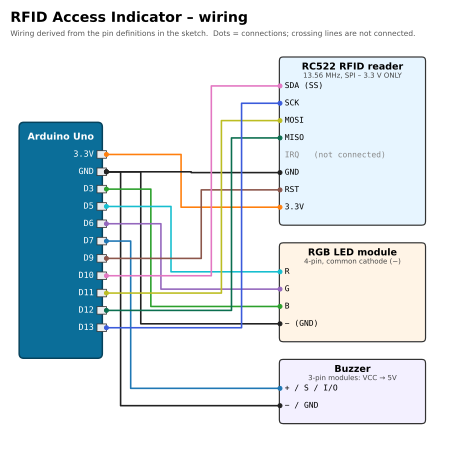

# 🪪 RFID Access Indicator

[](https://docs.arduino.cc/hardware/uno-rev3/)
[](rfid_rgb/rfid_rgb.ino)
[](#upload-and-use)
[](#required-libraries)
[](../../LICENSE)

> Part of [Yamen Agha's portfolio](../../README.md) · [Arduino projects](../README.md)

## Overview

A simple access-control indicator with an **RC522 RFID reader**. The first tag you scan is learned as the authorised one and stored in **EEPROM**, so it is remembered after power-off. From then on, the authorised tag gives a **green** light and a two-tone "OK" beep; any other tag gives **red** and three low "denied" beeps.

## Features

- **Learn on first use:** the first tag scanned becomes the "good" tag (UID up to 10 bytes).
- **Persistent:** UID saved in EEPROM (marker byte `0xA5`, length, UID bytes), using `EEPROM.update` to avoid needless writes.
- **Forget / re-learn:** hold a tag on the reader while pressing RESET; the LED flashes blue 3× and the next tag is learned.
- **Self-check:** reads the RC522 version register at start-up; if the reader is not found the LED blinks purple forever and the Serial Monitor explains why.
- Audible feedback: `beepOk()` (2000 Hz + 2600 Hz) and `beepBad()` (3 × 400 Hz).
- LED brightness limited by `BRIGHT = 120` (of 255).
- Every scanned UID printed in hex on the Serial Monitor (9600 baud).

## Components (bill of materials)

| Qty | Part | Notes |
|:-:|---|---|
| 1 | Arduino Uno R3 (or compatible) + USB cable | |
| 1 | RC522 RFID reader module (13.56 MHz, MIFARE) | **3.3 V only.** |
| 1-2 | RFID tags | The kit's white card and blue key fob. |
| 1 | RGB LED module, 4 pins (`R G B −`) | Common-cathode type. |
| 1 | Buzzer (2-pin, or 3-pin module) | `tone()` beeps, so a passive buzzer sounds best. |
| ~13 | Jumper wires | |

| RC522 reader, card and key fob | RGB LED module |
|:-:|:-:|
|  |  |

## Wiring

| Component | Component pin | Arduino Uno pin | Notes |
|---|---|---|---|
| RC522 | `SDA` (SS) | **D10** | `PIN_SS = 10` |
| RC522 | `SCK` | **D13** | hardware SPI |
| RC522 | `MOSI` | **D11** | hardware SPI |
| RC522 | `MISO` | **D12** | hardware SPI |
| RC522 | `IRQ` | not connected | |
| RC522 | `GND` | **GND** | |
| RC522 | `RST` | **D9** | `PIN_RST = 9` |
| RC522 | `3.3V` | **3.3V** | ⚠️ **never 5V** |
| RGB module | `R` | **D5** (PWM) | |
| RGB module | `G` | **D6** (PWM) | |
| RGB module | `B` | **D3** (PWM) | |
| RGB module | `−` | **GND** | |
| Buzzer | `+` / `S` / `I/O` | **D7** | `PIN_BUZ = 7` |
| Buzzer | `−` / `GND` | **GND** | 3-pin modules: `VCC` → 5V |



*Source of the wiring: the pin constants and the wiring block in the header of [`rfid_rgb.ino`](rfid_rgb/rfid_rgb.ino).*

## Required libraries

| Library | Author | Install |
|---|---|---|
| **MFRC522** (tested with 1.4.12) | GithubCommunity / Miguel Balboa | Arduino IDE → **Sketch → Include Library → Manage Libraries…** → search "MFRC522" → Install. CLI: `arduino-cli lib install MFRC522` |
| SPI, EEPROM | Arduino (built in) | nothing to install |

## Upload and use

1. Install the MFRC522 library, open `rfid_rgb/rfid_rgb.ino`, select **Arduino Uno** and the port, **Upload**.
2. Open the Serial Monitor at **9600 baud**: you should see `Reader version: 0x91` or `0x92` (clones may report other values; only `0x00`/`0xFF` mean "not found").
3. **First use:** scan the tag you want to authorise (e.g. the white card). It is saved and shows green.
4. Scan any other tag → red + three beeps.
5. **Re-learn:** hold the tag on the reader and press RESET; keep holding until the LED flashes blue 3×. Then scan the new good tag.

```bash
arduino-cli lib install MFRC522
arduino-cli compile --fqbn arduino:avr:uno rfid_rgb
arduino-cli upload  --fqbn arduino:avr:uno -p /dev/ttyACM0 rfid_rgb
```

## How it works

| Part of the code | What it does |
|---|---|
| `loadGood()` / `saveGood()` | EEPROM layout: byte 0 = `0xA5` ("valid" marker), byte 1 = UID length, bytes 2-11 = UID. Invalid or missing data means "nothing learned yet". |
| `setup()` | Starts SPI and the reader, checks `VersionReg`, then watches for a tag for 1.5 s. If a tag is present this early, the stored UID is erased (forget mode). Blue flash = ready. |
| `loop()` | `readCard()` waits for a new tag. If nothing is learned yet, the tag is saved. The UID is compared with `memcmp` (length must match too). Green + `beepOk()` or red + `beepBad()`, hold 1.5 s, LED off, `PICC_HaltA()` and `PCD_StopCrypto1()` so the same tag can be read again. |

This is a teaching project: a tag's UID can be cloned, so a UID check alone is **not** secure access control.

## Troubleshooting

| Symptom | Likely cause / fix |
|---|---|
| LED blinks purple, "Reader NOT found" | Wiring: 3.3V/GND, SDA → D10, SCK → D13, MOSI → D11, MISO → D12, RST → D9. Check the header pins are soldered. |
| Every tag is red, even the "good" one | Another tag was learned first. Use forget mode (hold tag + RESET) and learn again. |
| Reader worked once, then stopped | It may have been powered from 5V and damaged. Always use 3.3V. |
| No beep | Buzzer polarity, or an active buzzer that needs `VCC`. |

## Development notes

An earlier version of this sketch (found on the box) had the same reader + RGB logic without sound; the current version adds the buzzer on D7 with `beepOk()` / `beepBad()`.

## Possible improvements

- Store several authorised tags and add a "master" tag to add/remove others.
- Drive a relay or servo to open a real lock.
- Log scans with time stamps (RTC module) to an SD card.
- Read a secret from a protected sector of the card instead of trusting only the UID.

## Files

```text
rfid-access-rgb/
├── rfid_rgb/rfid_rgb.ino   # the sketch
├── docs/wiring.svg / .png  # wiring diagram
└── README.md
```
