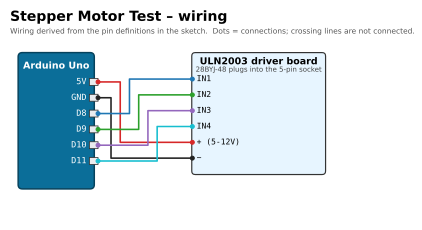

# ⚙️ Stepper Motor Test

[](https://docs.arduino.cc/hardware/uno-rev3/)
[](motor_test/motor_test.ino)
[](#upload-and-use)
[](#required-libraries)
[](../../LICENSE)

> Part of [Yamen Agha's portfolio](../../README.md) · [Arduino projects](../README.md)

## Overview

A minimal test sketch for the **28BYJ-48** stepper motor and its **ULN2003** driver board. It turns the motor one full revolution forward, pauses, one full revolution back, and repeats. It was written to check the motor and driver on their own (no joystick) before building the [Joystick Stepper Turntable](../joystick-stepper-turntable/README.md).

## Features

- No library: the coil sequence is written directly to the four driver inputs.
- Full-step, two-coils-on drive (strongest torque); **2048 steps = 1 revolution**.
- 4 ms per step → about **8 s per revolution**, slow enough to see that it really turns.
- Progress messages on the Serial Monitor (9600 baud).

## Components (bill of materials)

| Qty | Part | Notes |
|:-:|---|---|
| 1 | Arduino Uno R3 (or compatible) + USB cable | |
| 1 | 28BYJ-48 5 V unipolar stepper motor | 5-wire, plugs into the driver's white socket. |
| 1 | ULN2003 stepper driver board | Keep the power jumper fitted. |
| 6 | Female-to-male jumper wires | |

| 28BYJ-48 motor | ULN2003 driver |
|:-:|:-:|
|  |  |

## Wiring

| Component | Component pin | Arduino Uno pin | Notes |
|---|---|---|---|
| ULN2003 | `IN1` | **D8** | `IN_PINS[0]` |
| ULN2003 | `IN2` | **D9** | `IN_PINS[1]` |
| ULN2003 | `IN3` | **D10** | `IN_PINS[2]` |
| ULN2003 | `IN4` | **D11** | `IN_PINS[3]` |
| ULN2003 | `+` (5-12 V) | **5V** | jumper on the board must be fitted |
| ULN2003 | `−` | **GND** | |
| 28BYJ-48 | 5-pin plug | ULN2003 socket | keyed, only fits one way |



*Source of the wiring: the pin array and header comment in [`motor_test.ino`](motor_test/motor_test.ino).*

The motor draws roughly 200-250 mA. USB power from a PC is enough for this one small motor; use a separate 5 V supply (shared GND) if you add more load.

## Required libraries

None.

## Upload and use

1. Open `motor_test/motor_test.ino` in the Arduino IDE, select **Arduino Uno** and the port, **Upload**.
2. The motor turns one revolution clockwise or anticlockwise, stops for 1 s, then turns back. The four LEDs on the driver board blink in sequence.
3. Serial Monitor at **9600 baud** shows `Forward 1 turn` / `Backward 1 turn`.

```bash
arduino-cli compile --fqbn arduino:avr:uno motor_test
arduino-cli upload  --fqbn arduino:avr:uno -p /dev/ttyACM0 motor_test
```

## How it works

`SEQ[4][4]` holds the four full-step patterns `1100 → 0110 → 0011 → 1001`, which energise two neighbouring coils at a time. `stepOnce(dir)` moves the index forward (`+1`) or backward (`-1`) with wrap-around (`(idx + dir + 4) % 4`) and writes the pattern to D8-D11. `loop()` calls it 2048 times in each direction with a 4 ms delay.

(The gear ratio of the 28BYJ-48 is about 1:63.68, so a revolution is really ~2038 full steps. 2048 is the usual round figure and is close enough for a test.)

## Troubleshooting

| Symptom | Likely cause / fix |
|---|---|
| Driver LEDs blink but the shaft only buzzes / vibrates | IN wires out of order (must be IN1-IN4 → D8-D11), or the step delay is too short. |
| No driver LEDs at all | Power jumper missing, `+`/`−` not connected, or sketch not uploaded. |
| Motor gets warm | Normal: coils stay energised. The turntable sketch switches them off when idle. |
| Arduino resets when the motor starts | Weak USB port; use a powered hub or an external 5 V supply for the driver. |

## Possible improvements

- Half-step mode (8 patterns) for smoother, quieter movement.
- Switch all coils off during the pause to save power.
- Use the `Stepper` or `AccelStepper` library for acceleration profiles.

## Files

```text
stepper-motor-test/
├── motor_test/motor_test.ino   # the sketch
├── docs/wiring.svg / .png      # wiring diagram
└── README.md
```
