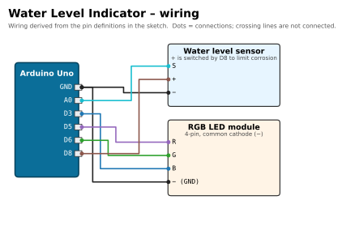

# 💧 Water Level Indicator

[](https://docs.arduino.cc/hardware/uno-rev3/)
[](water_level/water_level.ino)
[](#upload-and-use)
[](#required-libraries)
[](../../LICENSE)

> Part of [Yamen Agha's portfolio](../../README.md) · [Arduino projects](../README.md)

## Overview

Shows how full a glass or tank is with a traffic-light colour: **off** = dry, **red** = low, **yellow** = half, **green** = full. A resistive water-level sensor is read on A0, and the sensor is **powered from a digital pin only while it is being read**, which greatly slows the corrosion these cheap sensors suffer from.

## Features

- Four levels: EMPTY (LED off), LOW (red), HALF (yellow), FULL (green).
- Corrosion protection: sensor `+` is switched on by D8 for ~30 ms per reading, then off.
- Each reading is the average of 10 samples.
- Thresholds (`DRY_MAX`, `LOW_MAX`, `MID_MAX`) are constants at the top, tuned with the Serial Monitor.
- Updates twice per second; blue flash at start-up = ready.

## Components (bill of materials)

| Qty | Part | Notes |
|:-:|---|---|
| 1 | Arduino Uno R3 (or compatible) + USB cable | |
| 1 | Water level sensor (red PCB with exposed traces, pins `S + −`) | |
| 1 | RGB LED module, 4 pins (`R G B −`) | Common-cathode type. |
| ~7 | Jumper wires | |
| 1 | Glass / container of water for testing | Keep water away from the Arduino. |

| Water sensor | RGB LED module |
|:-:|:-:|
|  |  |

## Wiring

| Component | Component pin | Arduino Uno pin | Notes |
|---|---|---|---|
| Water sensor | `S` (signal) | **A0** | `SENSOR_PIN = A0` |
| Water sensor | `+` | **D8** | `SENSOR_POWER = 8`, switched on only while reading |
| Water sensor | `−` | **GND** | |
| RGB module | `R` | **D5** (PWM) | |
| RGB module | `G` | **D6** (PWM) | |
| RGB module | `B` | **D3** (PWM) | |
| RGB module | `−` | **GND** | |



*Source of the wiring: the pin constants and header comment in [`water_level.ino`](water_level/water_level.ino).*

Powering the sensor from D8 is fine: it draws only a few milliamps, far below the 20 mA recommended per Uno pin.

## Required libraries

None (Arduino core only).

## Upload and use

1. Open `water_level/water_level.ino` in the Arduino IDE, select **Arduino Uno** and the port, **Upload**.
2. Open the Serial Monitor at **9600 baud**.
3. Dip the sensor slowly into water (only the traces, never the pin header) and note the readings at "just wet", "half" and "full".
4. Edit the three thresholds and upload again:

```cpp
const int DRY_MAX  = 100;  // below this = dry (LED off)
const int LOW_MAX  = 400;  // up to this = LOW (red)
const int MID_MAX  = 550;  // up to this = HALF (yellow), above = FULL (green)
```

```bash
arduino-cli compile --fqbn arduino:avr:uno water_level
arduino-cli upload  --fqbn arduino:avr:uno -p /dev/ttyACM0 water_level
```

## How it works

| Part of the code | What it does |
|---|---|
| `readSensor()` | `D8 HIGH` → wait 10 ms to settle → 10 readings of A0, 2 ms apart → `D8 LOW` → return the average. |
| `loop()` | Compares the level with the thresholds, sets the colour (`255,80,0` makes yellow because the green die is brighter), prints the reading and state, waits 500 ms. |
| `setup()` | Sensor power off, LED pins as outputs, blue flash = ready. |

## Troubleshooting

| Symptom | Likely cause / fix |
|---|---|
| Always EMPTY / reading near 0 | `+` not on D8 or `S` not on A0; check the `−` wire. |
| Always FULL | Sensor wet across the header, or thresholds too low. Dry it and re-tune. |
| Readings drift over days | Normal for this sensor type (electrolysis). Clean the traces; the D8 power switching already slows this down. |
| Yellow looks orange/green | Adjust the mix in `setColor(255, 80, 0)`. |

## Possible improvements

- Add a buzzer warning at LOW or FULL (overflow alarm).
- Show the percentage on an LCD/OLED.
- Use hysteresis so the colour does not flicker near a threshold.
- Read less often (e.g. every 5 s) to extend sensor life even further.

## Files

```text
water-level-indicator/
├── water_level/water_level.ino   # the sketch
├── docs/wiring.svg / .png        # wiring diagram
└── README.md
```
