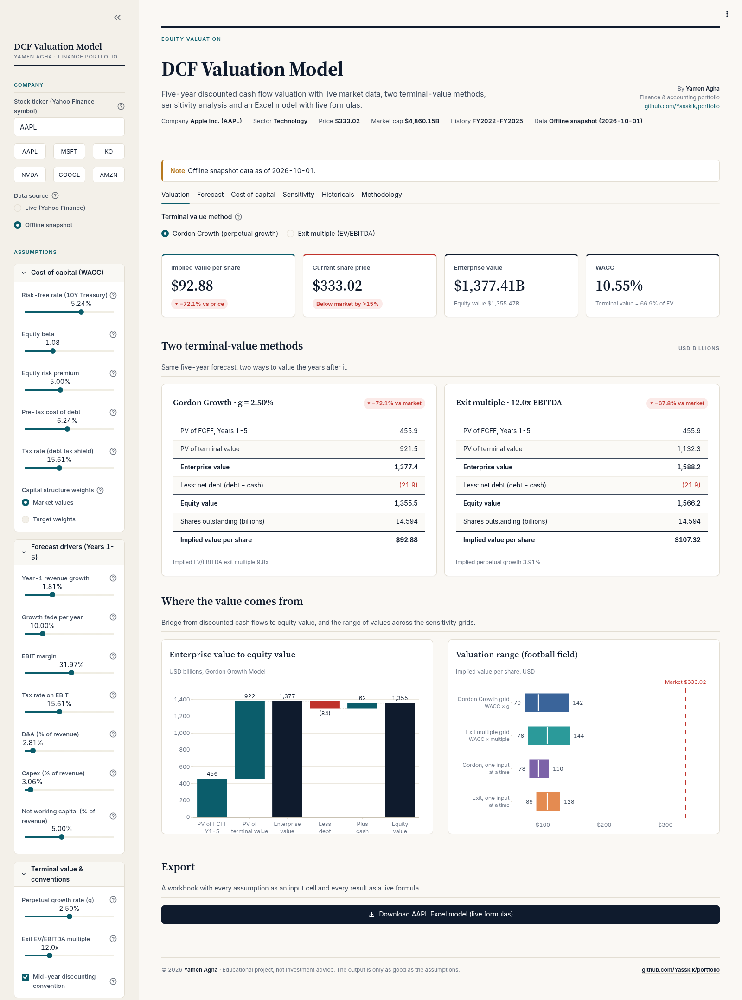
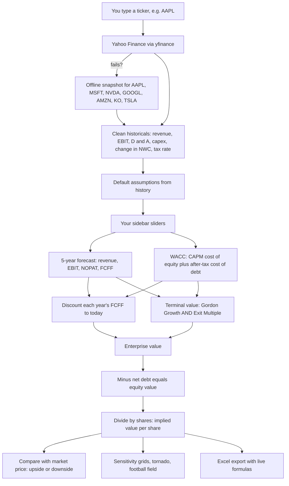
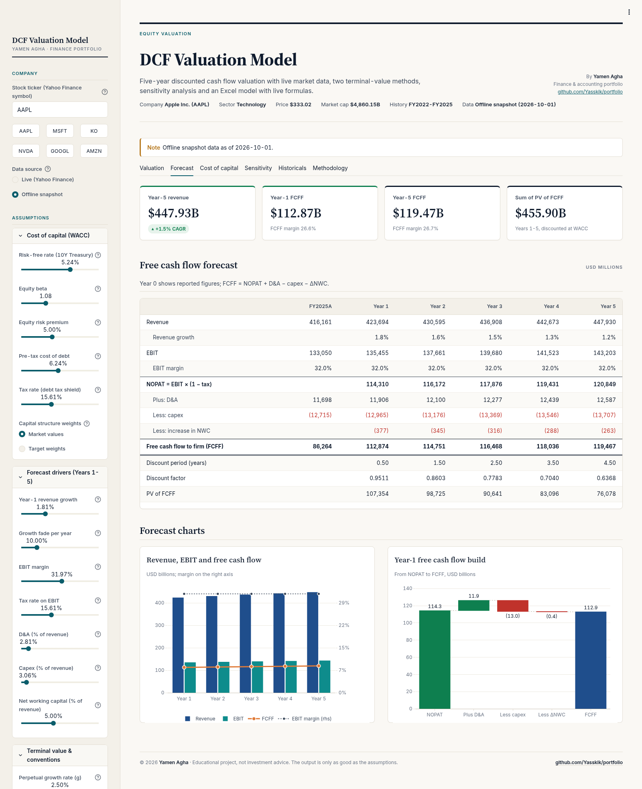
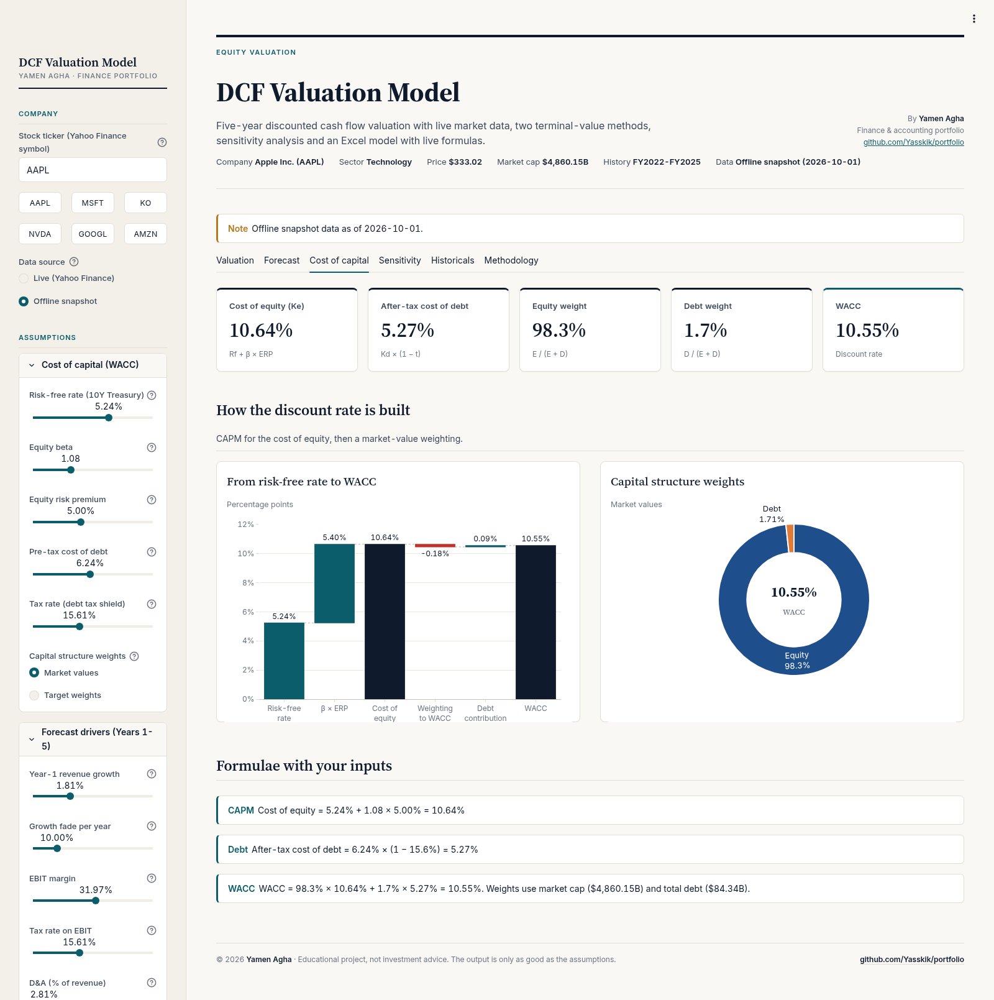
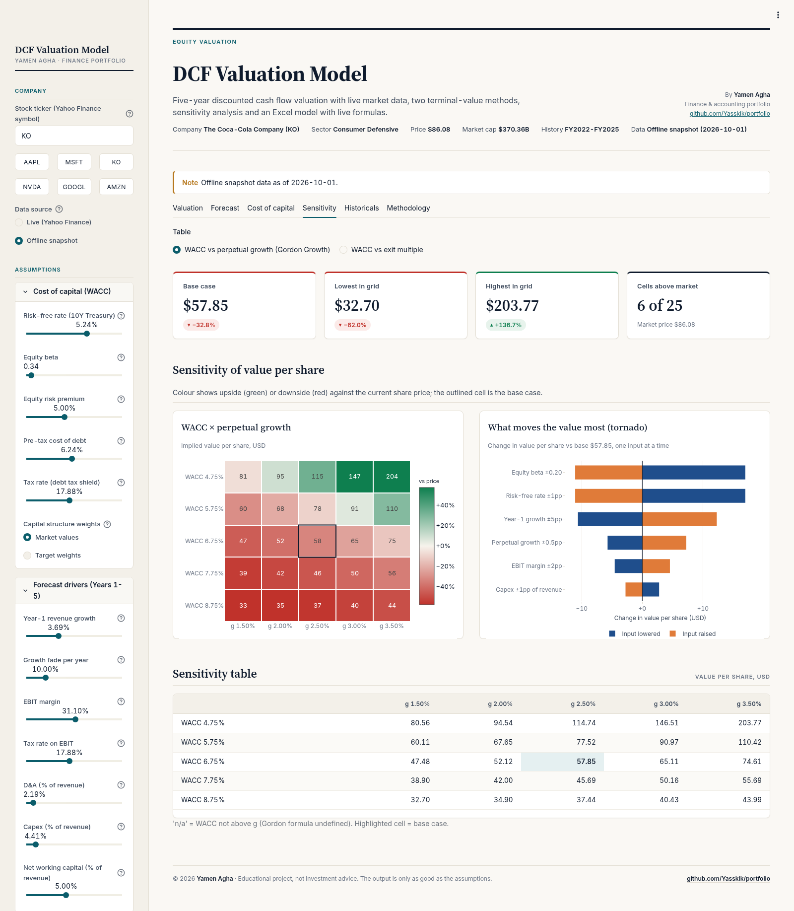
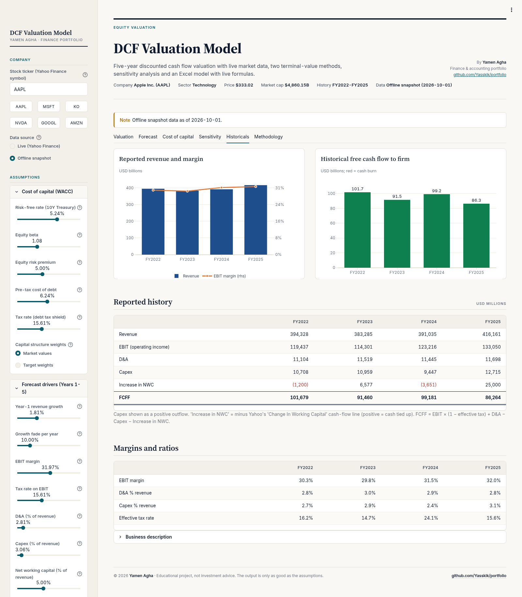

# 💰 DCF Valuation Model

[](https://www.python.org/) [](https://streamlit.io/) [](examples/AAPL_DCF.xlsx) [](tests/) [](LICENSE)

> Part of [Yamen Agha's portfolio](../../README.md) · [Finance projects](../README.md)

**Live demo:** [yamen-dcf-valuation.streamlit.app](https://yamen-dcf-valuation.streamlit.app/)
[](https://yamen-dcf-valuation.streamlit.app/)

> The free app may take ~30 seconds to wake up if it has been idle.

**One-line pitch:** type a stock ticker, and this app estimates what one share of that company is *really* worth, based on the cash the business is expected to produce. Then it hands you the whole model as an Excel file where every number is a live formula. 🚀



📘 Want an even gentler start? There is also a beginner's guide: [GUIDE.md](GUIDE.md) ([PDF version](GUIDE.pdf)). A ready-made Excel model is in [examples/AAPL_DCF.xlsx](examples/AAPL_DCF.xlsx).

---

## 📚 Table of contents

1. [What is this, in one breath?](#-what-is-this-in-one-breath)
2. [Why should I care?](#-why-should-i-care)
3. [The big picture: how data flows through the model](#%EF%B8%8F-the-big-picture-how-data-flows-through-the-model)
4. [Lessons: every concept, from zero](#-lessons-every-concept-from-zero)
   - [Lesson 1: Money today vs money later](#lesson-1-money-today-vs-money-later-)
   - [Lesson 2: Discounting and the discount factor](#lesson-2-discounting-and-the-discount-factor-)
   - [Lesson 3: Free cash flow to the firm (FCFF)](#lesson-3-free-cash-flow-to-the-firm-fcff-)
   - [Lesson 4: Forecasting five years](#lesson-4-forecasting-five-years-)
   - [Lesson 5: The discount rate, WACC and CAPM](#lesson-5-the-discount-rate-wacc-and-capm-%EF%B8%8F)
   - [Lesson 6: Mid-year vs end-of-year discounting](#lesson-6-mid-year-vs-end-of-year-discounting-)
   - [Lesson 7: Terminal value, two ways](#lesson-7-terminal-value-two-ways-)
   - [Lesson 8: From enterprise value to value per share](#lesson-8-from-enterprise-value-to-value-per-share-)
   - [Lesson 9: Sensitivity analysis](#lesson-9-sensitivity-analysis-%EF%B8%8F)
   - [Lesson 10: Where the data comes from, and what happens when it is missing](#lesson-10-where-the-data-comes-from-and-what-happens-when-it-is-missing-)
5. [Tour of the app, tab by tab](#%EF%B8%8F-tour-of-the-app-tab-by-tab)
6. [Every input field explained](#%EF%B8%8F-every-input-field-explained)
7. [The Excel export, sheet by sheet](#-the-excel-export-sheet-by-sheet)
8. [A full real example: Apple](#-a-full-real-example-apple)
9. [How to read the results and make a decision](#-how-to-read-the-results-and-make-a-decision)
10. [Limitations and common mistakes](#%EF%B8%8F-limitations-and-common-mistakes)
11. [FAQ](#-faq)
12. [Glossary](#-glossary)
13. [Features](#-features)
14. [Quick start](#-quick-start)
15. [Tech stack](#-tech-stack)
16. [Tests](#-tests)
17. [Project structure](#%EF%B8%8F-project-structure)
18. [Disclaimer, author and license](#-disclaimer-author-and-license)

---

## 🫁 What is this, in one breath?

A **DCF (discounted cash flow) model** answers one question: *"If I owned this whole company, how much cash would it hand me over its lifetime, and what is all that future cash worth in today's money?"* This app downloads a real company's financial statements, forecasts its cash for 5 years, adds a value for all the years after that, converts everything into today's money using a fair "discount rate", subtracts the company's debt, and divides by the number of shares. The result is an **implied value per share** you can compare with the price on the stock market.

## 🤔 Why should I care?

Great question! Here is why a DCF is one of the most important tools in finance:

- 🏦 **It is what professionals actually do.** Investment bankers, equity analysts, auditors testing goodwill, and corporate finance teams all build DCFs.
- 🧠 **It forces you to think about the business**, not the stock chart. How fast will sales grow? How profitable is it? How much must it reinvest?
- 🔍 **It makes assumptions visible.** The market price hides its assumptions. A DCF lays yours on the table, so you can argue about them.
- 📈 **It teaches the time value of money**, the single most important idea in finance.

And this particular project is useful because you can *play* with it: move a slider, see the value change, and build intuition fast.

---

## 🗺️ The big picture: how data flows through the model



Keep this picture in mind. Every lesson below explains one box.

---

## 🎓 Lessons: every concept, from zero

### Lesson 1: Money today vs money later 💵

**Wait, why isn't 100 dollars next year worth 100 dollars today?** Great question! Imagine your friend offers you a choice: 100 dollars today, or 100 dollars in one year. You should take it today, because:

1. You could put it in a bank and have *more* than 100 in a year.
2. Prices rise (inflation), so 100 buys less next year.
3. The future is uncertain: your friend might forget. 😅

So future money must be "shrunk" to compare it with today's money. That shrinking is called **discounting**, and it is the "D" in DCF.

### Lesson 2: Discounting and the discount factor 🔻

**So how much is next year's 100 worth today?** If you could earn 10% a year elsewhere, then 90.91 today grows to 100 in a year (90.91 × 1.10 = 100). So 100 next year is worth **90.91** today.

The real formula:

```math
PV = \frac{CF_t}{(1 + r)^{t}}
```

- $PV$ = present value (value today)
- $CF_t$ = the cash flow received at time $t$
- $r$ = the discount rate (here, the WACC from Lesson 5)
- $t$ = how many years away the cash is

The bit $\frac{1}{(1+r)^t}$ is called the **discount factor**. The model shows it as its own row.

**Worked example (illustrative), r = 10%:**

| Cash | When | Discount factor | Present value |
|---|---|---|---|
| 100 | 1 year | 1 / 1.10 = 0.9091 | 90.91 |
| 100 | 2 years | 1 / 1.10² = 0.8264 | 82.64 |

See? The further away the money, the less it is worth today.

### Lesson 3: Free cash flow to the firm (FCFF) 🚰

**Okay, but which "cash" are we discounting? Profit?** Not quite! Profit includes non-cash items and ignores money the company must spend to keep growing. We want the cash that is truly *free* to hand to **all** the people who funded the company: lenders **and** shareholders. That is **FCFF** (free cash flow to the firm, also called "unlevered free cash flow").

🍋 **Analogy: a lemonade stand.** You sell lemonade (revenue). After paying for lemons and sugar you have operating profit (EBIT). The government takes tax. Your profit was reduced by "wear and tear" on the stand (depreciation), but you never actually paid cash for that this year, so you add it back. Then you buy a bigger stand (capex) and keep extra lemons in stock (working capital). What is left in your pocket is free cash flow.

The formula the code uses (`dcf.py`):

```math
FCFF_t = \underbrace{EBIT_t \times (1 - tax_t)}_{NOPAT_t} + D\&A_t - Capex_t - \Delta NWC_t
```

| Piece | Plain words |
|---|---|
| $EBIT$ | Earnings before interest and tax = operating profit |
| $NOPAT$ | "Net operating profit after tax" = EBIT × (1 − tax rate). Tax as if the company had no debt |
| D&A | Depreciation & amortization: a non-cash expense, so we add it back |
| $Capex$ | Capital expenditure: cash spent on long-term assets (machines, buildings) |
| $\Delta NWC$ | Increase in net working capital: cash tied up in inventory and unpaid customer bills, minus bills the company hasn't paid yet |

**Why do we use EBIT and not net income?** Because FCFF is cash for *everyone*, including lenders. Interest is the lenders' share, so we take the cash *before* interest. The cost of debt is handled later, inside the WACC.

### Lesson 4: Forecasting five years 🔮

**How does the model guess future cash flows?** It uses simple "drivers", each a percentage of revenue. Here is the exact logic in `project_cash_flows()`:

```math
\begin{aligned}
Revenue_t &= Revenue_{t-1} \times (1 + g_t) \\
EBIT_t &= Revenue_t \times margin_t \\
NOPAT_t &= EBIT_t \times (1 - tax_t) \\
D\&A_t &= Revenue_t \times da\%_t \qquad Capex_t = Revenue_t \times capex\%_t \\
NWC_t &= Revenue_t \times nwc\%_t \qquad \Delta NWC_t = NWC_t - NWC_{t-1}
\end{aligned}
```

**And what is the "growth fade"?** Fast growth rarely lasts forever. In the app you set Year-1 growth and a fade. Each year's growth is the previous year's growth × (1 − fade):

```math
g_t = g_1 \times (1 - fade)^{t-1}
```

With the default fade of 10%, a Year-1 growth of 10% becomes 10% → 9% → 8.1% → 7.29% → 6.561%.

**What is Year-0 working capital?** A deliberate simplification: the model sets base-year NWC = base revenue × Year-1 NWC %. That way, only *growth* creates NWC investment, not a sudden jump in year 1.

**Worked example (illustrative numbers):** base revenue 100, growth 10%, EBIT margin 20%, tax 25%, D&A 4%, capex 5%, NWC 10% of revenue.

| Step | Calculation | Result |
|---|---|---|
| Revenue Y1 | 100 × 1.10 | 110.0 |
| EBIT | 110 × 20% | 22.0 |
| NOPAT | 22 × (1 − 25%) | 16.5 |
| + D&A | 110 × 4% | +4.4 |
| − Capex | 110 × 5% | −5.5 |
| NWC Y0 / Y1 | 100 × 10% / 110 × 10% | 10.0 / 11.0 |
| − Increase in NWC | 11 − 10 | −1.0 |
| **FCFF Y1** | 16.5 + 4.4 − 5.5 − 1.0 | **14.4** |



### Lesson 5: The discount rate, WACC and CAPM ⚖️

**Wait, what is a discount rate? Great question!** It is the yearly return investors *demand* for giving their money to this company instead of somewhere else. A riskier company → investors demand more → higher discount rate → lower value today.

A company is funded by two groups, so the rate is a blend: the **WACC** (weighted average cost of capital).

🍕 **Analogy:** a pizza bought by two friends. One friend (shareholders) paid 80% and wants a 10% return; the other (the bank) paid 20% and wants 6%. The "average cost" of the pizza money is weighted by who paid how much.

**Step 1: cost of equity with CAPM.** Shareholders get no fixed promise, so we estimate what they expect with the Capital Asset Pricing Model:

```math
K_e = R_f + \beta \times ERP
```

- $R_f$, **risk-free rate**: what a "safe" 10-year US government bond pays. The app downloads the latest 10-year Treasury yield (Yahoo symbol `^TNX`). If that fails, or the number is outside 0.5%-15%, it uses **4.25%**.
- $\beta$, **beta**: how much the stock swings compared with the whole market. 1.0 = moves with the market; 1.5 = swings 50% more. From Yahoo Finance; if missing or outside 0-5, the model uses **1.0** and warns you.
- $ERP$, **equity risk premium**: the extra return investors want for owning stocks rather than bonds. Default **5%**.

**Step 2: after-tax cost of debt.** Interest is tax-deductible, so debt is cheaper than it looks:

```math
K_d^{after\ tax} = K_d \times (1 - t)
```

**Step 3: weights.** By default the model uses **market values**: $E$ = market capitalisation (share price × shares) and $D$ = total debt (book value used as a proxy for market value). You can switch to **target weights** and set your own equity %.

```math
WACC = \frac{E}{E+D} K_e + \frac{D}{E+D} K_d (1 - t)
```

**Worked example (illustrative):** $R_f$ = 4%, $\beta$ = 1.2, ERP = 5%, $K_d$ = 6%, tax 25%, E = 800, D = 200.

1. $K_e$ = 4% + 1.2 × 5% = **10%**
2. After-tax $K_d$ = 6% × (1 − 0.25) = **4.5%**
3. Weights: 800 / 1000 = 80% equity, 20% debt
4. WACC = 0.8 × 10% + 0.2 × 4.5% = 8% + 0.9% = **8.9%**



### Lesson 6: Mid-year vs end-of-year discounting 📅

**Does a company receive its whole year of cash on 31 December?** No! Cash trickles in all year. So by default the model uses the **mid-year convention**: Year 1 cash is discounted 0.5 years, Year 2 is 1.5 years, and so on. Untick the checkbox to discount full years instead.

```math
period_t = \begin{cases} t - 0.5 & \text{mid-year (default)} \\ t & \text{end of year} \end{cases}
\qquad
PV(FCFF_t) = \frac{FCFF_t}{(1+WACC)^{period_t}}
```

**Worked example:** our FCFF of 14.4 at a 10% WACC:

- Mid-year: 14.4 / 1.10^0.5 = 14.4 × 0.9535 = **13.73**
- End-of-year: 14.4 / 1.10 = **13.09**

Mid-year gives a slightly higher value, because the cash arrives sooner on average.

### Lesson 7: Terminal value, two ways 🏁

**The company doesn't stop after Year 5, so what about all the years after?** Exactly! We squash "Year 6 to forever" into one number: the **terminal value (TV)**, a value *at the end of Year 5*. The model always calculates it two ways and shows both side by side.

#### Method A: Gordon Growth (perpetual growth) 🌱

Assume FCFF grows at a small, steady rate $g$ forever (like the economy).

```math
TV_{Gordon} = \frac{FCFF_5 \times (1 + g)}{WACC - g} \qquad \text{only if } WACC > g
```

**Why must WACC be bigger than g?** If cash grew faster than the discount rate forever, the value would be infinite, which is nonsense. The code returns "not a number" and shows a warning (and `n/a` in the sensitivity grid, `#N/A` in Excel) when WACC ≤ g. Default g = **2.5%**; the slider goes from 0% to 5%.

#### Method B: Exit multiple (EV/EBITDA) 🏷️

Assume someone buys the whole business at the end of Year 5 for a multiple of its EBITDA (EBIT + D&A), as is common in deals.

```math
TV_{Exit} = EBITDA_5 \times Multiple \qquad EBITDA_5 = EBIT_5 + D\&A_5
```

Default multiple = **12.0x** (slider 3x to 35x).

#### Discounting the TV

Because the TV is a value *at the end of Year 5*, the model discounts it **5 full years under both conventions**:

```math
PV(TV) = \frac{TV}{(1 + WACC)^5}
```

**Worked example (illustrative):** FCFF₅ = 100, g = 2.5%, WACC = 9%.

1. TV = 100 × 1.025 / (0.09 − 0.025) = 102.5 / 0.065 = **1,576.9**
2. 1.09⁵ = 1.5386
3. PV(TV) = 1,576.9 / 1.5386 = **1,024.9**

Exit version with EBITDA₅ = 150 and 12x: TV = 1,800; PV = 1,800 / 1.5386 = **1,169.9**.

#### Cross-checks: do the two methods agree? 🔁

The app turns each method into the other's language:

- **Implied exit multiple** of the Gordon TV = $TV_{Gordon} / EBITDA_5$
- **Implied perpetual growth** of the exit TV, solving the Gordon formula for $g$:

```math
g_{implied} = \frac{TV \times WACC - FCFF_5}{TV + FCFF_5}
```

If the Gordon method implies a 30x multiple, or the exit multiple implies 8% growth forever, one of your assumptions is unrealistic.

### Lesson 8: From enterprise value to value per share 🌉

**So we add everything up... and that's the share price?** Almost! Adding the discounted cash flows gives the value of the *whole business* for *all* investors:

```math
EV = \sum_{t=1}^{5} PV(FCFF_t) + PV(TV)
```

🏠 **Analogy: buying a house with a mortgage.** The house is worth 300k (enterprise value). The owner still owes the bank 200k (debt), but has 10k cash in a drawer that comes with it. The owner's share is 300 − 200 + 10 = 110k (equity value).

```math
Net\ debt = Debt - Cash \qquad Equity = EV - Net\ debt \qquad Value\ per\ share = \frac{Equity}{Shares}
```

```math
Upside = \frac{Value\ per\ share}{Current\ price} - 1
```

**Worked example (illustrative):** EV = 1,000, debt = 300, cash = 100, shares = 50. Net debt = 200; equity = 800; value per share = **16.00**. If the stock trades at 20, upside = 16 / 20 − 1 = **−20%** (the model says it looks overvalued).

Note: value per share can even be negative if debt is bigger than EV; the code does not hide that.

### Lesson 9: Sensitivity analysis 🎛️

**How sure can I be about one number?** Not very! A DCF is very sensitive to WACC, g and the multiple. So the model recalculates the value per share for a grid of alternatives:

- **WACC vs g (Gordon):** 5 WACC values (base −2, −1, 0, +1, +2 percentage points) × 5 growth values (base ± 0.5pp steps).
- **WACC vs exit multiple:** 5 WACC values × 5 multiples (base ± 2.0x steps, never below 0).

Each of the 25 cells is a *full* DCF re-run (the forecast is re-discounted at the new WACC). Green = above the market price, red = below; the outlined cell is your base case. Cells where WACC ≤ g show `n/a`.

The app also draws a **tornado chart** (move one input at a time, everything else at base):

| Input moved | Low / high |
|---|---|
| Risk-free rate | ±1 percentage point |
| Equity beta | ±0.20 |
| Year-1 growth | ±5 percentage points |
| EBIT margin | ±2 percentage points |
| Capex | ±1 percentage point of revenue |
| Perpetual growth (Gordon view) | ±0.5 percentage point |
| Exit multiple (Exit view) | ±2.0x |

The longest bar is the assumption that matters most. 🎯



### Lesson 10: Where the data comes from, and what happens when it is missing 🧹

**Can I trust the numbers Yahoo gives?** Mostly, but the model checks them and *tells you* whenever it had to guess. It never quietly invents numbers. Here is what `parse_yfinance_data()` does:

| Situation | What the model does |
|---|---|
| No income statement, revenue or operating income | Stops with a clear error |
| No share price or shares outstanding | Stops with a clear error (tries several Yahoo fields and the last close first) |
| D&A missing | Estimates **3.5% of revenue** and warns |
| Capex missing | Estimates **4% of revenue** and warns |
| Change in working capital missing | Assumes **0** and warns |
| Effective tax rate missing or outside 0%-50% | Uses **21%** and warns |
| Beta missing or outside 0-5 | Uses **1.0** and warns |
| Cash or debt missing | Assumes **0** and warns |
| Statements and price in different currencies | Warns that the per-share value is **not reliable** (no currency conversion) |
| Yahoo unreachable | Falls back to the offline snapshot, if the ticker is in it, with a warning; otherwise an error |

It keeps up to the **4 most recent annual periods** that have revenue.

**Sign conventions (a classic trap!):** Yahoo reports capex as a negative cash flow, so the model stores it as a positive "amount spent". Yahoo's "Change In Working Capital" is a cash-flow line where negative means cash was tied up, so the model flips its sign: an *increase* in NWC is positive and gets subtracted in FCFF.

**How are the starting slider values chosen?** From history (`default_assumptions_from_history()`), clamped to sensible ranges:

| Default | Source | Clamp |
|---|---|---|
| Year-1 growth | Revenue CAGR over the available years | −10% to 30% |
| EBIT margin | Latest year | 0% to 60% |
| Tax rate | Latest effective rate | 0% to 40% |
| D&A % | Latest year | 0% to 30% |
| Capex % | Latest year | 0% to 40% |
| NWC % | Fixed 5% | |



---

## 🖥️ Tour of the app, tab by tab

The header shows the company, sector, price, market cap, history years and whether data is **Live Yahoo Finance** or an **Offline snapshot**. Yellow "Note" boxes list every data warning. Then come six tabs:

### 1. Valuation 🏆


- A radio button picks which terminal-value method drives the headline (both are always computed).
- **KPI cards:** implied value per share (with % vs price), current price with a signal ("Above market by >15%", "Below market by >15%" or "Within ±15% of market"), enterprise value (with equity value), WACC (with TV as % of EV).
- **Two method cards** side by side: PV of FCFF, PV of TV, EV, less net debt, equity value, shares, value per share, plus the cross-check (implied multiple or implied growth).
- **Waterfall chart:** PV of FCFF → PV of TV → EV → less debt → plus cash → equity value.
- **Football field:** the range of values from each sensitivity grid and from the tornado, with the market price as a dashed red line.
- **Export button:** download the Excel model.

### 2. Forecast 📈


KPIs (Year-5 revenue and CAGR, Year-1 and Year-5 FCFF with FCFF margin, sum of PV of FCFF), the full table from revenue down to PV of FCFF (Year 0 = reported figures, in millions), a revenue/EBIT/FCFF chart and a Year-1 waterfall from NOPAT to FCFF.

### 3. Cost of capital 🧮


KPIs for Ke, after-tax Kd, weights and WACC; a waterfall from the risk-free rate to WACC; a donut of the equity/debt weights; and the formulas written out **with your numbers plugged in**.

### 4. Sensitivity 🎛️


Choose "WACC vs perpetual growth" or "WACC vs exit multiple". KPIs show base case, lowest and highest cell, and how many of the 25 cells are above market. Then the heatmap, the tornado chart and the plain table.

### 5. Historicals 🗂️


Reported revenue with EBIT margin, historical FCFF bars (red = cash burn), the reported table and ratio table (EBIT margin, D&A %, capex %, effective tax rate), and the business description. Use this tab to *justify* your assumptions.

### 6. Methodology 📐
All the formulas, including whether you are currently using mid-year or end-of-year discounting.

---

## 🎚️ Every input field explained

All inputs live in the sidebar. Widgets reset to the new company's defaults when you change ticker.

| Input | What it means in plain words | Default | Range |
|---|---|---|---|
| Stock ticker | Yahoo Finance symbol; quick buttons for AAPL, MSFT, KO, NVDA, GOOGL, AMZN | AAPL | any |
| Data source | Live Yahoo (falls back to snapshot) or Offline snapshot | Live | |
| Risk-free rate | Return on a safe 10-year US government bond | latest ^TNX yield (4.25% fallback) | 0.5%-8% |
| Equity beta | How much the stock swings vs the market | Yahoo beta | 0.2-3.0 |
| Equity risk premium | Extra return wanted for owning stocks | 5.00% | 3%-8% |
| Pre-tax cost of debt | Interest rate on new borrowing | risk-free + 1% | 1%-12% |
| Tax rate (debt tax shield) | Makes debt cheaper after tax | latest effective tax rate | 0%-40% |
| Capital structure weights | Market values, or your own target mix | Market values | |
| Target equity weight | Only if "Target weights" is chosen | 85% | 0%-100% |
| Year-1 revenue growth | Sales growth next year | historical CAGR | −20% to 50% |
| Growth fade per year | How much growth shrinks each year | 10% | 0%-50% |
| EBIT margin | Operating profit per 1 of revenue | latest margin | −10% to 70% |
| Tax rate on EBIT | Tax on operating profit | latest effective rate | 0%-40% |
| D&A (% of revenue) | Non-cash depreciation, added back | latest year | 0%-30% |
| Capex (% of revenue) | Investment in long-term assets | latest year | 0%-45% |
| Net working capital (% of revenue) | Cash tied up in day-to-day operations | 5% | −20% to 40% |
| Perpetual growth rate (g) | Growth after Year 5, forever | 2.5% | 0%-5% |
| Exit EV/EBITDA multiple | Price paid for the business at end of Year 5 | 12.0x | 3x-35x |
| Mid-year discounting | Discount year t by t − 0.5 years | On | |

Note: the margins, tax, D&A, capex and NWC sliders apply the same value to all 5 years; only growth changes year by year (through the fade). In the Excel file each year has its own cell, so you can vary them there.

---

## 📗 The Excel export, sheet by sheet

Click **Download ... Excel model (live formulas)** on the Valuation tab. Amounts are in **millions** (except per-share values). The colour code is the professional standard:

- 🔵 **Blue text on yellow** = inputs you may change
- 🟢 **Green text** = links to another sheet
- ⚫ **Black text** = formulas (don't type over them!)

| Sheet | What's inside | How to use it |
|---|---|---|
| **Summary** | WACC, EV, equity value, value per share, price, upside, TV % of EV for both methods. An **audit** block stores the Python app's answer as a static number and shows "Excel formula − app" (0.00 at export). "How to use" notes and any model warnings | Start here. If the difference is not 0.00 after you changed an input, that's expected: Excel is now the live answer |
| **Assumptions** | Every input: ticker, price, shares, market cap, debt, cash, base-year revenue; Rf, beta, ERP, Kd, tax; "Use target weights? (1/0)" and target equity weight; g, exit multiple, mid-year switch (1/0); sensitivity step sizes (WACC 1%, g 0.5%, multiple 2.0x); Year 1-5 drivers | The only sheet you edit. Each year's driver can differ |
| **Historicals** | Reported revenue, EBIT, D&A, capex, increase in NWC, effective tax; NOPAT, FCFF, growth and ratios as formulas | Sanity-check your assumptions against the past |
| **WACC** | CAPM, after-tax cost of debt, E, D, V, weights and WACC, all formulas | Follow the discount rate step by step |
| **DCF** | Revenue → EBIT → NOPAT → D&A → capex → NWC → FCFF → discount period → discount factor → PV; then the TV and equity bridge for Gordon and Exit side by side, plus both cross-checks | The heart of the model |
| **Sensitivity** | Two 5×5 grids (WACC × g and WACC × multiple). Every cell recomputes the full DCF with `SUMPRODUCT`; green if ≥ current price, red if below | Change a step size on Assumptions and the grids redraw |

Try it: on **Assumptions**, change the perpetual growth rate from 2.5% to 3.0%, then watch DCF, Summary and the Sensitivity grids all update. 🎉

The export was checked by recalculating it in LibreOffice (headless): all 246 formulas return results with no errors and match the Python engine within 1e-9, even after inputs are changed inside the workbook (see `tests/test_fixes.py`).

---

## 🍎 A full real example: Apple

These numbers come straight from the cached values in [`examples/AAPL_DCF.xlsx`](examples/AAPL_DCF.xlsx) (app defaults, data as of 1 Oct 2026). They will differ from what the live app shows today, because the data changes.

**Inputs:** price 333.02 USD, 14,594.18 million shares, market cap 4,860,154m, debt 84,344m, cash 62,399m, base revenue FY2025 416,161m. Rf 5.29%, beta 1.08, ERP 5%, Kd 6.29% (Rf + 1%), tax 15.61%. Year-1 growth 1.81% (the FY2022-FY2025 revenue CAGR) fading 10% a year, EBIT margin 31.97%, D&A 2.81%, capex 3.06%, NWC 5%, g 2.5%, multiple 12x, mid-year on.

**Step 1: WACC.**
- Ke = 5.29% + 1.08 × 5% = **10.69%**
- After-tax Kd = 6.29% × (1 − 15.61%) = **5.31%**
- Weights: E / (E + D) = 4,860,154 / 4,944,498 = **98.29%** equity, 1.71% debt
- WACC = 98.29% × 10.69% + 1.71% × 5.31% = **10.60%**

**Step 2: Year-1 FCFF (millions).**
- Revenue = 416,161 × 1.0181 = 423,694
- EBIT = 423,694 × 31.97% = 135,455 → NOPAT = 135,455 × (1 − 15.61%) = 114,310
- + D&A 11,906 − capex 12,965 − increase in NWC 377 (21,185 − 20,808)
- **FCFF Y1 = 112,874**, discounted 0.5 years with factor 0.9509 → PV **107,330**

**Step 3: the five years.**

| | Y1 | Y2 | Y3 | Y4 | Y5 |
|---|---|---|---|---|---|
| FCFF (m) | 112,874 | 114,751 | 116,468 | 118,036 | 119,467 |
| Discount period | 0.5 | 1.5 | 2.5 | 3.5 | 4.5 |
| PV (m) | 107,330 | 98,658 | 90,539 | 82,965 | 75,924 |

Sum of PV = **455,417m**.

**Step 4: terminal value and bridge.**

| | Gordon Growth (g = 2.5%) | Exit multiple (12x) |
|---|---|---|
| TV at end of Year 5 | 119,467 × 1.025 / (10.60% − 2.5%) = 1,512,106 | 155,790 EBITDA × 12 = 1,869,482 |
| PV of TV (÷ 1.106⁵) | 913,781 | 1,129,747 |
| Enterprise value | 1,369,198 | 1,585,164 |
| − Net debt (84,344 − 62,399) | −21,945 | −21,945 |
| Equity value | 1,347,253 | 1,563,219 |
| **Value per share** | **92.31 USD** | **107.11 USD** |
| vs price 333.02 | **−72.3%** | **−67.8%** |
| TV as % of EV | 66.7% | 71.3% |
| Cross-check | implied multiple 9.7x | implied growth 3.96% |

**Whoa, does that mean Apple is a "sell"? 😱** No! It means the market expects *much* better than these deliberately simple defaults: growth of only ~1.8% and a fairly high 10.6% WACC (driven by a 5.29% Treasury yield). The DCF tells you **what you have to believe** to justify the price. In the sensitivity grid, even the most generous Gordon cell (WACC 8.60%, g 3.5%) gives about 141 USD, and the most generous exit cell (8.60%, 16x) about 144 USD. That's a great discussion point in an interview.

---

## 🧭 How to read the results and make a decision

1. **Read the warnings first.** If the app had to estimate D&A or capex, or the currencies differ, take the result with extra salt. 🧂
2. **Compare the two methods.** If Gordon and Exit are far apart, check the cross-checks: is the implied multiple sensible for the industry? Is the implied growth below long-run GDP growth (~2-3%)?
3. **Look at TV as % of EV.** The app warns above 85% (Gordon). A high share means most of the value rests on the "forever" assumptions.
4. **Look at the range, not one number.** Use the sensitivity grid and football field. If the market price sits inside your range, the stock is "fairly valued under reasonable assumptions".
5. **Find what matters.** The longest tornado bar is the assumption to research hardest.
6. **Reverse the question.** Move sliders until the value equals the price. What growth, margin or WACC does the market imply? Do you believe it?
7. **Think in margins of safety.** Many investors only act if the value is well above the price (the app flags ±15%).

---

## ⚠️ Limitations and common mistakes

**Simplifications the model makes on purpose:**
- Basic (not diluted) shares.
- Total debt includes lease liabilities, as Yahoo reports them; debt is at book value as a proxy for market value.
- Year-0 NWC = base revenue × NWC %, so only growth drives NWC investment.
- No adjustments for minority interests, pensions or non-operating assets.
- No currency conversion (the app warns you).
- A fixed 5-year forecast, and the sidebar applies one margin/tax/D&A/capex/NWC value to all years.

**Common beginner mistakes:**
- ❌ **g ≥ WACC.** The Gordon formula breaks (the app shows n/a). Keep g at or below long-run economic growth.
- ❌ **Using net income instead of FCFF**, or subtracting interest. FCFF is before interest; debt is handled in WACC and net debt.
- ❌ **Forgetting to subtract net debt.** EV is not the shareholders' value.
- ❌ **Capex below D&A forever** in a growing firm. It implies the company shrinks its asset base while growing.
- ❌ **Mixing currencies** (e.g. statements in TWD, price in USD).
- ❌ **Trusting one number.** Always look at the sensitivity range.
- ❌ **Typing over black formula cells** in Excel. Only change blue cells.

---

## ❓ FAQ

**Why are there two values per share?** Because the terminal value can be estimated two ways. They are both shown so you can compare; the radio button only picks the headline.

**Why does the value change when I untick mid-year?** End-of-year discounting assumes cash arrives later, so it is worth a little less today.

**Why is the Gordon cell "n/a"?** That combination has WACC ≤ g, where the formula is undefined.

**Can I value a bank or insurer?** You can type the ticker, but FCFF-based DCFs suit non-financial companies; for banks, debt is raw material, not financing.

**What if my ticker isn't found?** The app shows an error instead of inventing data. Offline mode only covers AAPL, MSFT, NVDA, GOOGL, AMZN, KO and TSLA.

**Is the Excel file the same model?** Yes: the same formulas, and the Summary sheet proves it with a difference of 0.00 at export.

**Why might the value be negative?** If debt exceeds enterprise value, equity is negative. The model shows it honestly.

---

## 📖 Glossary

| Term | Meaning |
|---|---|
| **Beta (β)** | How much a stock moves relative to the market |
| **Capex** | Capital expenditure: cash spent on long-term assets |
| **CAGR** | Compound annual growth rate: the steady yearly growth that links a start and end value |
| **CAPM** | Capital Asset Pricing Model: $K_e = R_f + \beta \times ERP$ |
| **Cost of debt (Kd)** | Interest rate the company pays on borrowing |
| **Cost of equity (Ke)** | Return shareholders expect |
| **D&A** | Depreciation and amortization: non-cash expense spreading an asset's cost over its life |
| **DCF** | Discounted cash flow: valuing future cash in today's money |
| **Discount factor** | $1/(1+r)^t$, the multiplier that converts future cash to today |
| **EBIT** | Earnings before interest and taxes (operating income) |
| **EBITDA** | EBIT + D&A |
| **Enterprise value (EV)** | Value of the whole business for lenders and shareholders |
| **Equity value** | EV − net debt: what belongs to shareholders |
| **ERP** | Equity risk premium: extra return demanded for owning stocks |
| **Exit multiple** | EV/EBITDA ratio assumed for a sale at the end of Year 5 |
| **FCFF** | Free cash flow to the firm: NOPAT + D&A − capex − increase in NWC |
| **Football field** | Chart of value ranges from different methods |
| **Gordon Growth** | TV formula assuming constant growth forever |
| **Market capitalisation** | Share price × shares outstanding |
| **Mid-year convention** | Discounting year t cash by t − 0.5 years |
| **Net debt** | Debt − cash |
| **NOPAT** | Net operating profit after tax: EBIT × (1 − t) |
| **NWC** | Net working capital: operating current assets minus operating current liabilities |
| **Present value (PV)** | Today's value of a future amount |
| **Risk-free rate (Rf)** | Return on a safe government bond |
| **Sensitivity analysis** | Re-running the model with different inputs to see how the answer moves |
| **Terminal value (TV)** | Value at the end of Year 5 of all cash flows after it |
| **Tornado chart** | Bars showing how much each input moves the value, one at a time |
| **Upside / downside** | Value per share ÷ price − 1 |
| **WACC** | Weighted average cost of capital: the blended discount rate |

---

## ✨ Features

- **Live data** from Yahoo Finance (`yfinance`): revenue, operating income, D&A, capex, change in working capital, tax rate, cash, debt, shares, beta and price. An offline snapshot covers a few benchmark tickers (AAPL, MSFT, NVDA, GOOGL, AMZN, KO, TSLA).
- **Clear data handling**: if data is missing, the app either warns you and uses a stated estimate, or stops with an error. It never quietly invents numbers.
- **WACC calculator**: CAPM cost of equity, after-tax cost of debt, and market-value weights (or target weights you set). The risk-free rate defaults to the latest 10-year US Treasury yield.
- **5-year FCFF forecast** driven by revenue growth (with a yearly fade), EBIT margin, tax rate, D&A %, capex % and NWC %.
- **Two terminal values**: Gordon Growth (perpetual growth) and Exit EV/EBITDA multiple, each cross-checked against the other (implied exit multiple and implied growth).
- **Bridge from EV to equity value to value per share**, with upside or downside against the market price, shown as a waterfall chart.
- **Sensitivity tables**: value per share for a range of WACC vs. g and WACC vs. exit multiple, plus heatmaps, a tornado chart and a football field.
- **Excel export with live formulas**: six sheets. Every input sits in blue on an `Assumptions` sheet. Change one and the forecast, WACC, terminal value, share price and both sensitivity grids all recalculate.
- **32 automated tests**, including a test that recalculates the Excel file in LibreOffice and checks that it matches the Python engine.

| Forecast & FCFF | Sensitivity analysis |
|---|---|
|  |  |

| Cost of capital | Historicals |
|---|---|
|  |  |

---

## 🚀 Quick start

```bash
git clone https://github.com/Yasskik/portfolio.git
cd portfolio/finance/dcf-valuation-model
python3 -m venv .venv
source .venv/bin/activate          # Windows: .venv\Scripts\activate
pip install -r requirements.txt
streamlit run app.py               # opens http://localhost:8501
```

Other useful commands:

```bash
python scripts/make_example.py AAPL                 # writes examples/AAPL_DCF.xlsx
python scripts/update_offline_snapshots.py AAPL KO  # refreshes the offline data
```

## 🧰 Tech stack

| Tool | Used for |
|---|---|
| Python 3 | Everything |
| Streamlit | The interactive web app |
| yfinance | Financial statements, prices, beta, Treasury yield |
| pandas / NumPy | Data cleaning and calculations |
| Plotly | Interactive charts (waterfalls, heatmaps, tornado, football field) |
| openpyxl | Excel export with live formulas and conditional formatting |
| pytest | Automated tests |
| LibreOffice (optional) | Headless recalculation of the Excel file in a test |

## 🧪 Tests

```bash
pytest -q
```

There are 32 tests. They cover the WACC maths, the FCFF build, mid-year vs. end-of-year discounting, both terminal values, the EV-to-equity bridge, the sensitivity grids, and Yahoo sign conventions (capex and working capital). They also check how missing or odd data is handled, the offline fallback, the Excel formula structure, a LibreOffice recalculation of the Excel file compared against Python, and a smoke test that runs the Streamlit app. The tests need no internet connection. The LibreOffice test is skipped if LibreOffice isn't installed.

## 🗂️ Project structure

```text
dcf-valuation-model/
├── app.py                      # Streamlit user interface
├── ui_theme.py                 # Vendored copy of the shared design system (../_shared/)
├── dcf.py                      # Valuation engine: data loading, WACC, FCFF, terminal value, bridge, sensitivity
├── excel_export.py             # Excel export with live formulas (openpyxl)
├── data/offline_snapshots.json # Offline data for benchmark tickers
├── examples/AAPL_DCF.xlsx      # Sample Excel export
├── scripts/                    # make_example.py, update_offline_snapshots.py
├── tests/                      # pytest suite (engine, data parsing, Excel, app smoke test)
├── docs/screenshots/           # Screenshots used in this README
├── GUIDE.md / GUIDE.pdf        # Beginner's guide to DCF and to this project
├── .streamlit/config.toml      # Light theme generated from the ui_theme.py tokens
├── requirements.txt
└── LICENSE
```

## 📜 Disclaimer, author and license

This is an educational portfolio project. It is **not investment advice** and not a recommendation to buy or sell any security. A DCF is only as good as its assumptions, and Yahoo Finance data can contain errors or gaps.

**Yamen Agha**, accounting student at Aleppo University. Released under the [MIT License](LICENSE).
