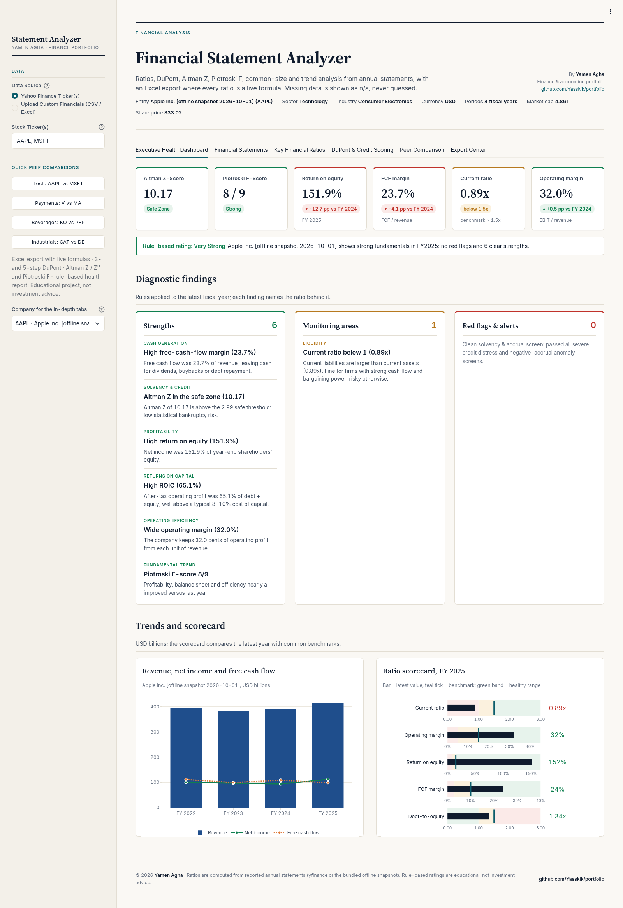
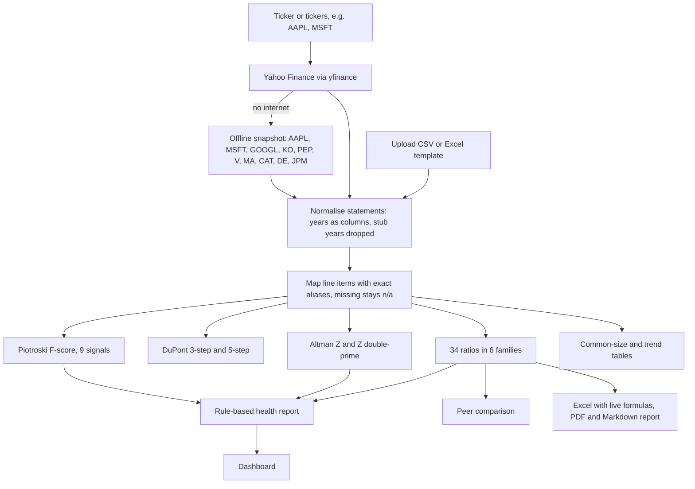
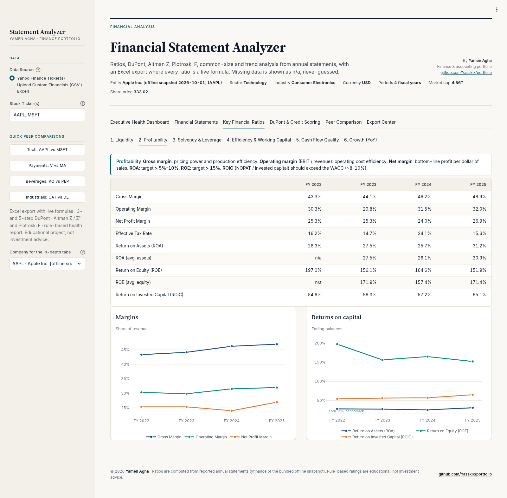
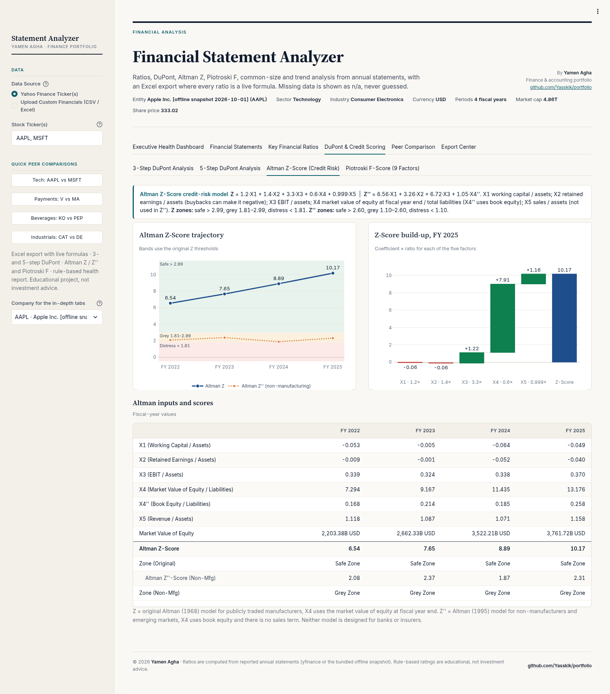
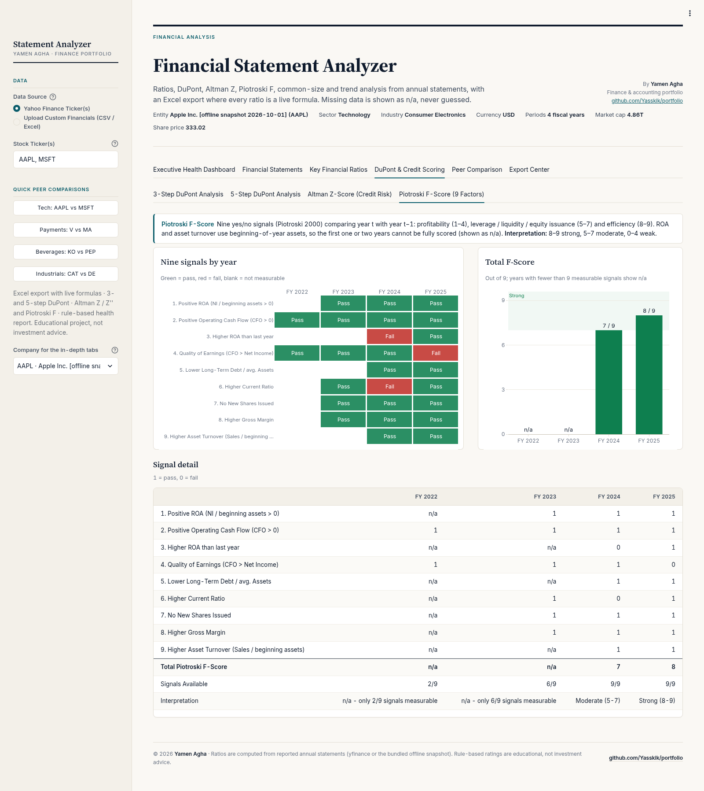
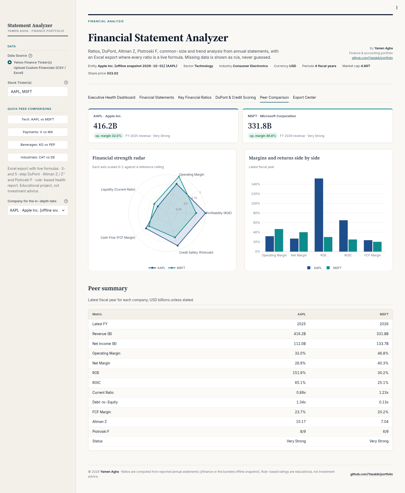

# 🔬 Financial Statement Analyzer

[](https://www.python.org/) [](https://streamlit.io/) [](examples/AAPL_analysis.xlsx) [](tests/) [](LICENSE)

> Part of [Yamen Agha's portfolio](../../README.md) · [Finance projects](../README.md)

**Live demo:** [yamen-statement-analyzer.streamlit.app](https://yamen-statement-analyzer.streamlit.app/)
[](https://yamen-statement-analyzer.streamlit.app/)

> The free app may take ~30 seconds to wake up if it has been idle.

**One-line pitch:** type a ticker (or upload your own statements) and get a full "medical check-up" of the company: **34 ratios**, **DuPont**, **Altman Z**, **Piotroski F**, common-size and trend tables, peer comparison and a plain-English health report, all exportable to an Excel file where **every ratio is a live formula**. 🩺



📘 Want an even gentler start, with a hands-on exercise? Read the beginner's guide: [GUIDE.md](GUIDE.md) ([PDF version](GUIDE.pdf)). Sample outputs are in [examples/](examples/): [AAPL_analysis.xlsx](examples/AAPL_analysis.xlsx), [AAPL_health_report.pdf](examples/AAPL_health_report.pdf) and [AAPL_health_report.md](examples/AAPL_health_report.md).

---

## 📚 Table of contents

1. [What is this, in one breath?](#-what-is-this-in-one-breath)
2. [Why should I care?](#-why-should-i-care)
3. [The big picture](#%EF%B8%8F-the-big-picture)
4. [Lessons: every concept, from zero](#-lessons-every-concept-from-zero)
5. [Tour of the app, tab by tab](#%EF%B8%8F-tour-of-the-app-tab-by-tab)
6. [Every input explained](#%EF%B8%8F-every-input-explained)
7. [The Excel export, sheet by sheet](#-the-excel-export-sheet-by-sheet)
8. [How to read the results](#-how-to-read-the-results)
9. [Limitations and common mistakes](#%EF%B8%8F-limitations-and-common-mistakes)
10. [FAQ](#-faq)
11. [Glossary](#-glossary)
12. [Features](#-features)
13. [Methodology and conventions](#-methodology-and-conventions)
14. [Review notes: bugs fixed](#-review-notes-bugs-fixed)
15. [Quick start](#-quick-start), [Tech stack](#-tech-stack), [Tests](#-tests), [Project structure](#%EF%B8%8F-project-structure), [License](#-disclaimer-author-and-license)

---

## 🫁 What is this, in one breath?

A company's financial statements are full of huge numbers (Apple's revenue is over 400 **billion** dollars!). Raw numbers alone don't tell you if the company is healthy. **Ratios** do: they divide one number by another so you can compare years and companies of any size. This app downloads up to **4 years** of annual statements (from Yahoo Finance, an offline snapshot of 10 companies, or your own upload), computes **34 ratios in six families**, explains *why* return on equity is high or low (**DuPont**), estimates bankruptcy risk (**Altman Z**), scores whether the fundamentals are improving (**Piotroski F**), compares peers, and writes a **rule-based health report**.

## 🤔 Why should I care?

Great question! Ratio analysis is the daily bread of:

- 🏦 **Credit analysts** deciding whether to lend money.
- 📈 **Equity analysts and brokers** screening stocks.
- 🧾 **Auditors** spotting unusual movements (analytical procedures are an audit requirement!).
- 🏢 **Managers** benchmarking against competitors.

For an accounting student, it turns the statements you learned to *prepare* into a story you can *read*. 📖

---

## 🗺️ The big picture



---

## 🎓 Lessons: every concept, from zero

All worked examples below use **Apple (AAPL), FY2025**, from the offline snapshot bundled in [`data/snapshots.json`](data/snapshots.json) (USD millions). I recomputed every number by running `analyzer.py` on that snapshot.

### Lesson 1: Why ratios? 🍎🍊

**Wait, why can't I just compare profits?** Great question! Imagine a lemonade stand that earns 100 and a supermarket that earns 1,000,000. Which is *better run*? You can't tell! But if the stand keeps 30 cents of profit per 1 of sales and the supermarket keeps 3 cents, now you know something. **Ratios remove size**, so you can compare:

1. **Across time** (is Apple better than last year?) → *trend analysis*
2. **Across companies** (Apple vs Microsoft?) → *peer comparison*
3. **Against benchmarks** (is a current ratio of 0.89 "low"?) → *scorecard*

**Year-end or average balances?** By default the model uses **year-end** balances. Rows marked **"(avg.)"** use (this year + last year) / 2, so the **first year shows n/a** for them.

### Lesson 2: Liquidity, can it pay its bills? 💧

🏠 **Analogy:** your bills due this month vs the money in your wallet plus what friends owe you this month.

```math
Current\ ratio = \frac{Current\ assets}{Current\ liabilities}
\qquad
Quick\ ratio = \frac{Cash + ST\ investments + Receivables}{Current\ liabilities}
\qquad
Cash\ ratio = \frac{Cash + ST\ investments}{Current\ liabilities}
```

The **quick ratio** ("acid test") ignores inventory, because you can't always sell stock quickly.

**Worked example (Apple FY2025):**
- Current ratio = 147,957 / 165,631 = **0.89x**
- Quick ratio = (54,697 + 72,957) / 165,631 = **0.77x**
- Cash ratio = 54,697 / 165,631 = **0.33x**

**Is below 1 a disaster?** Not for Apple! It collects cash fast and pays suppliers slowly (see Lesson 5). The health report flags it as a *monitoring area*, not a red flag.

### Lesson 3: Profitability, how good is it at making money? 💰

```math
Gross\ margin = \frac{Gross\ profit}{Revenue}
\quad
Operating\ margin = \frac{Operating\ income}{Revenue}
\quad
Net\ margin = \frac{Net\ income}{Revenue}
```

```math
ROA = \frac{Net\ income}{Total\ assets}
\quad
ROE = \frac{Net\ income}{Shareholders\ equity}
\quad
ROIC = \frac{Operating\ income \times (1 - t)}{Total\ debt + Total\ equity}
```

- **Effective tax rate** $t$ = tax provision / pre-tax income (0% if pre-tax income ≤ 0; n/a if the result is outside 0-100%).
- **"EBIT" is always the reported Operating Income** in this project, not Yahoo's derived "EBIT" line.
- ROA and ROE also come in "(avg.)" versions.

**Worked example (Apple FY2025):**
- Gross margin = 195,201 / 416,161 = **46.9%**
- Operating margin = 133,050 / 416,161 = **32.0%**
- Net margin = 112,010 / 416,161 = **26.9%**
- Tax rate = 20,719 / 132,729 = **15.6%**
- ROE = 112,010 / 73,733 = **151.9%** 😮
- ROIC = 133,050 × (1 − 0.156) / (98,657 + 73,733) = 112,281 / 172,390 = **65.1%**

**Why is Apple's ROE over 150%?** Because years of huge buybacks shrank its book equity, so the denominator is small. That's exactly what DuPont (Lesson 7) reveals.

### Lesson 4: Solvency, is the debt manageable? 🏋️

🏦 **Analogy:** a mortgage. How big is the loan compared with what you own, and can your salary cover the interest?

```math
\frac{Debt}{Equity}
\qquad
\frac{Debt}{Assets}
\qquad
Equity\ multiplier = \frac{Total\ assets}{Equity}
\qquad
Interest\ coverage = \frac{Operating\ income}{|Interest\ expense|}
```

**Worked example (Apple FY2025):** D/E = 98,657 / 73,733 = **1.34x**; D/A = 98,657 / 359,241 = **0.27x**; multiplier = 359,241 / 73,733 = **4.87x**.

**Why is Apple's interest coverage n/a?** Apple stopped reporting interest expense separately in FY2024. The model shows **n/a, not ∞** and not a guess. 🙅

### Lesson 5: Efficiency and working capital, how fast does cash go round? 🔄

🍞 **Analogy: a bakery.** Flour arrives (you owe the supplier), bread sits on the shelf (inventory days), a café buys on credit (receivable days), then pays you. The **cash conversion cycle** is how long your own cash is tied up.

```math
DSO = \frac{Accounts\ receivable}{Revenue} \times 365
\quad
DIO = \frac{Inventory}{COGS} \times 365
\quad
DPO = \frac{Accounts\ payable}{COGS} \times 365
```

```math
CCC = DSO + DIO - DPO
```

Plus **asset turnover** (revenue / assets) and **inventory turnover** (COGS / inventory), each also in an "(avg.)" version. If a company reports no inventory, CCC = DSO − DPO (DIO counts as 0). For banks, receivables are loans, so DSO and CCC are n/a.

**Worked example (Apple FY2025):**
- DSO = 39,777 / 416,161 × 365 = **34.9 days**
- DIO = 5,718 / 220,960 × 365 = **9.4 days**
- DPO = 69,860 / 220,960 × 365 = **115.4 days**
- CCC = 34.9 + 9.4 − 115.4 = **−71.1 days** 🤯

A **negative** CCC means suppliers effectively finance Apple's operations: it collects from customers ~71 days *before* it pays suppliers. That's why a current ratio under 1 isn't scary for Apple.

**Heads-up:** DSO uses **accounts receivable** (39,777) while the quick ratio uses **total receivables** (72,957, which includes non-trade receivables). Both are from the mapping in `analyzer.py`.



### Lesson 6: Cash-flow quality, is the profit real cash? 💵

**Can a company show a profit and still run out of cash?** Absolutely! Profit includes non-cash items and sales not yet collected. So we check:

```math
\frac{CFO}{Net\ income}
\qquad
FCF = CFO - |Capex|
\qquad
FCF\ margin = \frac{FCF}{Revenue}
\qquad
Sloan\ accruals = \frac{Net\ income - CFO}{Total\ assets}
```

(CFO / NI is shown only when NI > 0. Capex is treated as an outflow whatever its sign, because Yahoo reports it negative.)

**Worked example (Apple FY2025):** FCF = 111,482 − 12,715 = **98,767**; FCF margin = 98,767 / 416,161 = **23.7%**; CFO / NI = 111,482 / 112,010 = **0.995x**; Sloan = (112,010 − 111,482) / 359,241 = **0.0015** (tiny accruals, good).

**Growth (YoY)** is the sixth family: revenue, operating income, net income, diluted EPS and FCF growth, each $(this - last) / |last|$. Apple FY2025: revenue **+6.4%**, net income **+19.5%**, FCF **−9.2%**.

### Lesson 7: DuPont, *why* is ROE high? 🧩

**ROE is one number. How do I know what drives it?** DuPont splits it into pieces you can multiply back together:

```math
ROE = \underbrace{\frac{NI}{Revenue}}_{profit\ margin} \times \underbrace{\frac{Revenue}{Assets}}_{asset\ turnover} \times \underbrace{\frac{Assets}{Equity}}_{leverage}
```

The 5-step version splits the margin further:

```math
ROE = \underbrace{\frac{NI}{EBT}}_{tax\ burden} \times \underbrace{\frac{EBT}{EBIT}}_{interest\ burden} \times \underbrace{\frac{EBIT}{Revenue}}_{operating\ margin} \times \frac{Revenue}{Assets} \times \frac{Assets}{Equity}
```

Both use **ending** balances, so they multiply back **exactly** to ROE. A check row in the app and in Excel proves it.

**Worked example (Apple FY2025):**
- 3-step: 26.92% × 1.158 × 4.872 = **151.9%** ✅ = reported ROE
- 5-step: 0.8439 × 0.9976 × 0.3197 × 1.158 × 4.872 = **151.9%** ✅

So Apple's ROE comes from a strong margin **and** high leverage (4.87x). The leverage piece is large because equity is small after buybacks.

### Lesson 8: Altman Z-score, how close to bankruptcy? 🚦

**Can one number predict distress?** Edward Altman (1968) found a weighted mix of five ratios that separated firms that went bankrupt from those that didn't:

```math
Z = 1.2X_1 + 1.4X_2 + 3.3X_3 + 0.6X_4 + 0.999X_5
```

| Factor | Formula | Plain words |
|---|---|---|
| $X_1$ | Working capital / Total assets | Short-term cushion |
| $X_2$ | Retained earnings / Total assets | Accumulated profitability |
| $X_3$ | EBIT (operating income) / Total assets | Operating power |
| $X_4$ | **Market value of equity at fiscal year-end** / Total liabilities | Market cushion over debts |
| $X_5$ | Revenue / Total assets | Sales efficiency |

Zones: **safe > 2.99**, grey 1.81-2.99, **distress < 1.81**. Market value = FY-end share price × shares outstanding.

For non-manufacturers, the app also computes **Altman Z'' (1995)**, which uses **book** equity and drops the sales term:

```math
Z'' = 6.56X_1 + 3.26X_2 + 6.72X_3 + 1.05X_4''
\qquad X_4'' = \frac{Book\ equity}{Total\ liabilities}
```

Zones: **safe > 2.60**, grey 1.10-2.60, **distress < 1.10**.

**Worked example (Apple FY2025):** market value = 254.63 × 14,773.26m shares = **3,761,715m**.

| | Value | × weight (Z) | Contribution |
|---|---|---|---|
| X1 = −17,674 / 359,241 | −0.0492 | 1.2 | −0.059 |
| X2 = −14,264 / 359,241 | −0.0397 | 1.4 | −0.056 |
| X3 = 133,050 / 359,241 | 0.3704 | 3.3 | 1.222 |
| X4 = 3,761,715 / 285,508 | 13.1755 | 0.6 | 7.905 |
| X5 = 416,161 / 359,241 | 1.1584 | 0.999 | 1.157 |
| **Z** | | | **10.17 → Safe** ✅ |

With book equity, Z'' = 6.56(−0.0492) + 3.26(−0.0397) + 6.72(0.3704) + 1.05(0.2583) = **2.31 → Grey** ⚠️. Fun lesson: the *market* sees a huge cushion; the *books* (after buybacks) look thinner. The dashboard shows Z when it can be measured and falls back to Z'' otherwise.



### Lesson 9: Piotroski F-score, is it getting stronger? 💪

**What does "F-score 8/9" mean?** Joseph Piotroski (2000) defined **9 yes/no tests**, 1 point each, comparing this year with last year:

| # | Signal | 1 point if... |
|---|---|---|
| 1 | Positive ROA | NI / **beginning** assets > 0 |
| 2 | Positive CFO | CFO > 0 |
| 3 | Higher ROA | ROA this year > last year |
| 4 | Earnings quality | CFO > NI |
| 5 | Lower leverage | Long-term debt / average assets fell (or both zero) |
| 6 | Higher current ratio | Current ratio rose |
| 7 | No new shares | Shares outstanding ≤ last year |
| 8 | Higher gross margin | Gross margin rose |
| 9 | Higher asset turnover | Sales / beginning assets rose |

**Interpretation:** Strong 8-9, Moderate 5-7, Weak 0-4. A missing input makes a signal **n/a (never 0)**, and the total is shown **only when all 9 can be measured**. Signals need two or three years of data, so **with 4 years only the last 2 years get a score**.

**Worked example (Apple FY2025): 8/9 Strong.** It passes everything except #4: CFO 111,482 < NI 112,010, so "earnings quality" scores 0. (FY2024 scored 7.)



### Lesson 10: Common-size and trend analysis 📏📈

- **Common-size (vertical):** every income statement line as % of revenue, every balance sheet line as % of total assets (share counts and EPS rows are excluded). It answers "what does the company *look like*?"
- **Trend (horizontal):** for all three statements, either **YoY % change** $(t - (t-1)) / |t-1|$ or **indexed** to the oldest year = 100. It answers "how is it *changing*?"

**Worked example (illustrative):** revenue 1,000 → 1,150 is a **+15%** YoY change and an index of **115**.

### Lesson 11: The health report 🩺

`generate_health_report()` applies **fixed rules** (no randomness) to the latest year and sorts findings into **Strengths**, **Monitoring areas** and **Red flags**. A few of the rules:

| Rule | Classified as |
|---|---|
| CFO < 0 | Red flag |
| CFO / NI ≥ 1.10 / < 0.70 | Strength / red flag |
| FCF margin > 15% / FCF < 0 | Strength / weakness |
| Altman zone safe / grey / distress | Strength / weakness / red flag |
| Interest coverage < 1.5x / > 8x | Red flag / strength |
| D/E > 3 / ≤ 0.6; negative equity | Weakness / strength; weakness |
| Current ratio < 1 / ≥ 1.8; quick < 0.7 | Weakness / strength; weakness |
| ROE ≥ 20% / < 0; ROIC > 15% | Strength / red flag; strength |
| Operating margin > 20% / 0-4% / < 0 | Strength / weakness / red flag |
| F-score ≥ 8 / ≤ 3 | Strength / red flag |
| Revenue growth > 15% / < −5%; NI −20% while sales grew | Strength / weakness; weakness |

**Overall rating:** *Very Strong* (no red flags and ≥ 4 strengths), *Solid* (≤ 1 red flag and ≥ 2 strengths), *Elevated Risk* (≥ 2 red flags, or 1 red flag with ≤ 1 strength), otherwise *Mixed*. Financial companies get *Limited*.

**Apple FY2025:** *Very Strong*: 6 strengths, 1 monitoring area (current ratio 0.89x), 0 red flags (see [AAPL_health_report.md](examples/AAPL_health_report.md)).

### Lesson 12: Banks and insurers are different 🏦

A bank's "receivables" are loans and its debt is raw material. The app detects financial companies from their industry (bank, insurance, capital markets, asset management, mortgage, ...) or a financial-sector company without a classified balance sheet. For them, **current ratio, CCC, Altman and Piotroski are n/a**, cash-flow rules are skipped, and the health report is marked **"Limited"**. Try **JPM** to see this.

---

## 🖥️ Tour of the app, tab by tab

The header shows entity, sector, industry, currency, number of periods, market cap and share price.

### 1. Executive Health Dashboard 🏠


Six KPI cards (Altman Z or Z'' with zone, Piotroski F, ROE, FCF margin, current ratio vs 1.5x, operating margin, each with the change vs last year in percentage points), the **rule-based rating**, three finding cards (Strengths, Monitoring areas, Red flags & alerts), a revenue / net income / FCF chart, and a **ratio scorecard** of bullet gauges (current ratio benchmark 1.5x, operating margin 15%, ROE 15%, FCF margin 10%, interest coverage 3.0x, D/E 1.5x).

### 2. Financial Statements 📄
Choose the view (reported values, common-size, or horizontal trend), the statement (income, balance sheet, cash flow) and the display scale (raw, millions, billions). Negatives in red parentheses; n/a = not reported.

### 3. Key Financial Ratios 📐
Six sub-tabs: Liquidity, Profitability, Solvency & Leverage, Efficiency & Working Capital, Cash Flow Quality, Growth (YoY). Each has a short explanation, a table and a chart with benchmark lines.


### 4. DuPont & Credit Scoring 🧩
Sub-tabs: 3-Step DuPont, 5-Step DuPont, Altman Z-Score, Piotroski F-Score (9 factors).

| Piotroski | Altman |
|---|---|
|  |  |

### 5. Peer Comparison 👥
Needs **two or more tickers** (e.g. `AAPL, MSFT` or a quick button). KPI cards per company, a **financial strength radar** (ROE and operating margin scaled to 40%, current ratio to 3.0, FCF margin to 35%, Piotroski to 9), a bar chart of operating margin, net margin, ROE, ROIC and FCF margin, and a peer summary table (revenue, NI, margins, ROE, ROIC, current ratio, D/E, FCF margin, Altman Z, Piotroski F, status).



### 6. Export Center 📦
Download the **Excel model (live formulas)**, the **PDF health report**, or the **Markdown report**.

---

## 🎚️ Every input explained

| Input | What it does | Default |
|---|---|---|
| Data Source | *Yahoo Finance Ticker(s)* (falls back to the offline snapshot without internet) or *Upload Custom Financials (CSV / Excel)* | Yahoo |
| Stock Ticker(s) | One or more comma-separated tickers; the first is the primary company | `AAPL, MSFT` |
| Quick peer comparisons | One-click pairs: AAPL vs MSFT, V vs MA, KO vs PEP, CAT vs DE | |
| Company for the in-depth tabs | When several tickers load, which one the dashboard/statements/ratios/scoring tabs show | first |
| Download Excel / CSV template | Blank templates for your own company | |
| Upload Completed Statement File | `.xlsx` with sheets *Income Statement*, *Balance Sheet*, *Cash Flow*, or one CSV with columns *Statement, Line Item, year, year, ...* | |
| Custom Ticker / Code, Company Name | Labels for an upload | ACME, Acme Enterprise Corp |
| Market value of equity at the latest year end | Optional, same units as the file; used **only** for the original Altman Z (X4). Leave 0 for a private company: Z becomes n/a and Z'' is used | 0 |

---

## 📗 The Excel export, sheet by sheet

`examples/AAPL_analysis.xlsx` is a sample export for Apple (FY2022–FY2025, data as of 1 Oct 2026). Statements are shown in USD millions, and inputs are in blue.

| Sheet | Contents |
|---|---|
| Summary | Company, key ratios, Z, Z'' and F-score for the latest year, as formulas |
| Income Statement / Balance Sheet / Cash Flow | Reported figures. Missing items are left blank. The balance sheet has a market-data block (FY-end price, shares, and market value = price × shares) |
| Ratios | 34 ratios, each an `IF(COUNT(…)<n,"n/a",IFERROR(…))` formula pointing at the statement sheets |
| DuPont | 3-step and 5-step components, plus check rows comparing them with ROE |
| Altman Z | X1–X5, Z, Z'' and their zones |
| Piotroski | Helper rows (beginning assets, average assets and so on), the 9 signals and the total |
| Common-Size | Vertical analysis as formulas |
| Notes | Definitions and conventions |

**What does `IF(COUNT(...)<n,"n/a",...)` mean?** "If any input cell is empty, show n/a instead of a fake number." It's the Excel version of the app's *never-guess* rule. Try it: change revenue on *Income Statement* and watch every margin, turnover, DuPont factor and Z update. 🎉

**Verification.** `scripts/verify_excel.py` recalculates the workbook in LibreOffice (headless) and compares every ratio and score cell with the Python engine. On all 10 snapshot tickers there were **0 mismatches**. For AAPL, that is 474 formulas and 276 ratio/score cells. The test suite repeats this check for AAPL, KO, JPM and GOOGL.

---

## 🧭 How to read the results

1. **Start with the rating and the red flags.** Red flags (negative CFO, distress zone, weak coverage, losses) deserve attention first.
2. **Never judge one ratio alone.** Apple's current ratio < 1 looks weak, but a −71-day CCC and 23.7% FCF margin explain it.
3. **Compare with peers in the same industry.** A 30% margin is huge for a supermarket and normal for software. Use the quick peer buttons.
4. **Look at the trend.** Improving from bad is often better news than slipping from great. Piotroski is built on this idea.
5. **Use DuPont to find the driver.** High ROE from leverage is riskier than high ROE from margins.
6. **Check Z vs Z''.** If they disagree (Apple: safe vs grey), ask why: usually market value vs book equity.
7. **Respect n/a.** It means "not reported", not "zero". Check the company's filings.

---

## ⚠️ Limitations and common mistakes

**Limitations:**
- Up to 4 annual periods from Yahoo; sparse "stub" years (under 30% of the best-filled year's data) are dropped.
- Yahoo data is standardised and can contain errors or gaps; always check against filed reports.
- Ratios and scores are **screening tools**, not a full credit or equity analysis.
- Altman Z was built for public manufacturers (1968); Z'' for non-manufacturers. Neither suits banks or insurers.
- The health report thresholds are general rules of thumb, not industry-specific.

**Common beginner mistakes:**
- ❌ Treating a **missing value as 0** (the app never does).
- ❌ Using Yahoo's **derived "EBIT"** instead of operating income.
- ❌ Mixing **ending and average** balances when comparing ratios.
- ❌ Comparing companies from **different industries** without context.
- ❌ Reading **ROE** without checking equity: tiny or negative equity makes ROE meaningless.
- ❌ Forgetting that **capex is negative** in Yahoo data (FCF = CFO − |capex|).

---

## ❓ FAQ

**Why is Piotroski n/a for the first two years?** Signals compare with last year and use beginning assets (and turnover needs two years before), so the earliest years can't be scored.

**Why is interest coverage n/a for Apple?** Apple no longer reports interest expense separately. The app shows n/a rather than ∞.

**Why is ROE over 100%?** Small book equity after buybacks. See DuPont: the leverage factor is 4.87x.

**Can I analyse a private company?** Yes: upload the template and leave market value at 0. Z will be n/a; Z'' (book equity) still works.

**Why does JPM show so many n/a?** It's a bank. Models built for operating companies don't apply.

**Is the Excel file the same as the app?** Yes; verified cell by cell in LibreOffice with 0 mismatches on all 10 snapshot tickers.

---

## 📖 Glossary

| Term | Meaning |
|---|---|
| **Accruals (Sloan)** | (Net income − CFO) / total assets; high accruals = profit not backed by cash |
| **Altman Z / Z''** | Weighted ratio scores estimating bankruptcy risk (1968 / 1995) |
| **Asset turnover** | Revenue / total assets |
| **CCC** | Cash conversion cycle = DSO + DIO − DPO |
| **CFO** | Cash flow from operations |
| **Common-size** | Lines as % of revenue (IS) or total assets (BS) |
| **COGS** | Cost of goods sold (cost of revenue) |
| **Current ratio** | Current assets / current liabilities |
| **D/E** | Total debt / shareholders' equity |
| **DSO / DIO / DPO** | Days to collect receivables / sell inventory / pay suppliers |
| **DuPont** | Splitting ROE into margin × turnover × leverage (and more) |
| **EBIT** | Here: reported operating income |
| **EBT** | Earnings before tax (pre-tax income) |
| **Equity multiplier** | Total assets / equity (financial leverage) |
| **FCF** | Free cash flow = CFO − \|capex\| |
| **Interest coverage** | Operating income / interest expense |
| **Piotroski F-score** | 9 binary signals of improving fundamentals |
| **Quick ratio** | (Cash + ST investments + receivables) / current liabilities |
| **ROA / ROE / ROIC** | Return on assets / equity / invested capital |
| **Stub year** | A mostly empty year column from Yahoo, dropped by the app |
| **Trend (horizontal) analysis** | YoY % change or index vs a base year |
| **Working capital** | Current assets − current liabilities |

---

## ✨ Features

- **Live data** from Yahoo Finance (`yfinance`), with up to 4 annual periods. An offline snapshot covers 10 benchmark tickers: AAPL, MSFT, GOOGL, KO, PEP, V, MA, CAT, DE and JPM.
- **Your own data**: upload a CSV or Excel file using the templates in `templates/`.
- **Ratios in six groups**: liquidity, profitability, solvency, efficiency and working capital (DSO, DIO, DPO, cash conversion cycle), cash-flow quality and growth.
- **DuPont 3-step and 5-step**, with a check row showing that the product equals ROE.
- **Altman Z (1968)** for public manufacturers and **Z'' (1995)** for non-manufacturers, both labelled with their zones.
- **Piotroski F-score**: all 9 signals, scored year over year.
- **Common-size** (vertical) analysis of the income statement and balance sheet, and **trend** (horizontal) analysis for all three statements.
- **Peer comparison** with a table, a radar chart and bar charts.
- **Clear about missing data**: a missing input shows as **n/a**. Nothing is filled with 0 or estimated. Banks and insurers get ratios that make sense for them, and models that don't apply to them (Altman, Piotroski, CCC) show as n/a.
- **Excel export with live formulas**, checked against Python using LibreOffice.
- **61 automated tests.**

| Efficiency & working capital | Piotroski F-score |
|---|---|
|  |  |

| Altman Z-score | Peer comparison |
|---|---|
|  |  |

## 📏 Methodology and conventions

These are the accounting choices the app makes. They are listed so you can check every number.

| Item | Definition used |
|---|---|
| Balances | **Year-end** balances by default. Rows marked "(avg.)" use (this year + last year) / 2, so the first year shows n/a. |
| Operating margin, interest coverage, DuPont EBIT, Altman X3 | **Operating Income** as reported. Yahoo's derived "EBIT" line (pre-tax income + interest) is not used. |
| Interest coverage | Operating income / interest expense. Interest expense is taken as a positive amount. If a company reports none (Apple since FY2024), it shows **n/a**, not ∞. |
| Quick ratio | (Cash + short-term investments + receivables) / current liabilities |
| Inventory turnover, DIO, DPO | Based on **COGS** (cost of revenue). DSO uses revenue. All three use a **365-day** year. CCC = DSO + DIO − DPO. |
| ROIC | Operating income × (1 − effective tax rate) / (total debt + total equity). The effective tax rate is tax / pre-tax income, set to 0 if pre-tax income ≤ 0. |
| Free cash flow | Operating cash flow − \|capex\|. Yahoo reports capex as a negative number, so the absolute value is used. |
| DuPont | 3-step: NI/Revenue × Revenue/Assets × Assets/Equity. 5-step: NI/EBT × EBT/EBIT × EBIT/Revenue × Revenue/Assets × Assets/Equity. Both use ending balances, so they multiply back exactly to ROE. |
| Altman Z (original, 1968) | 1.2·X1 + 1.4·X2 + 3.3·X3 + 0.6·X4 + 0.999·X5. X4 = **market value of equity at fiscal year-end** (FY-end share price × shares) / total liabilities. Zones: safe > 2.99, grey 1.81–2.99, distress < 1.81. |
| Altman Z'' (1995) | 6.56·X1 + 3.26·X2 + 6.72·X3 + 1.05·X4, with X4 based on **book** equity. Use this for non-manufacturers. Zones: safe > 2.60, grey 1.10–2.60, distress < 1.10. |
| Piotroski F | The 9 signals from Piotroski (2000). ROA and asset turnover use **beginning-of-year** assets. Leverage = long-term debt / average assets. Share issuance: shares outstanding ≤ last year. A total is shown only when all 9 signals can be measured, so with 4 years of data only the last 2 years get a score. |
| Financial companies | Banks, insurers and capital-markets firms are detected from their industry. Current ratio, CCC, Altman and Piotroski are n/a for them, and the health report is marked "Limited". |

## 🔧 Review notes: bugs fixed

The first version of this project had the following problems, which I found and fixed when reviewing it line by line, as an accountant and as a developer:

1. **Wrong line items.**
   - "Total Liabilities And Stockholders Equity" was used as total liabilities, and "Common Stock" as total equity.
   - "Other Receivables" and "Raw Materials" were used as receivables and inventory. "Total Expenses" was used as operating expenses, and "Operating Costs" as COGS.
   - Gross PPE was used as net PPE. A long-term investment line was used as short-term investments.
   - Cash was counted twice, through a combined cash + short-term investments line.
2. **Yahoo's derived EBIT** was used for interest coverage, DuPont and Altman X3. These now use reported operating income.
3. **Missing data was turned into 0**, for example cash, receivables and debt. A missing input now gives n/a. Piotroski no longer gives a point when data is missing.
4. **Altman Z mixed market and book equity across years.** Today's market cap was used for the latest year and book equity for older years, so AAPL jumped from 2.1 to 12.5. Every year now uses the market value at its fiscal year-end. Z'' now uses book equity, as the 1995 model requires.
5. **Piotroski differed from the paper**: it used ending assets and allowed 1% dilution. It now follows the original definitions, listed in the table above.
6. **ROIC** used an assumed 21% tax rate and an inconsistent invested-capital figure. It now uses the effective tax rate and debt + equity.
7. **Quick ratio and FCF** were defined differently in the app and in Excel. Capex sign handling was also fixed.
8. **Sparse "stub" years from Yahoo** (columns that are mostly empty) are now dropped, so they no longer distort averages and growth.
9. **Common-size rows** included EPS and share counts. These are removed. **Trend analysis** now also covers the cash-flow statement.
10. **App and report fixes.**
    - Crashes fixed: when a score is missing, when a company has no inventory (banks), and in the cash-flow trend view.
    - Missing chart points are no longer drawn as 0.
    - DuPont asset turnover was shown as a %. Altman zone labels were broken.
    - The report timestamp was wrongly labelled UTC.
11. **Excel export rebuilt.** It previously held static values. Every ratio and score is now a formula.

---

## 🚀 Quick start

```bash
git clone https://github.com/Yasskik/portfolio.git
cd portfolio/finance/financial-statement-analyzer
python3 -m venv .venv
source .venv/bin/activate          # Windows: .venv\Scripts\activate
pip install -r requirements.txt
streamlit run app.py               # opens http://localhost:8501
```

Other useful commands:

```bash
python scripts/make_examples.py AAPL         # writes examples/AAPL_analysis.xlsx, .pdf and .md
python scripts/update_snapshots.py AAPL KO   # refreshes the offline data
python scripts/verify_excel.py AAPL KO JPM   # LibreOffice recalculation vs Python
```

## 🧰 Tech stack

| Tool | Used for |
|---|---|
| Python 3 | Everything |
| Streamlit | The interactive app |
| yfinance | Annual statements, FY-end prices, company info |
| pandas / NumPy | Statement normalisation and ratio maths |
| Plotly | Charts, bullet scorecard, radar |
| openpyxl | Excel export with live formulas |
| reportlab | PDF health report |
| pytest | Automated tests |
| LibreOffice (optional) | Headless recalculation to verify the Excel file |

## 🧪 Tests

```bash
pytest -q
```

There are 61 tests. They cover:

- every ratio formula on a hand-built set of statements
- DuPont multiplying back to ROE
- Altman Z and Z'' using fiscal-year-end market value
- all 9 Piotroski signals, including year-over-year comparisons
- n/a handling for missing data
- banks and companies with no inventory
- Yahoo field mapping and capex sign
- stub-year removal
- Excel formula structure
- a LibreOffice recalculation compared with Python
- smoke tests that run the Streamlit app with several ticker sets and with an upload

The tests run offline using the snapshot data. The LibreOffice tests are skipped if LibreOffice isn't installed.

## 🗂️ Project structure

```text
financial-statement-analyzer/
├── app.py                 # Streamlit user interface (6 tabs)
├── ui_theme.py            # Vendored copy of the shared design system (../_shared/)
├── analyzer.py            # Data loading, line-item mapping, ratios, DuPont, Altman, Piotroski, health report
├── excel_export.py        # Excel export with live formulas (openpyxl)
├── report_export.py       # PDF (reportlab) and Markdown health report
├── data/snapshots.json    # Offline data for 10 benchmark tickers
├── templates/             # CSV / XLSX templates for uploading your own statements
├── examples/              # AAPL workbook and health reports
├── scripts/               # make_examples.py, update_snapshots.py, verify_excel.py
├── tests/                 # pytest suite (formulas, regressions, Excel recalculation, app smoke test)
├── docs/screenshots/      # Screenshots used in this README
├── GUIDE.md / GUIDE.pdf   # Beginner's guide to financial statement analysis and to this project
├── .streamlit/config.toml # Light theme generated from the ui_theme.py tokens
├── requirements.txt
└── LICENSE
```

## 📜 Disclaimer, author and license

This is an educational portfolio project. It is **not investment advice**. Ratios and scores are screening tools, not a full credit or equity analysis. Yahoo Finance data can contain errors or gaps, so always check against the company's filed reports.

**Yamen Agha**, accounting student at Aleppo University. Released under the [MIT License](LICENSE).
