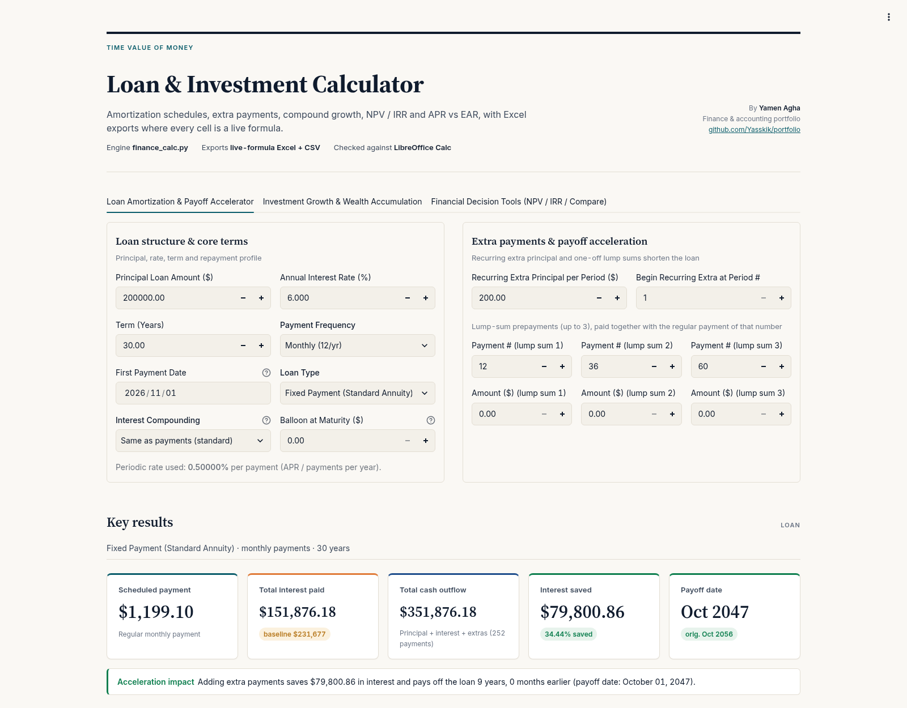
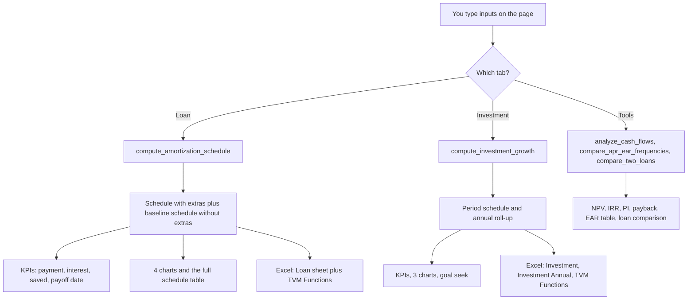
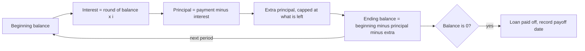
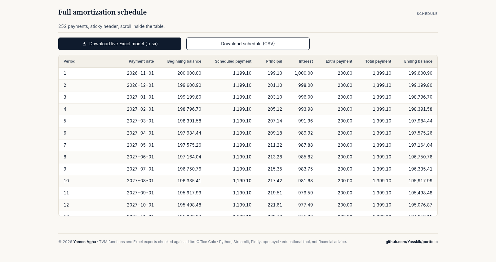
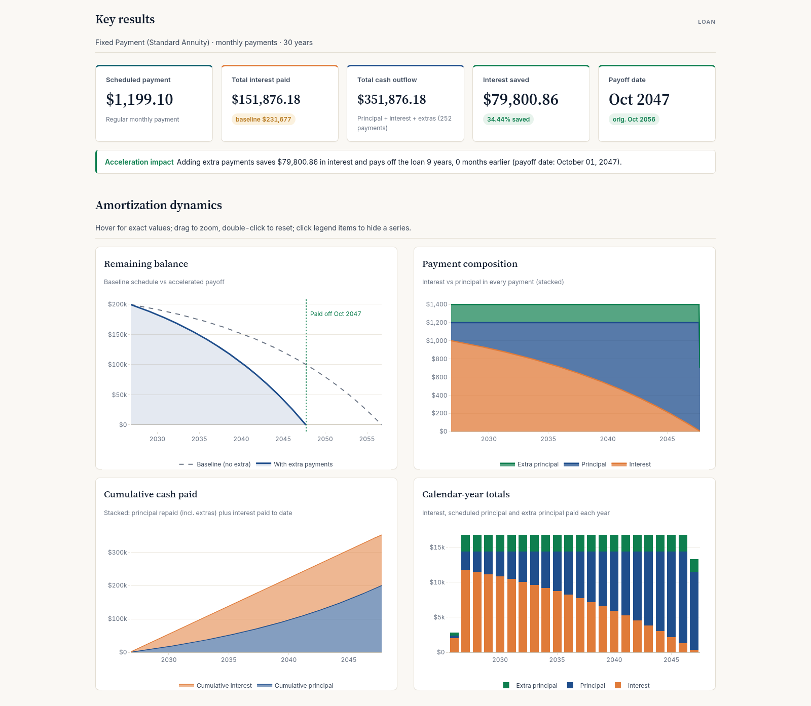
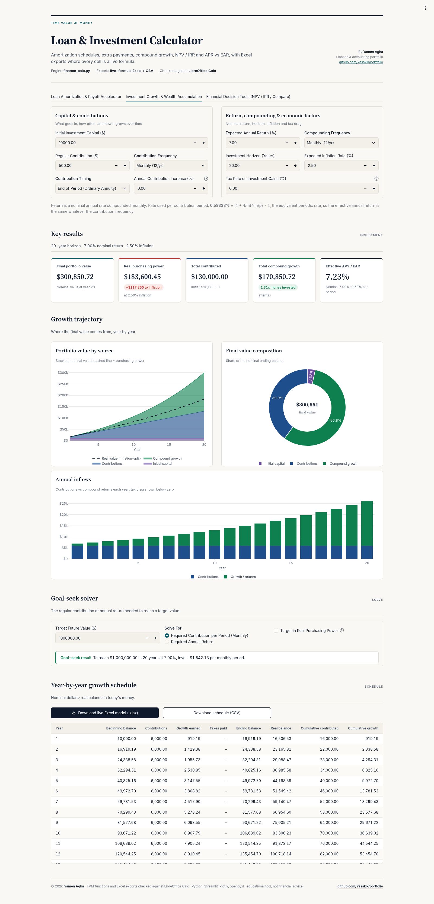
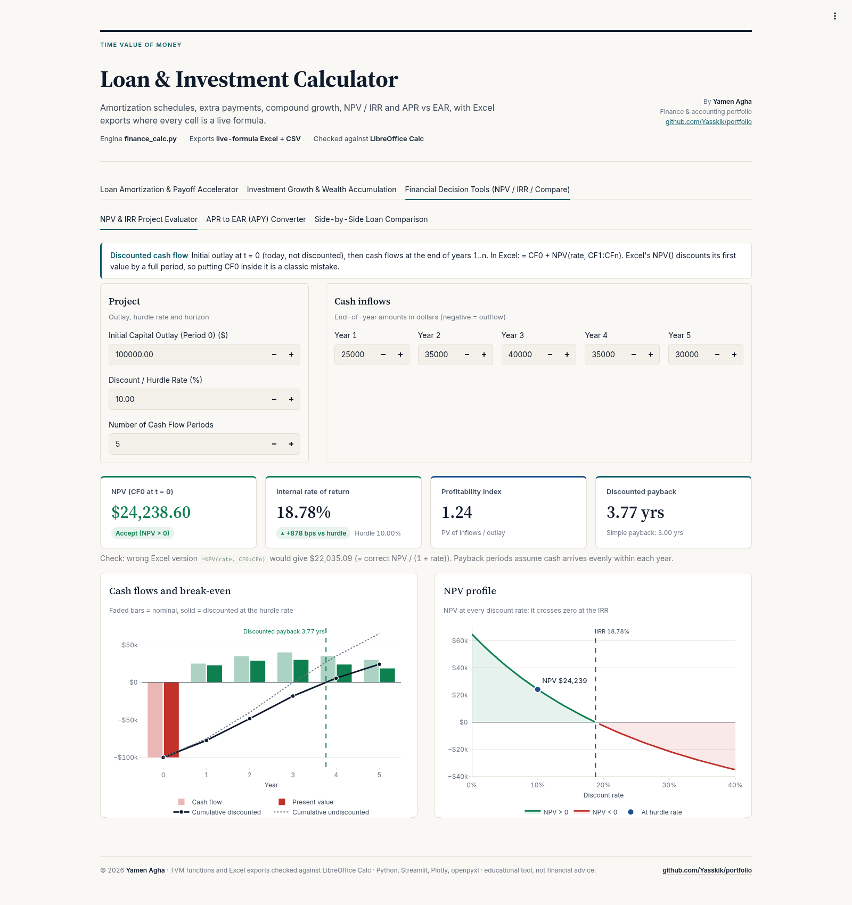
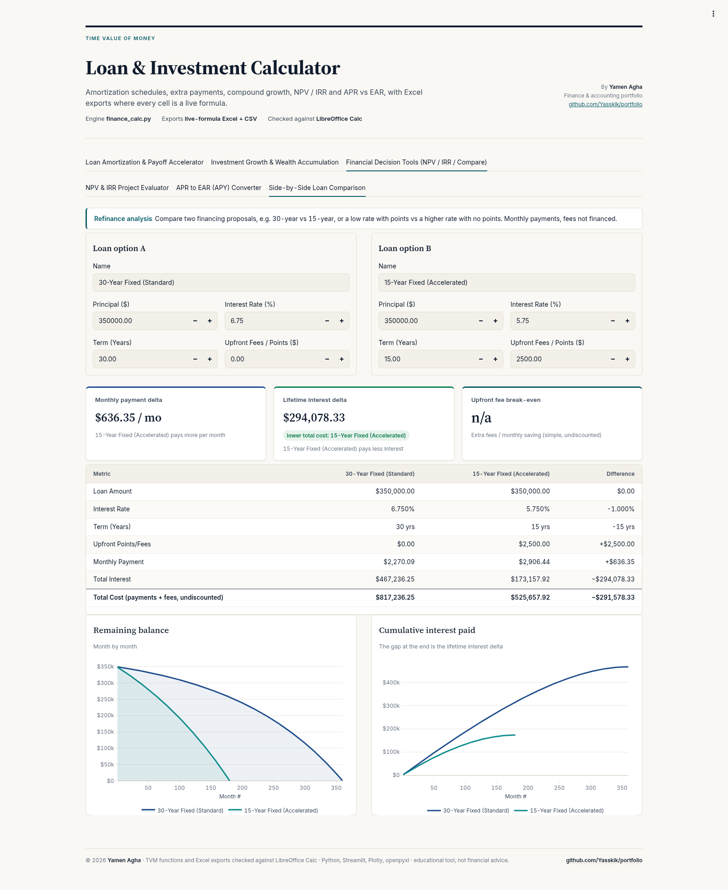
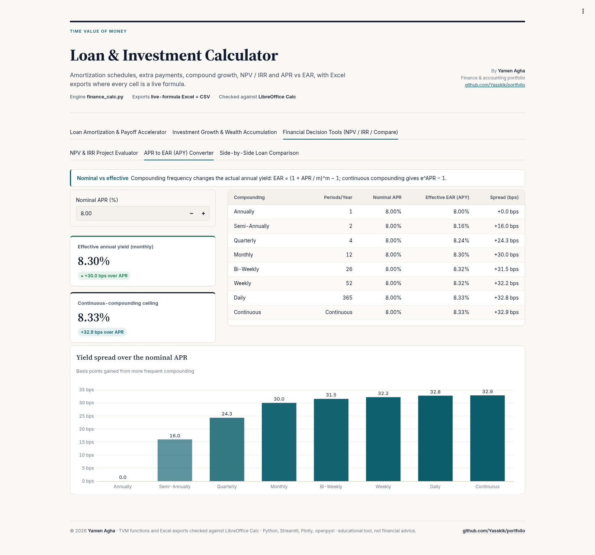
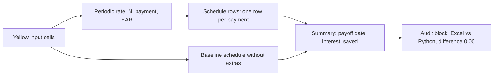

# 🏦 Loan & Investment Calculator

[](https://www.python.org/) [](https://streamlit.io/) [](examples/Mortgage_25yr_300k.xlsx) [](tests/) [](LICENSE)

> Part of [Yamen Agha's portfolio](../../README.md) · [Finance projects](../README.md)

**Live demo:** [yamen-loan-calculator.streamlit.app](https://yamen-loan-calculator.streamlit.app/)
[](https://yamen-loan-calculator.streamlit.app/)

> The free app may take ~30 seconds to wake up if it has been idle.

**One-line pitch:** one friendly app that answers the three money questions everybody eventually asks: *"How much will this loan really cost me?"*, *"How much will my savings grow to?"* and *"Is this project or deal worth it?"*. And every answer can be downloaded as an Excel file full of live formulas. 🎉



📘 Want an even gentler start? There is also a beginner's guide: [GUIDE.md](GUIDE.md) ([PDF version](GUIDE.pdf)). Ready-made workbooks are in [examples/](examples/): [Mortgage_25yr_300k.xlsx](examples/Mortgage_25yr_300k.xlsx) and [Investment_Plan_30yr.xlsx](examples/Investment_Plan_30yr.xlsx).

---

## 📚 Table of contents

1. [What is this, in one breath?](#-what-is-this-in-one-breath)
2. [Why should I care?](#-why-should-i-care)
3. [Sample results](#-sample-results)
4. [The big picture: how data flows through the app](#%EF%B8%8F-the-big-picture-how-data-flows-through-the-app)
5. [Lessons: every concept, from zero](#-lessons-every-concept-from-zero)
   - [Lesson 1: Interest, the rent you pay on money](#lesson-1-interest-the-rent-you-pay-on-money-)
   - [Lesson 2: Compounding, interest on interest](#lesson-2-compounding-interest-on-interest-%EF%B8%8F)
   - [Lesson 3: APR, EAR and the rate per period](#lesson-3-apr-ear-and-the-rate-per-period-)
   - [Lesson 4: The loan payment formula](#lesson-4-the-loan-payment-formula-)
   - [Lesson 5: The amortization schedule, row by row](#lesson-5-the-amortization-schedule-row-by-row-)
   - [Lesson 6: Three kinds of loans and the balloon](#lesson-6-three-kinds-of-loans-and-the-balloon-)
   - [Lesson 7: Extra payments, the payoff accelerator](#lesson-7-extra-payments-the-payoff-accelerator-)
   - [Lesson 8: Growing an investment](#lesson-8-growing-an-investment-)
   - [Lesson 9: Inflation, tax drag and step-ups](#lesson-9-inflation-tax-drag-and-step-ups-)
   - [Lesson 10: Goal seek, working backwards](#lesson-10-goal-seek-working-backwards-)
   - [Lesson 11: NPV, is a project worth it?](#lesson-11-npv-is-a-project-worth-it-)
   - [Lesson 12: IRR, profitability index and payback](#lesson-12-irr-profitability-index-and-payback-)
   - [Lesson 13: Comparing two loans](#lesson-13-comparing-two-loans-%EF%B8%8F)
6. [Tour of the app, tab by tab](#%EF%B8%8F-tour-of-the-app-tab-by-tab)
7. [Every input field explained](#%EF%B8%8F-every-input-field-explained)
8. [Conventions, so every number can be checked](#-conventions-so-every-number-can-be-checked)
9. [The Excel export, sheet by sheet](#-the-excel-export-sheet-by-sheet)
10. [How to read the results and make a decision](#-how-to-read-the-results-and-make-a-decision)
11. [Limitations and common mistakes](#%EF%B8%8F-limitations-and-common-mistakes)
12. [FAQ](#-faq)
13. [Glossary](#-glossary)
14. [Features](#-features)
15. [Review notes: bugs fixed](#%EF%B8%8F-review-notes-bugs-fixed)
16. [Quick start](#-quick-start)
17. [Tech stack](#-tech-stack)
18. [Tests](#-tests)
19. [Project structure](#%EF%B8%8F-project-structure)
20. [Disclaimer, author and license](#-disclaimer-author-and-license)

---

## 🫁 What is this, in one breath?

This is a **time-value-of-money** toolkit in a web app. It has three tabs:

- **Loans:** type in a loan (amount, rate, years) and it builds the full payment-by-payment schedule, showing how much of each payment is interest and how much actually pays the loan down. Add extra payments and it shows the interest you save and your new, earlier payoff date.
- **Investments:** type in a starting amount and a monthly saving, and it shows how compound growth turns that into a big number, what that number is worth after inflation, and how much you would need to save to hit a target.
- **Tools:** judge a project with NPV and IRR, convert a quoted rate (APR) into the rate you really pay or earn (EAR), and put two loan offers side by side.

Everything can be exported to Excel, where **each schedule cell is a live formula**. The workbooks were recalculated in LibreOffice and match the Python engine to the cent.

## 🤔 Why should I care?

Great question! Because these are the most common money decisions in real life:

- 🏠 **A mortgage or car loan** is often the biggest contract a person signs. On the sample loan below, the bank collects **more in interest than the amount you borrowed**. Seeing that is eye-opening.
- 💸 **Paying a little extra** each month can save tens of thousands. On that same loan, 200 extra a month saves **79,800.86** of interest and ends the loan 9 years earlier.
- 🌱 **Saving early** works like magic: in the investment example, you put in 130,000 and compound growth adds **170,850.72** on top.
- 🧮 **Companies and accountants** use NPV and IRR every day to decide which projects to fund. As an accounting student you will meet them in managerial accounting and corporate finance.
- 📊 And all of it is checkable: the Excel export shows every formula, so you can learn the mechanics by clicking into cells.

## 🏆 Sample results

These were produced by the engine (`finance_calc.py`) with the app's default-style inputs, and re-run while writing this README:

| Scenario | Result |
|---|---|
| 200,000 loan, 6% APR, 30 years, monthly | Payment **1,199.10**. Total interest **231,677.04**. The last payment is 1,200.14, so the balance ends at exactly 0.00. |
| Same loan + 200/month extra (the app's default) | Interest **151,876.18**, so **79,800.86 is saved**. Paid off in 252 payments instead of 360 (**9 years earlier**, October 2047 instead of October 2056). |
| 10,000 + 500/month, 7% compounded monthly, 20 years (end of month) | Final value **300,850.72**. You put in **130,000.00**, and growth adds **170,850.72**. In today's money (2.5% inflation) that is 183,600.45. |
| Project: −100,000 then 25k, 35k, 40k, 35k, 30k at 10% | NPV **24,238.60**, IRR **18.78%**, PI 1.24, discounted payback 3.77 years |

(All amounts are in dollars, which is the currency label the app uses. The maths works the same for any currency.)

---

## 🗺️ The big picture: how data flows through the app

Every tab follows the same pattern: **your inputs → one engine (`finance_calc.py`) → tables, KPIs and charts → optional Excel/CSV download**.



And here is what happens *inside* the loan engine for every single payment:



---

## 🎓 Lessons: every concept, from zero

Each lesson works the same way: **an everyday analogy → the real formula the code uses → a small worked example with numbers.**

### Lesson 1: Interest, the rent you pay on money 🏠

**Wait, what is interest?** Great question! Imagine borrowing your friend's car for a year. You would expect to pay them something for the favour, a kind of rent. **Interest is rent on money.** When you borrow, you pay it. When you save or invest, someone pays it to you.

**Why does money "cost" anything at all?** Because the lender gives up the chance to use that money elsewhere, takes the risk you never pay it back, and inflation slowly eats its value. Interest compensates for all three.

The basic idea, for one period:

```math
\text{Interest} = \text{Balance} \times i
```

where $i$ is the interest rate **for that period** (we will see in Lesson 3 how the app gets $i$).

**Worked example.** You owe 200,000 and the monthly rate is 0.5% (6% a year ÷ 12):

```math
200{,}000 \times 0.005 = 1{,}000
```

So the first month's rent on the money is exactly **1,000**. That is precisely the first row of the app's schedule for the sample loan. 🎯

### Lesson 2: Compounding, interest on interest ❄️

**Okay, so what is compounding?** Think of a snowball rolling downhill. It picks up snow, and the bigger it gets, the *more* snow it picks up on each turn. With compounding, the interest you earn is added to your balance, and next period **you earn interest on the interest too**.

```math
FV = PV \times (1 + i)^{n}
```

- $PV$ = present value, the money you start with
- $i$ = rate per period
- $n$ = number of periods
- $FV$ = future value, what it grows into

**Worked example (illustrative).** 1,000 at 10% a year for 3 years:

| Year | Start | Interest (10%) | End |
|---:|---:|---:|---:|
| 1 | 1,000 | 100 | 1,100 |
| 2 | 1,100 | 110 | 1,210 |
| 3 | 1,210 | 121 | 1,331 |

Check with the formula: $1{,}000 \times 1.1^3 = 1{,}331$. ✅ Notice the interest grew from 100 to 121 without you adding a cent. That is the snowball.

**Bonus: continuous compounding.** If you compounded every instant (infinitely often), the formula becomes $FV = PV \times e^{r t}$. The Investment tab offers this as "Continuous Compounding".

### Lesson 3: APR, EAR and the rate per period 🔁

**Wait, the bank says "6% a year", but I pay monthly. Which rate is used?** Excellent question, and it confuses almost everyone!

- **APR** (annual percentage rate, also called the *nominal* rate) is the **quoted** yearly rate. It is a label, like the price on a menu.
- **EAR** (effective annual rate, called **APY** for savings) is what you **really** pay or earn in a year once compounding is counted. It is the bill you actually get.
- The **rate per period** $i$ is what the engine actually multiplies the balance by each period.

The app's rule (from `periodic_rate` in `finance_calc.py`):

```math
i = \left(1 + \frac{APR}{m}\right)^{m/p} - 1
```

where $m$ = how many times a year interest **compounds** and $p$ = how many **payments** (or contributions) a year. In the normal case $m = p$, so this collapses to simply:

```math
i = \frac{APR}{p}
```

For continuous compounding the code uses $i = e^{APR/p} - 1$.

The EAR (same as Excel's `EFFECT`):

```math
EAR = \left(1 + \frac{APR}{m}\right)^{m} - 1
```

**Worked example 1: monthly.** APR 6%, monthly: $`i = 0.06/12 = 0.5\%`$ and $`EAR = 1.005^{12} - 1 = 6.168\%`$. So "6%" really costs 6.168% a year. Sneaky! 😮

**Worked example 2: a Canadian mortgage.** Canadian mortgages compound **semi-annually** ($m = 2$) but are paid **monthly** ($p = 12$). The equivalent monthly rate is:

```math
i = \left(1 + \frac{0.06}{2}\right)^{2/12} - 1 = 0.49386\%
```

That is slightly *less* than 0.5%, so the payment on a 200,000, 30-year loan drops from 1,199.10 to **1,189.65** (computed with the engine). The app shows the exact periodic rate it used under the loan inputs, so you never have to guess.

**Worked example 3: the APR → EAR tool at 8%** (straight from the app's table):

| Compounding | EAR | Extra over APR |
|---|---:|---:|
| Annually | 8.0000% | 0 bps |
| Semi-annually | 8.1600% | 16.00 bps |
| Quarterly | 8.2432% | 24.32 bps |
| Monthly | 8.3000% | 30.00 bps |
| Bi-weekly | 8.3154% | 31.54 bps |
| Weekly | 8.3220% | 32.20 bps |
| Daily | 8.3278% | 32.78 bps |
| Continuous | 8.3287% | 32.87 bps |

**What is a "bp"?** A basis point is one hundredth of a percent (0.01%). So 30 bps = 0.30%.

### Lesson 4: The loan payment formula 🧮

**How does the bank decide my monthly payment?** Think of a pizza you must finish in exactly 360 bites, while the pizza *keeps growing a little* between bites (that is the interest). The payment formula finds the one bite size that, repeated every time, finishes the pizza right on the last bite. 🍕

This is called an **annuity** payment (Excel's `PMT`):

```math
PMT = \frac{P \cdot i \,(1+i)^{n}}{(1+i)^{n} - 1}
```

- $P$ = principal (the amount borrowed)
- $i$ = rate per period
- $n$ = number of payments = years × payments per year

The app rounds this to cents: `ROUND(PMT(i, n, −P, balloon), 2)`. If the rate is zero, it simply uses $P / n$, so there is no division by zero.

**Worked example: the sample loan.** $P = 200{,}000$, $i = 0.005$, $n = 30 \times 12 = 360$.

1. $(1+i)^n = 1.005^{360} = 6.022575$
2. Top: $200{,}000 \times 0.005 \times 6.022575 = 6{,}022.58$
3. Bottom: $6.022575 - 1 = 5.022575$
4. $PMT = 6{,}022.58 / 5.022575 = 1{,}199.10$ ✅

Multiply by 360 payments and you pay about 431,677 in total, of which **231,677.04 is interest**. You borrowed 200,000 and paid back more than double. 😲

### Lesson 5: The amortization schedule, row by row 📋

**What does "amortization" mean?** It just means paying a debt off bit by bit. The **schedule** is a table with one row per payment showing where every cent goes.

Each row follows these exact rules from the engine:

```math
\text{Interest}_t = \operatorname{round}(\text{Balance}_{t-1} \times i,\ 2)
```

```math
\text{Principal}_t = \text{Payment} - \text{Interest}_t
```

```math
\text{Balance}_t = \text{Balance}_{t-1} - \text{Principal}_t - \text{Extra}_t
```

**Worked example: the first three rows of the sample loan** (exact app output):

| # | Date | Beginning balance | Payment | Interest | Principal | Ending balance |
|---:|---|---:|---:|---:|---:|---:|
| 1 | 2026-11-01 | 200,000.00 | 1,199.10 | 1,000.00 | 199.10 | 199,800.90 |
| 2 | 2026-12-01 | 199,800.90 | 1,199.10 | 999.00 | 200.10 | 199,600.80 |
| 3 | 2027-01-01 | 199,600.80 | 1,199.10 | 998.00 | 201.10 | 199,399.70 |

Walk through row 2: interest = 199,800.90 × 0.005 = 999.00 (rounded). Principal = 1,199.10 − 999.00 = 200.10. New balance = 199,800.90 − 200.10 = 199,600.80. 🎉

**Notice something?** In the beginning, about 83% of each payment is interest! As the balance shrinks, the interest part shrinks and the principal part grows. The **Payment composition** chart shows this beautifully.

**And the last row?** Rounding to cents leaves a few cents of "dust", so the **final payment absorbs it** and the balance ends at **exactly 0.00**. On the sample loan, the last payment (October 2056) is 1,200.14 instead of 1,199.10:

| # | Date | Beginning balance | Payment | Interest | Principal | Ending balance |
|---:|---|---:|---:|---:|---:|---:|
| 359 | 2056-09-01 | 2,381.36 | 1,199.10 | 11.91 | 1,187.19 | 1,194.17 |
| 360 | 2056-10-01 | 1,194.17 | 1,200.14 | 5.97 | 1,194.17 | 0.00 |



**How are the dates worked out?** The date you enter is the **first payment date**. Monthly-type frequencies step forward in calendar months, like Excel's `EDATE` (Jan 31 → Feb 28/29 → Mar 31). Bi-weekly adds 14 days and weekly adds 7.

### Lesson 6: Three kinds of loans and the balloon 🎈

**Are all loans paid the same way?** Nope! The app supports three "Loan Type" options:

| Loan type | Analogy | What happens | Payment shape |
|---|---|---|---|
| **Fixed Payment (Standard Annuity)** | Same-size bites every time | Payment from Lesson 4, the same every period | Flat |
| **Equal Principal Amortization** | Cut the pizza into equal slices, plus rent on what is left | Principal part = $P/n$ every period, plus interest on the current balance | Starts high, falls each period |
| **Interest-Only then Balloon** | Pay only the rent, return the whole car at the end | You pay just the interest; the whole principal is due with the last payment | Flat and low, then one huge last payment |

**Worked example (computed with the engine): 120,000 at 6% over 10 years, monthly.**

- **Equal principal:** principal per payment = 120,000 / 120 = 1,000. Payment 1 = 1,000 + 120,000 × 0.005 = **1,600.00**. Payment 2 = 1,000 + 119,000 × 0.005 = **1,595.00**. It keeps falling by 5 each month.
- **Interest-only:** every payment is 120,000 × 0.005 = **600.00**, and the last one is **120,600.00** (the whole principal plus the final interest). Total interest: **72,000.00**.

**What is a balloon on a fixed-payment loan?** It is a chunk you choose to leave unpaid until the very end. The app sets the payment so that exactly the balloon is still owed, and you pay it with the final payment. Formula:

```math
PMT = \frac{\left(P - \dfrac{B}{(1+i)^{n}}\right) i}{1 - (1+i)^{-n}}
```

**Worked example:** the 200,000, 6%, 30-year loan with a **50,000 balloon** has a payment of **1,149.33** (instead of 1,199.10), and the final payment is **51,145.42** (the balloon plus the last regular payment). Lower monthly payments, but a big bill at the end. ⚠️

The balloon field is only active for fixed-payment loans. Interest-only loans always end with the whole principal as the balloon.

### Lesson 7: Extra payments, the payoff accelerator 🚀

**What happens if I pay more than I have to?** This is the fun part! Every extra cent goes **100% to principal**. A smaller balance means less interest next month, so more of your *regular* payment also goes to principal. It is the snowball rolling the other way. ⛄

The app's rules:

- A **recurring extra** amount is added every period, starting from the period number you choose.
- Up to **3 lump sums** can be paid with specific payment numbers (defaults suggest payments 12, 36 and 60, with amount 0 until you type one).
- Extras are **capped at the remaining balance**, so you can never overpay.
- The regular payment is **not recalculated**. The loan just ends sooner.
- To measure "interest saved", the engine also builds a **baseline schedule** with no extras and compares the two.

```math
\text{Interest saved} = \text{Baseline interest} - \text{Actual interest}
```

**Worked example: the app's default (200 extra every month).**

| | Baseline | With 200/month extra |
|---|---:|---:|
| Payments | 360 | 252 |
| Total interest | 231,677.04 | 151,876.18 |
| Payoff | October 2056 | October 2047 |

First row with the extra: interest 1,000.00, principal 199.10, extra 200.00, so the balance drops to **199,600.90** instead of 199,800.90. Over time that adds up to **79,800.86** saved, about a third of all the interest, and **9 years** of freedom. 🥳



The **Remaining balance** chart shows both lines: the baseline curve and the faster "accelerated" curve diving to zero years earlier.

### Lesson 8: Growing an investment 🌱

**How does the Investment tab work?** Picture a tree you plant (the **initial investment**) and then water every month (the **regular contribution**). Each month the tree grows a percentage (the **return**), and the growth itself grows. That is compounding on autopilot.

Each period, the engine does:

```math
\text{Growth}_t = (\text{Balance}_{t-1} + c \cdot C_t) \times i
```

```math
\text{Balance}_t = \text{Balance}_{t-1} + C_t + \text{Growth}_t - \text{Tax}_t
```

where $C_t$ is the contribution and $c = 1$ if contributions are made at the **beginning** of the period (so they earn that period's growth, an "annuity due"), or $c = 0$ at the **end** (an "ordinary annuity"). No rounding happens between periods.

With no tax and no step-up this equals Excel's `FV`:

```math
FV = P_0 (1+i)^{n} + C \cdot \frac{(1+i)^{n} - 1}{i} \cdot (1 + c \cdot i)
```

**Worked example: the default plan.** 10,000 to start, 500 a month at the end of each month, 7% compounded monthly, 20 years.

1. $`i = 0.07/12 = 0.58333\%`$ and $n = 240$
2. $(1+i)^{240} = 4.038739$
3. The initial 10,000 grows to $10{,}000 \times 4.038739 = 40{,}387.39$
4. The contributions grow to $500 \times \frac{4.038739 - 1}{0.0058333} = 260{,}463.33$
5. Total: $40{,}387.39 + 260{,}463.33 =$ **300,850.72** ✅

You put in $10{,}000 + 500 \times 240 = 130{,}000$, so growth contributed **170,850.72**, more than you saved yourself! 🌳

**What if I contribute at the beginning of each month?** Each 500 gets one extra month of growth, and the engine gives **302,370.09**, about 1,519 more.



### Lesson 9: Inflation, tax drag and step-ups 🎈💸📈

**Wait, is 300,850 in 20 years really 300,850?** Not in spending power! **Inflation** means prices rise, so a dollar later buys less. The app converts the result into **today's money** (the "real" value):

```math
\text{Real value} = \frac{\text{Nominal value}}{(1 + \pi)^{\text{years}}}
```

**Worked example:** with 2.5% inflation, $1.025^{20} = 1.638616$, so $300{,}850.72 / 1.638616 =$ **183,600.45** in today's money. Still great, but 117,250 less impressive. 😅

The real *return* (the Fisher relation) is:

```math
r_{real} = \frac{1 + r_{nominal}}{1 + \pi} - 1
```

With an effective 7.229% return and 2.5% inflation, that is about **4.61%** a year of genuine growth.

**What is "tax drag"?** The "Tax Rate on Investment Gains" field uses a simple model: each period's **positive** growth is taxed at the rate you set, and the tax is paid out of the account (losses get no refund). It is like interest in a taxable savings account, **not** capital-gains tax on sale.

```math
\text{Tax}_t = \max(0,\ \text{Growth}_t) \times \tau
```

**Worked example (engine):** the default plan with a 15% tax rate ends at **262,431.08**, and 23,370.19 of tax was paid along the way. Tax drag compounds too!

**And the step-up?** "Annual Contribution Increase (%)" raises your contribution once a year, for example to match salary rises:

```math
C_{\text{year } y} = C \times (1 + g)^{y-1}
```

The ready-made example [`Investment_Plan_30yr.xlsx`](examples/Investment_Plan_30yr.xlsx) uses this: 10,000 + 500/month at 7% for 30 years, rising 3% a year, ends at 914,744.96 (436,097.97 in today's money), with 295,452.49 invested in total.

### Lesson 10: Goal seek, working backwards 🎯

**What if I know where I want to end up?** Goal seek answers: *"To reach 1,000,000, how much must I save each period?"* or *"...what return would I need?"*

- **Required contribution:** the final value is a straight-line function of the contribution, so the engine solves it **exactly** and then double-checks it.
- **Required annual return:** there is no neat formula, so the engine uses **bisection**: guess a rate between −99% and 100%, see if the result is too high or too low, halve the range, repeat. If the target cannot be reached, it says so instead of inventing a number.
- **Target in Real Purchasing Power:** tick this and the target is treated as today's money, so it is inflated over the horizon first.

**Worked example (engine, default plan inputs, target 1,000,000 nominal):**

- Required monthly contribution: **1,842.13** (instead of 500)
- Or, keeping 500 a month, required annual return: **15.36%**

Which one looks more realistic to you? That is exactly the kind of conversation this tool is for. 😉

### Lesson 11: NPV, is a project worth it? 💡

**Wait, what is a discount rate?** Great question! Imagine someone offers you 100 today or 100 in a year. You take it today, right? You could invest it, and the future is uncertain. So money in the future is worth **less** than money today. A **discount rate** (also called the **hurdle rate**) is the yearly return you could get elsewhere for similar risk. We use it to shrink future cash back into today's money: that is **discounting**, compounding in reverse.

```math
PV = \frac{CF_t}{(1 + r)^{t}}
```

**And NPV?** **Net present value** adds up all the discounted future cash flows and subtracts what you pay today:

```math
NPV = CF_0 + \sum_{t=1}^{n} \frac{CF_t}{(1+r)^{t}}
```

$CF_0$ is the initial outlay (negative, at time 0, **not** discounted). The rule: **NPV > 0 → the project earns more than your hurdle rate → it creates value.** ✅

**Worked example: the app's default project.** Pay 100,000 today, receive 25k, 35k, 40k, 35k, 30k at the end of years 1–5, hurdle rate 10%.

| Year | Cash flow | Discount factor $1/1.1^t$ | Present value | Cumulative PV |
|---:|---:|---:|---:|---:|
| 0 | −100,000 | 1.0000 | −100,000.00 | −100,000.00 |
| 1 | 25,000 | 0.9091 | 22,727.27 | −77,272.73 |
| 2 | 35,000 | 0.8264 | 28,925.62 | −48,347.11 |
| 3 | 40,000 | 0.7513 | 30,052.59 | −18,294.52 |
| 4 | 35,000 | 0.6830 | 23,905.47 | 5,610.95 |
| 5 | 30,000 | 0.6209 | 18,627.64 | 24,238.60 |

**NPV = 24,238.60.** Positive, so at a 10% hurdle the project is a go. 🟢

**🚨 The classic Excel trap.** Excel's `NPV()` assumes its **first** value arrives at the end of period 1. So the right formula is `=CF0 + NPV(r, CF1:CFn)`. If you write `=NPV(r, CF0:CFn)`, everything is discounted one period too much and you get **22,035.09** (which is just 24,238.60 / 1.10). The app shows this wrong number on purpose, so you learn to spot it.



### Lesson 12: IRR, profitability index and payback 📐

**What is IRR?** The **internal rate of return** is the discount rate that makes NPV exactly zero. Think of it as the project's own "interest rate". If IRR beats your hurdle rate, the project clears the bar.

```math
0 = CF_0 + \sum_{t=1}^{n} \frac{CF_t}{(1 + IRR)^{t}}
```

There is no direct formula, so the engine uses **Newton's method** (smart guessing using the slope) with a **bisection fallback**. For the default project, **IRR = 18.78%**, comfortably above 10%. The **NPV profile** chart draws NPV at every discount rate; the line crosses zero exactly at the IRR.

**Can IRR go wrong?** Yes, and the app warns you:

- If the cash flows never change sign (e.g. all positive), there is **no IRR**, and the app shows n/a.
- If the signs change **more than once**, there can be several IRRs. Example (engine): −100, +230, −132 has IRRs of **10.00% and 20.00%**, and the app says *"Multiple IRRs... use NPV to decide."* In that case, trust NPV.

**Profitability index (PI)** is "value per dollar invested":

```math
PI = \frac{\text{PV of future cash flows}}{|CF_0|}
```

Default project: $124{,}238.60 / 100{,}000 = 1.24$. Above 1 means NPV is positive. For a zero outlay, PI is n/a.

**Payback** is how long until you get your money back:

- **Simple payback:** cumulative cash −75,000, −40,000, 0 → exactly **3.00 years**.
- **Discounted payback** uses the discounted column: after year 3 you still need 18,294.52, and year 4 brings 23,905.47, so $3 + 18{,}294.52 / 23{,}905.47 =$ **3.77 years**. If you never break even, the app says "Beyond horizon".

### Lesson 13: Comparing two loans ⚖️

**15 years or 30 years? Pay fees for a lower rate or not?** The comparison tool builds both loans (monthly payments, fees paid upfront and not financed) and lines them up.

- **Totals are simple sums** of cash paid (not discounted).
- **Total cost** = all payments + upfront fees.
- **Fee break-even** (months) = extra fees ÷ monthly payment saving. It only exists when the loan with higher fees also has the lower payment; otherwise it shows n/a.
- **APR with fees:** if a loan has fees, the engine finds the rate at which *(principal − fees)* equals the payments, using `RATE`. This is the "true" cost of a loan with points.

**Worked example: the app's defaults** (engine output):

| | A: 30-Year Fixed (Standard) | B: 15-Year Fixed (Accelerated) |
|---|---:|---:|
| Principal | 350,000 | 350,000 |
| Rate | 6.75% | 5.75% |
| Fees | 0 | 2,500 |
| Monthly payment | 2,270.09 | 2,906.44 |
| Total interest | 467,236.25 | 173,157.92 |
| Total cost incl. fees | 817,236.25 | 525,657.92 |
| APR with fees | n/a (no fees) | 5.861% |

B costs **636.35 more per month** but saves **294,078.33 of interest** and has the lower total cost. The fee break-even is n/a, because B has both the higher fee *and* the higher payment, so there is no monthly saving to "earn back" the fee. The right choice depends on whether you can comfortably afford the higher payment. 💪



---
## 🖥️ Tour of the app, tab by tab

The app has three big tabs across the top.

### 1. Loan Amortization & Payoff Accelerator 🏠

**Top half, two input boxes:**
- *Loan structure & core terms*: principal, rate, term, payment frequency, first payment date, loan type, compounding, balloon. Under the box, a caption shows the **periodic rate actually used**.
- *Extra payments & payoff acceleration*: recurring extra, its start period, and 3 lump-sum slots.

**Key results (5 KPI cards):**

| Card | What it means |
|---|---|
| Scheduled payment | The regular payment. For equal-principal loans it is the *first* payment (it falls each period); for interest-only loans the note shows the balloon. |
| Total interest paid | Interest over the whole life, with the baseline (no extras) shown underneath |
| Total cash outflow | Principal + interest + extras, and the number of payments actually made |
| Interest saved | Baseline interest minus actual interest, and the % saved |
| Payoff date | Your payoff month vs the original one |

If extras save anything, a green callout spells out the time saved in years and months.


**Amortization dynamics (4 interactive charts):**
1. **Remaining balance**: baseline vs accelerated payoff.
2. **Payment composition**: interest vs principal in every payment, stacked. Watch the interest slice shrink!
3. **Cumulative cash paid**: principal repaid (incl. extras) plus interest paid to date.
4. **Calendar-year totals**: interest, scheduled principal and extra principal paid each year.


**Full amortization schedule:** every payment in a scrollable table, plus two buttons: **Download live Excel model (.xlsx)** and **Download schedule (CSV)**.


### 2. Investment Growth & Wealth Accumulation 🌱

- Two input boxes: *Capital & contributions* and *Return, compounding & economic factors*. A caption shows the periodic rate used, $(1 + R/m)^{m/p} - 1$, so the effective annual return is the same whatever the contribution frequency.
- **Key results** cards: *Final portfolio value*, *Real purchasing power* (today's money), *Total contributed*, *Total compound growth* and *Effective APY / EAR*.
- **Growth trajectory** charts: *Portfolio value by source* (stacked, with a dashed purchasing-power line), *Final value composition* (a pie of the ending balance) and *Annual inflows* (contributions vs returns each year, with tax drag below zero).
- **Goal-seek solver**: target, "solve for" choice and the real-money checkbox (Lesson 10).
- **Year-by-year growth schedule** with Excel and CSV download buttons.


### 3. Financial Decision Tools (NPV / IRR / Compare) 🧰

Three sub-tabs:

1. **NPV & IRR Project Evaluator**: outlay, hurdle rate, up to 25 years of cash flows. Cards for NPV, IRR, profitability index and discounted payback; a *Cash flows and break-even* chart (faded bars = nominal, solid = discounted) and the *NPV profile* chart. (Lessons 11 and 12.)
2. **APR to EAR (APY) Converter**: type an APR (default 8%) and see the EAR for every compounding frequency, plus a *Yield spread over the nominal APR* chart in basis points. (Lesson 3.)
3. **Side-by-Side Loan Comparison**: two loans, KPI cards for the monthly payment delta, lifetime interest delta and fee break-even, a comparison table, and *Remaining balance* and *Cumulative interest paid* charts. (Lesson 13.)

| NPV & IRR | APR vs EAR |
|---|---|
|  |  |


---

## 🎚️ Every input field explained

### Loan tab

| Field | Default | Allowed | What it means |
|---|---|---|---|
| Principal Loan Amount | 200,000 | 1,000 to 100,000,000 | How much you borrow |
| Annual Interest Rate (%) | 6.000 | 0 to 40 | The quoted APR |
| Term (Years) | 30 | 0.5 to 50 | How long the loan lasts |
| Payment Frequency | Monthly | Monthly, Bi-Weekly, Weekly, Quarterly, Semi-Annual, Annual | Payments per year $p$ |
| First Payment Date | 2026-11-01 | any date | Date of payment #1 (31st → last day of shorter months) |
| Loan Type | Fixed Payment | Fixed Payment, Equal Principal, Interest-Only then Balloon | Lesson 6 |
| Interest Compounding | Same as payments | Same as payments, Semi-annual (Canadian), Monthly, Annual, Daily (365) | $m$ in Lesson 3 |
| Balloon at Maturity | 0 | 0 to principal − 1 | Fixed-payment loans only (Lesson 6) |
| Recurring Extra Principal per Period | **200** | 0 to 500,000 | Extra paid every period (Lesson 7). Set it to 0 to see the plain loan. |
| Begin Recurring Extra at Period # | 1 | 1 to number of payments | When the recurring extra starts |
| Lump sum 1–3: Payment # and Amount | payments 12, 36, 60; amount 0 | any payment number | One-off extra payments, paid with that regular payment |

### Investment tab

| Field | Default | Allowed | What it means |
|---|---|---|---|
| Initial Investment Capital | 10,000 | 0 to 100,000,000 | What you start with |
| Regular Contribution | 500 | 0 to 500,000 | How much you add each period |
| Contribution Frequency | Monthly | Monthly, Bi-Weekly, Weekly, Quarterly, Semi-Annual, Annually | Contributions per year $p$ |
| Contribution Timing | End of Period | End (ordinary annuity) or Beginning (annuity due) | Lesson 8 |
| Annual Contribution Increase (%) | 0 | −10 to 25 | Step-up $g$ (Lesson 9) |
| Expected Annual Return (%) | 7.0 | −20 to 100 | Nominal annual return |
| Compounding Frequency | Monthly | Monthly, Quarterly, Semi-Annually, Annually, Daily, Continuous | $m$ |
| Investment Horizon (Years) | 20 | 1 to 60 | How long you invest |
| Expected Inflation Rate (%) | 2.5 | 0 to 20 | $\pi$, for the real value |
| Tax Rate on Investment Gains (%) | 0 | 0 to 50 | Tax drag $\tau$ (Lesson 9) |
| Goal seek: Target Future Value | 1,000,000 | 1,000 to 1,000,000,000 | Where you want to end up |
| Goal seek: Solve For | Required Contribution | Contribution or Annual Return | What to solve for |
| Goal seek: Target in Real Purchasing Power | off | on/off | Treat the target as today's money |

### Tools tab

| Field | Default | What it means |
|---|---|---|
| Initial Capital Outlay (Period 0) | 100,000 | What the project costs today (entered as a positive number) |
| Discount / Hurdle Rate (%) | 10 | Your required return, 0 to 50 |
| Number of Cash Flow Periods | 5 | 1 to 25 years |
| Year 1…n | 25k, 35k, 40k, 35k, 30k (then 30k) | End-of-year cash flows; negative = outflow |
| Nominal APR (%) | 8 | Nominal rate for the EAR table |
| Loan A / B: Name, Principal, Rate, Term, Upfront Fees | A: 30-Year Fixed, 350,000, 6.75%, 30, 0. B: 15-Year Fixed, 350,000, 5.75%, 15, 2,500 | The two offers to compare (monthly payments) |

---

## 📏 Conventions, so every number can be checked

| Item | Convention used |
|---|---|
| Rate per period | i = (1 + APR/m)^(m/p) − 1, where m is compounding periods a year and p is payments (or contributions) a year. If m = p (the normal case), this is simply **APR / p**. For continuous compounding, i = e^(APR/p) − 1. The app always shows the rate it used. |
| EAR / APY | (1 + APR/m)^m − 1, the same as Excel `EFFECT`. The inverse is `NOMINAL`. |
| Fixed payment | `ROUND(PMT(i, n, −P, balloon), 2)` |
| Interest each period | `ROUND(balance × i, 2)`. The cents are rounded **half-up, like Excel**; Python's default `round()` would round half to even. |
| Final payment | The last payment pays off whatever is left, so the balance ends at **exactly 0.00**. With a balloon loan, the balloon is paid with the last payment. |
| Extra payments | Go fully to principal and are capped at the balance. The regular payment is **not recalculated**, so the loan simply ends sooner. |
| Dates | The start date is the **first payment date**. Monthly-type frequencies use calendar months counted from that first date, like Excel `EDATE`: Jan 31 → Feb 28/29 → Mar 31. Bi-weekly adds 14 days and weekly adds 7. |
| Zero-interest loans | Payment = P / n. There is no division by zero. |
| Investment timing | End of period = ordinary annuity. Beginning = annuity due, where the contribution earns that period's return. With no tax or step-up, the result equals Excel `FV(i, n, −C, −P0, type)`. No rounding happens between periods. |
| Contribution step-up | The contribution in year y is C × (1 + g)^(y − 1). |
| Tax on gains | A simple "taxed as earned" model: each period's positive growth is taxed at t and the tax is taken out of the balance. A loss gives no refund. This is a simplification. Real accounts may tax only on sale, or not at all (tax-advantaged accounts). |
| Inflation | Real value = nominal value / (1 + π)^(years). The Fisher real return is (1 + r)/(1 + π) − 1. |
| NPV | NPV = CF0 + Σ CFt/(1 + r)^t. In Excel that is **`=CF0 + NPV(r, CF1:CFn)`**, because Excel's `NPV()` treats its first value as arriving at **t = 1**. The app also shows the wrong result you get from `=NPV(r, CF0:CFn)`. |
| IRR | Newton's method, with a bracketed bisection fallback. If the cash flows never change sign, there is no IRR, so the app shows n/a. If they change sign more than once, it lists every root it finds between −99% and 1000% and warns that IRR is unreliable. In that case, use NPV. |
| Goal seek | **Contribution:** the final value is linear in the contribution, so it is solved exactly, then checked. **Return:** bisection between −99% and 100% a year; if the target can't be reached, the app says so. |

---

## 📗 The Excel export, sheet by sheet

**Which workbook do I get?** The Loan tab's button downloads **Loan + TVM Functions**. The Investment tab's button downloads **Investment + Investment (Annual) + TVM Functions**. In every sheet, **inputs are blue numbers on yellow cells; everything else is a live formula**, so you can change an input in Excel and watch the whole schedule update, including the payoff date and the interest saved.



| Sheet | Contents |
|---|---|
| Loan | Inputs (C4:C13): principal, APR, years, payments a year, compounding a year, first date, loan type, balloon, recurring extra and its start period. There is a lump-sum table (E5:F14). Calculated cells: the periodic rate, N, payment and EAR. Summary: payments, payoff date, interest, interest saved and the final payment. The schedule (row 32 on) uses `EDATE`, `ROUND`, `MIN`, `MAX`, `SUMIF` and `IF`, next to a **baseline schedule with no extras**. An audit block compares the results with Python. |
| Investment | Inputs (C4:C13), the periodic rate, N and EAR, a summary with an **Excel `FV()` cross-check**, and a period-by-period table (contribution, growth, tax, balance, real value). |
| Investment (Annual) | A year-by-year roll-up using `SUMIF` / `INDEX` |
| TVM Functions | Worked examples of `PMT`, `IPMT`, `PPMT`, `CUMIPMT`, `NPER`, `RATE`, `FV`, `EFFECT`, `NOMINAL`, the correct and the mistaken `NPV`, and `IRR` |

A closer look at the pieces a beginner should click on:

- **Loan sheet, cell C16 (periodic rate):** `=IF(C8=C7,C5/C7,IF(C8<=0,EXP(C5/C7)-1,(1+C5/C8)^(C8/C7)-1))`. That is Lesson 3 in one Excel formula!
- **Loan sheet, C17 and C18:** N = `ROUND(years × p, 0)` and the payment, which picks the right rule for loan type 1 (annuity), 2 (equal principal) or 3 (interest-only).
- **Loan summary (column I):** payments actually made (`COUNTIF`), payoff date (`INDEX`), total interest, total extra principal, total of all payments, final payment, interest without extras, **interest saved = I11 − I7**, payments saved and years saved.
- **Audit block (H17 onward):** "Excel (live)" vs "Python" vs "Difference". The Python values are frozen at export time, so the differences stay 0.00 until you change an input.
- **Rows:** the schedule has rows for the contractual term. Shortening the term works; lengthening it needs a new export. Up to 10 lump sums fit in the Excel table.
- **Investment sheet:** the `FV()` cross-check only applies with no step-up and no tax; otherwise it says "n/a (step-up or tax used)".
- **TVM Functions:** a mini Excel lesson. Excel's sign rule: money you receive is +, money you pay is −. It also shows the correct and mistaken NPV side by side (Lesson 11).

**Verification.** `scripts/verify_excel.py` builds the workbook for 15 scenarios, recalculates each one in headless LibreOffice and compares **every schedule and summary cell** with the Python engine. The scenarios are:

- **9 loans:** 30-year standard, with extras, a 25-year mortgage with lump sums, balloon, equal principal (quarterly), interest-only, bi-weekly, zero-rate, Canadian semi-annual compounding.
- **6 investments:** monthly, beginning timing with quarterly compounding, step-up + tax + inflation, daily compounding, weekly with continuous compounding, a negative return with tax.

Result: **42,256 cells compared, 0 mismatches, 0 error cells.** As a control, a tampered workbook is caught (1,020 mismatches). Separately, 104 TVM cases (`PMT`, `IPMT`, `PPMT`, `FV`, `PV`, `RATE`, `NPER`, `NPV`, `IRR`, `EFFECT`, `NOMINAL`) were checked against LibreOffice's own functions.

Examples (both recalculated and checked):

- [`Mortgage_25yr_300k.xlsx`](examples/Mortgage_25yr_300k.xlsx) (4,826 formulas on the Loan sheet): 300,000 at 6% over 25 years, with 200/month extra and a 10,000 lump sum at payment 60.
  - Payment 1,932.90.
  - Interest 205,217.43, which **saves 74,655.37**.
  - 233 payments instead of 300; paid off on 1 March 2046.
- [`Investment_Plan_30yr.xlsx`](examples/Investment_Plan_30yr.xlsx): 10,000 + 500/month at 7% for 30 years, with contributions rising 3% a year.
  - Final value 914,744.96.
  - 436,097.97 in today's money (2.5% inflation).
  - Total invested 295,452.49.

---

## 🧭 How to read the results and make a decision

**For a loan:**
1. Look at **Scheduled payment** first: can you afford it every month, comfortably?
2. Then **Total interest paid**: that is the real price of borrowing. Compare it with the principal.
3. Play with **Recurring Extra Principal**: watch **Interest saved** and **Payoff date** move. Even small amounts matter most early on, when the balance (and so the interest) is largest.
4. Check the **Payment composition** chart: early payments are mostly interest, which is why early extras are so powerful.

**For an investment:**
1. Compare **total invested** with **growth**: the longer the horizon, the more growth dominates.
2. Always look at the **real value** (today's money), not just the big nominal number.
3. Use **goal seek** to test whether a target is realistic. A required return above what markets typically deliver is a warning sign, not a plan.

**For a project (NPV/IRR):**
- **NPV > 0** → accept; **NPV < 0** → reject; **NPV ≈ 0** → it just earns the hurdle rate.
- **IRR > hurdle** agrees with a positive NPV for normal cash flows. If the app warns about multiple IRRs, use NPV.
- **PI > 1** helps rank projects when money is limited.
- **Discounted payback** tells you how long your money is at risk.

**For two loans:** compare total cost, but also the monthly payment and how long you are committed. Lower total cost is not automatically better if the payment strains your budget.

---

## ⚠️ Limitations and common mistakes

**Limitations (be honest about what the model does *not* do):**
- Real loans can include fees, insurance, escrow, day-count rules and prepayment penalties that are not modelled.
- The loan comparison assumes monthly payments, fees paid upfront (not financed), and **undiscounted** totals.
- The investment return is a constant rate every period. Real markets go up and down (see the Monte Carlo simulator in this portfolio for that!).
- Tax drag is a simplified "taxed as earned" model, not capital-gains tax on sale and not a tax-advantaged account.
- The Excel schedule has rows only for the contractual term; a longer term needs a new export.
- The engine supports a bi-monthly (6 a year) frequency, but the app's dropdown does not offer it.

**Common beginner mistakes:**
- ❌ **Mixing annual and monthly rates.** Always convert to the rate per period (Lesson 3).
- ❌ **Treating APR as the true cost.** EAR is what you really pay; fees push it higher still (APR with fees).
- ❌ **`=NPV(r, CF0:CFn)` in Excel.** Keep $CF_0$ outside: `=CF0 + NPV(r, CF1:CFn)`.
- ❌ **Trusting IRR when signs flip more than once.** Use NPV.
- ❌ **Forgetting inflation.** A million in 30 years is not a million today.
- ❌ **Ignoring the balloon.** A low payment with a huge final payment can be a trap.
- ❌ **Leaving the default 200 extra on** when you wanted the plain loan. Set it to 0 to see the contract as written.

---

## ❓ FAQ

**Why does my last payment differ by a few cents?** Every interest amount is rounded to the cent, so a few cents of "dust" remain. The final payment absorbs it so the balance ends at exactly 0.00.

**Why does the app round half-up and not like Python?** Because Excel rounds half-up (2.5 → 3), while Python's `round()` rounds half to even (2.5 → 2). To match Excel to the cent, the engine uses its own `xround()`.

**Do extra payments lower my monthly payment?** No. The regular payment stays the same and the loan ends sooner. That is how most real prepayments work.

**What is the difference between "Scheduled payment" and "Total cash outflow"?** The first is one regular payment; the second is everything you pay over the life, including extras.

**Why is the effective return the same whatever the contribution frequency?** Because the app uses the equivalent periodic rate $(1 + R/m)^{m/p} - 1$, so changing how often you contribute does not secretly change the annual return.

**Can I use it for non-dollar currencies?** Yes. The maths is currency-free; the dollar sign is only a label.

**Why is the fee break-even "n/a" in the default comparison?** Because loan B has both the higher fee and the higher payment, so there is no monthly saving to recover the fee.

**Can I trust the Excel file?** It was recalculated in LibreOffice for 15 scenarios: 42,256 cells, 0 mismatches. And the audit block in the Loan sheet lets you check it yourself.

---

## 📖 Glossary

| Term | Plain-English meaning |
|---|---|
| **Amortization** | Paying a debt off gradually through regular payments |
| **Annuity** | A series of equal payments at regular intervals |
| **Annuity due** | Payments at the *beginning* of each period |
| **APR** | The quoted (nominal) annual rate |
| **Balloon** | A large final payment that clears what is left |
| **Baseline schedule** | The same loan with no extra payments, used to measure savings |
| **Basis point (bp)** | 0.01% |
| **Compounding** | Earning (or paying) interest on interest |
| **Discount rate / hurdle rate** | The return you require; used to bring future cash to today's value |
| **Discounted payback** | Years until discounted cash flows repay the outlay |
| **EAR / APY** | The true annual rate after compounding |
| **Equal principal** | A loan where the principal part is the same each period, so payments fall |
| **FV (future value)** | What money grows into |
| **Goal seek** | Working backwards from a target to the input needed |
| **Inflation** | The general rise in prices that erodes purchasing power |
| **Interest-only** | A loan where you pay only interest until the end |
| **IRR** | The discount rate at which NPV = 0 |
| **Lump sum** | A one-off extra payment |
| **Nominal vs real** | Nominal = actual future amounts; real = in today's purchasing power |
| **NPV** | Present value of all cash flows minus the initial outlay |
| **Ordinary annuity** | Payments at the *end* of each period |
| **Periodic rate** | The rate applied each payment period |
| **PI (profitability index)** | PV of future cash flows ÷ initial outlay |
| **Principal** | The amount borrowed (or the part of a payment that reduces it) |
| **PV (present value)** | What future money is worth today |
| **Step-up** | A yearly percentage increase in contributions |
| **Tax drag** | Growth lost to taxes paid along the way |
| **TVM** | Time value of money: a dollar today is worth more than a dollar later |

---

## ✨ Features

- **Three loan types**:
  - Fixed payment (standard annuity, Excel `PMT`), optionally with a balloon
  - Equal principal (the payment falls over time)
  - Interest-only, with the principal repaid at maturity
- **Payment frequencies**: the app offers annual, semi-annual, quarterly, monthly, bi-weekly and weekly (the engine also supports bi-monthly). Interest can compound at a different frequency from the payments, for example semi-annually as on Canadian mortgages.
- **Extra payments**: a recurring extra from any period, plus up to 3 lump sums. You get interest saved, payments saved and the new payoff date, measured against a schedule with no extras.
- **Investment growth**:
  - initial amount plus contributions at any frequency, paid at the beginning or end of each period
  - any compounding frequency, including continuous
  - an annual contribution step-up
  - inflation-adjusted (real) value
  - tax on gains
- **Goal seek**: the contribution or the annual return needed to reach a target.
- **Tools tab**:
  - NPV with the cash flow at t = 0 handled correctly
  - IRR with warnings for no or multiple IRRs
  - profitability index, simple and discounted payback
  - an APR ↔ EAR table
  - a two-loan comparison that includes fees
- **Excel export with live formulas** for loans and investments, plus a sheet of Excel TVM functions.
- **107 automated tests**, including LibreOffice ground-truth checks.

---

## 🛠️ Review notes: bugs fixed

The first version had the following problems, which I found and fixed when reviewing every formula against Excel/LibreOffice:

1. **Cent rounding.** Python's `round()` rounds half to even, but Excel rounds half up. On the $200k loan with $200 extra, this gave $151,876.15 of interest instead of **$151,876.18**. A half-up `xround()` is now used everywhere.
2. **The final payment didn't clear the loan** in the Excel export, so the balance never reached 0. The last payment now absorbs the rounding. There was also float noise in the balloon payment (21,593.149999).
3. **Periodic rate.** Compounding that differed from the payment frequency wasn't supported for loans. It now uses the equivalent periodic rate shown above.
4. **The investment engine rounded every period**, including the step-ups, so it drifted away from Excel `FV`. It now matches `FV` exactly.
5. **`RATE` silently returned −164%** when there is no solution. It now raises an error.
6. **`IRR` crashed** (OverflowError) on flows like [−1,000,000, 10,000, 10,000]. There was also no handling for "no IRR" or "multiple IRRs".
7. **Goal seek.** The return solver reported 200% when the target was unreachable. The contribution solver in the app was hard-coded to monthly whatever frequency was chosen.
8. **The profitability index was 0** for a zero outlay. It is now n/a.
9. **"Time saved" was wrong for bi-weekly and weekly** payments. It used a fixed months-per-period factor.
10. **The old Excel export**:
    - stored the start date as text
    - ignored the loan type, balloon and extra start period
    - hard-coded the lump sums
    - built only an annual investment sheet, with beginning-of-period timing, that ignored compounding, tax and contribution frequency
    - added a default (unrelated) second model to every download
11. **App issues**:
    - balloon and compounding couldn't be entered
    - the APR table crashed Arrow serialization (a column mixed numbers and text)
    - deprecated Streamlit arguments
    - over-the-top marketing branding and a claim to "match Excel exactly" that wasn't true at the time

Each fix has a regression test in `tests/test_regressions.py`.

---

## 🚀 Quick start

```bash
git clone https://github.com/Yasskik/portfolio.git
cd portfolio/finance/loan-investment-calculator
python3 -m venv .venv
source .venv/bin/activate          # Windows: .venv\Scripts\activate
pip install -r requirements.txt
streamlit run app.py               # opens http://localhost:8501
```

Other useful commands (LibreOffice is needed for the recalculation checks):

```bash
python scripts/make_examples.py    # rebuilds and verifies the two example workbooks
python scripts/verify_excel.py     # 15 scenarios: LibreOffice recalculation vs Python
```

## 🧰 Tech stack

| Tool | Used for |
|---|---|
| Python 3 | The TVM engine (`finance_calc.py`) |
| Streamlit | The web app and its tabs |
| pandas | Schedules and tables |
| Plotly | Interactive charts |
| openpyxl | Excel workbooks with live formulas |
| LibreOffice (headless) | Recalculating the workbooks to verify them |
| pytest | Automated tests |

## 🧪 Tests

```bash
pytest -q
```

There are 107 tests. They cover:

- every TVM function against known Excel values, including `type = 1` (beginning of period)
- schedules ending at exactly 0, balloon and interest-only loans, zero rates, month-end dates
- extra payments and lump sums, the equivalent periodic rate
- investment growth against `FV`, step-up, tax and inflation
- goal-seek round trips and unreachable targets
- IRR edge cases (no sign change, multiple roots, large losses)
- the NPV t = 0 convention
- LibreOffice recalculation of the workbooks compared with Python (skipped if LibreOffice isn't installed)
- smoke tests that run the Streamlit app

## 🗂️ Project structure

```text
loan-investment-calculator/
├── app.py                 # Streamlit user interface (Loan, Investment and Tools tabs)
├── ui_theme.py            # Vendored copy of the shared design system (../_shared/)
├── finance_calc.py        # TVM engine: PMT/IPMT/PPMT/FV/PV/RATE/NPER/NPV/IRR/EFFECT, schedules, goal seek
├── excel_export.py        # Excel workbooks with live formulas (openpyxl)
├── examples/              # 25-year mortgage and 30-year investment plan workbooks
├── scripts/               # lo_recalc.py, verify_excel.py, make_examples.py
├── tests/                 # pytest suite (engine, regressions, LibreOffice recalculation, app smoke test)
├── docs/screenshots/      # Screenshots used in this README
├── GUIDE.md / GUIDE.pdf   # Beginner's guide to loans, compounding, NPV/IRR and to this project
├── .streamlit/config.toml # Light theme
├── requirements.txt
└── LICENSE
```

## 📜 Disclaimer, author and license

This is an educational portfolio project, **not financial advice**. Real loans can include fees, insurance, escrow, day-count rules and prepayment penalties that are not modelled here. Investment returns are not guaranteed.

**Yamen Agha**, accounting student at Aleppo University. Released under the [MIT License](LICENSE).
