# 🎲 Monte Carlo Simulation Toolkit

[](https://www.python.org/) [](https://streamlit.io/) [](examples/Portfolio_60_40_SPY_AGG.xlsx) [](tests/) [](LICENSE)

> Part of [Yamen Agha's portfolio](../../README.md) · [Finance projects](../README.md)

**Live demo:** [yamen-monte-carlo.streamlit.app](https://yamen-monte-carlo.streamlit.app/)
[](https://yamen-monte-carlo.streamlit.app/)

> The free app may take ~30 seconds to wake up if it has been idle.

**One-line pitch:** nobody can predict the future, but this app can **play it out 10,000 times** and tell you how bad things could get for an investment portfolio, how likely your retirement savings are to last, and what an option is worth. Then it hands you everything as an Excel file with live formulas. 🎲✨

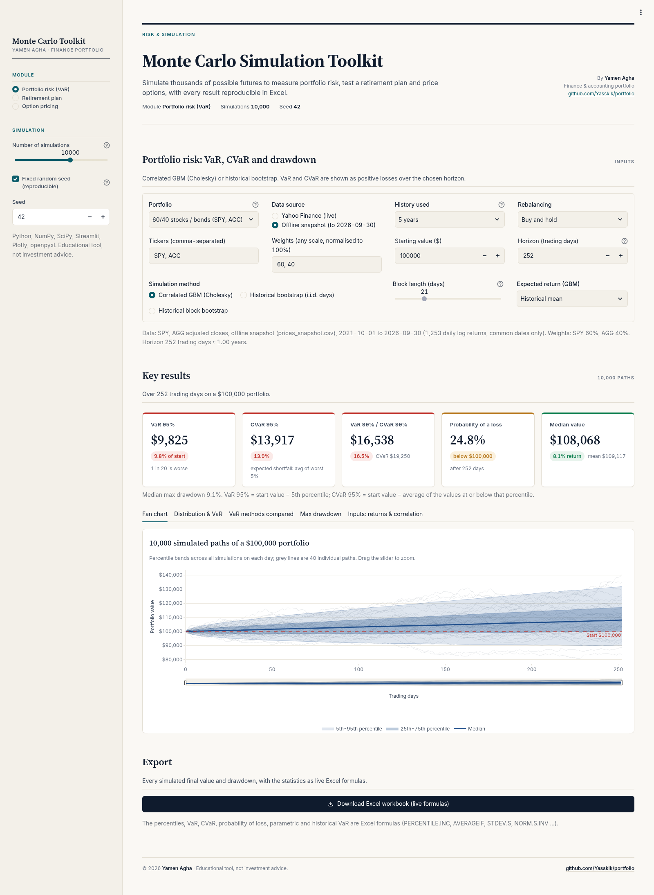

📘 Want an even gentler start? There is also a beginner's guide: [GUIDE.md](GUIDE.md) ([PDF version](GUIDE.pdf)). Ready-made workbooks are in [examples/](examples/): [Portfolio_60_40_SPY_AGG.xlsx](examples/Portfolio_60_40_SPY_AGG.xlsx), [Retirement_Plan.xlsx](examples/Retirement_Plan.xlsx) and [Option_BS_vs_MC.xlsx](examples/Option_BS_vs_MC.xlsx).

---

## 📚 Table of contents

1. [What is this, in one breath?](#-what-is-this-in-one-breath)
2. [Why should I care?](#-why-should-i-care)
3. [Sample results](#-sample-results)
4. [The big picture: how data flows through the app](#%EF%B8%8F-the-big-picture-how-data-flows-through-the-app)
5. [Lessons: every concept, from zero](#-lessons-every-concept-from-zero)
   - [Lesson 1: What is a Monte Carlo simulation?](#lesson-1-what-is-a-monte-carlo-simulation-)
   - [Lesson 2: Returns, log returns and volatility](#lesson-2-returns-log-returns-and-volatility-)
   - [Lesson 3: Geometric Brownian motion, the random walk of prices](#lesson-3-geometric-brownian-motion-the-random-walk-of-prices-)
   - [Lesson 4: Correlation and the Cholesky trick](#lesson-4-correlation-and-the-cholesky-trick-)
   - [Lesson 5: Historical bootstrap, replaying real days](#lesson-5-historical-bootstrap-replaying-real-days-)
   - [Lesson 6: Buy and hold vs daily rebalancing](#lesson-6-buy-and-hold-vs-daily-rebalancing-%EF%B8%8F)
   - [Lesson 7: VaR and CVaR, how bad can it get?](#lesson-7-var-and-cvar-how-bad-can-it-get-)
   - [Lesson 8: Three other ways to measure VaR](#lesson-8-three-other-ways-to-measure-var-)
   - [Lesson 9: Maximum drawdown, the scariest ride](#lesson-9-maximum-drawdown-the-scariest-ride-)
   - [Lesson 10: Retirement, saving then spending](#lesson-10-retirement-saving-then-spending-)
   - [Lesson 11: Probability of success and the 4% rule](#lesson-11-probability-of-success-and-the-4-rule-)
   - [Lesson 12: Options, the right but not the obligation](#lesson-12-options-the-right-but-not-the-obligation-%EF%B8%8F)
   - [Lesson 13: Black-Scholes, the famous formula](#lesson-13-black-scholes-the-famous-formula-)
   - [Lesson 14: Pricing an option by Monte Carlo, with antithetic variates](#lesson-14-pricing-an-option-by-monte-carlo-with-antithetic-variates-)
   - [Lesson 15: The Greeks](#lesson-15-the-greeks-)
6. [Tour of the app, module by module](#%EF%B8%8F-tour-of-the-app-module-by-module)
7. [Every input field explained](#%EF%B8%8F-every-input-field-explained)
8. [Conventions, so every number can be checked](#-conventions-so-every-number-can-be-checked)
9. [The Excel workbooks, sheet by sheet](#-the-excel-workbooks-sheet-by-sheet)
10. [How to read the results and make a decision](#-how-to-read-the-results-and-make-a-decision)
11. [Limitations and common mistakes](#%EF%B8%8F-limitations-and-common-mistakes)
12. [FAQ](#-faq)
13. [Glossary](#-glossary)
14. [Features](#-features)
15. [Review notes: bugs fixed](#%EF%B8%8F-review-notes-bugs-fixed)
16. [Quick start](#-quick-start)
17. [Tech stack](#-tech-stack)
18. [Tests](#-tests)
19. [Project structure](#%EF%B8%8F-project-structure)
20. [Disclaimer, author and license](#-disclaimer-author-and-license)

---

## 🫁 What is this, in one breath?

A **Monte Carlo simulation** means: *"I don't know what will happen, so let me simulate thousands of possible futures with realistic randomness and look at the whole spread of outcomes."* This app does that for three finance problems:

- **Portfolio risk:** it downloads real prices (Yahoo Finance, or an offline snapshot), measures how the assets have moved and how they move together, and simulates thousands of possible next years with **correlated geometric Brownian motion (Cholesky)** or a **historical bootstrap**. You get a fan chart, the distribution of final values, the probability of a loss, **VaR and CVaR at 95% and 99%**, the max-drawdown distribution, and a comparison with parametric and historical VaR.
- **Retirement plan:** saving each month, then spending with inflation-adjusted withdrawals. It shows the **probability that the money lasts**, percentile wealth paths and a **safe-withdrawal-rate sweep** (the "4% rule").
- **Option pricing:** European calls and puts priced by Monte Carlo with **antithetic variates**, compared with the exact **Black-Scholes** formula, with a convergence chart, 95% confidence intervals and the Greeks.

Every module exports an **Excel workbook in which the summary statistics are live formulas** (`PERCENTILE.INC`, `AVERAGE`, `STDEV.S`, `AVERAGEIF`, `NORM.S.DIST` …) over the exported simulations, plus a Black-Scholes sheet built only from formulas. The workbooks were recalculated in LibreOffice and match the Python engine.

## 🤔 Why should I care?

Great question! Because real money decisions are about **uncertainty**, and a single "expected" number hides it:

- 📉 **"My portfolio should return 8%"** says nothing about the bad years. VaR and CVaR put a number on the bad years, and banks and regulators use these exact measures.
- 👵 **"I'll retire with a million"** sounds safe, but the *order* of good and bad years can empty a retirement account early. Only a simulation can show the chance that this happens.
- 🎟️ **Options** are priced on Wall Street with exactly these two tools: the Black-Scholes formula and Monte Carlo. Seeing them agree is a lovely "aha" moment.
- 🧾 **For an accountant:** fair-value measurement (for example of employee stock options under IFRS 2 / ASC 718), impairment testing and audit of models all use these ideas.

---

## 🏆 Sample results

All runs use seed 42 and 10,000 simulations, so you can reproduce them exactly. (These were re-run with the engine while writing this README and match to the last digit.)

| Scenario | Result |
|---|---|
| **Option**: European call, S = K = 100, r = 5%, σ = 20%, T = 1 year, no dividend | Black-Scholes **10.4506** (put 5.5735). Monte Carlo with antithetic variates: **10.3425**, standard error 0.1046, 95% CI **[10.1376, 10.5474]**, which contains the Black-Scholes price. Plain MC on independent draws: 10.4290 ± 0.1443. Variance reduction 1.91×. |
| **Portfolio**: 100,000 in 60% SPY / 40% AGG, 1 year (252 trading days), correlated GBM, buy and hold. Parameters from 5 years of adjusted closes, 2021-10-01 to **2026-09-30** (1,253 daily returns) | **95% VaR 9,825 (9.83%)**, **95% CVaR 13,917 (13.92%)**. 99% VaR 16,538, 99% CVaR 19,250. Probability of losing money 24.8%. Median final value 108,068. Median max drawdown 9.1%. |
| **Retirement**: 50,000 today + 1,000/month for 25 years, then 60,000/year (rising 2.5% a year) for 30 years; expected return 7%, volatility 15% | **Probability of success 34.3%**. Median nest egg 889,155 (no-volatility plan: 1,054,414). The 60,000 is 6.75% of the median nest egg, well above the 4% rule. |
| Same nest egg, safe-withdrawal-rate sweep (30 years) | 3% → 87.4% success, **4% → 69.9%**, 5% → 50.4%. The highest rate with ≥ 90% success is 2.5%. |

The portfolio numbers depend on the data window. With the default live Yahoo source they change as new prices arrive; the offline snapshot in `data/` reproduces the table above. (Amounts are in dollars, the currency label the app uses.)

---

## 🗺️ The big picture: how data flows through the app

The sidebar picks the **module** and the shared simulation settings (number of simulations, seed). Each module then runs its own pipeline in `montecarlo.py`:

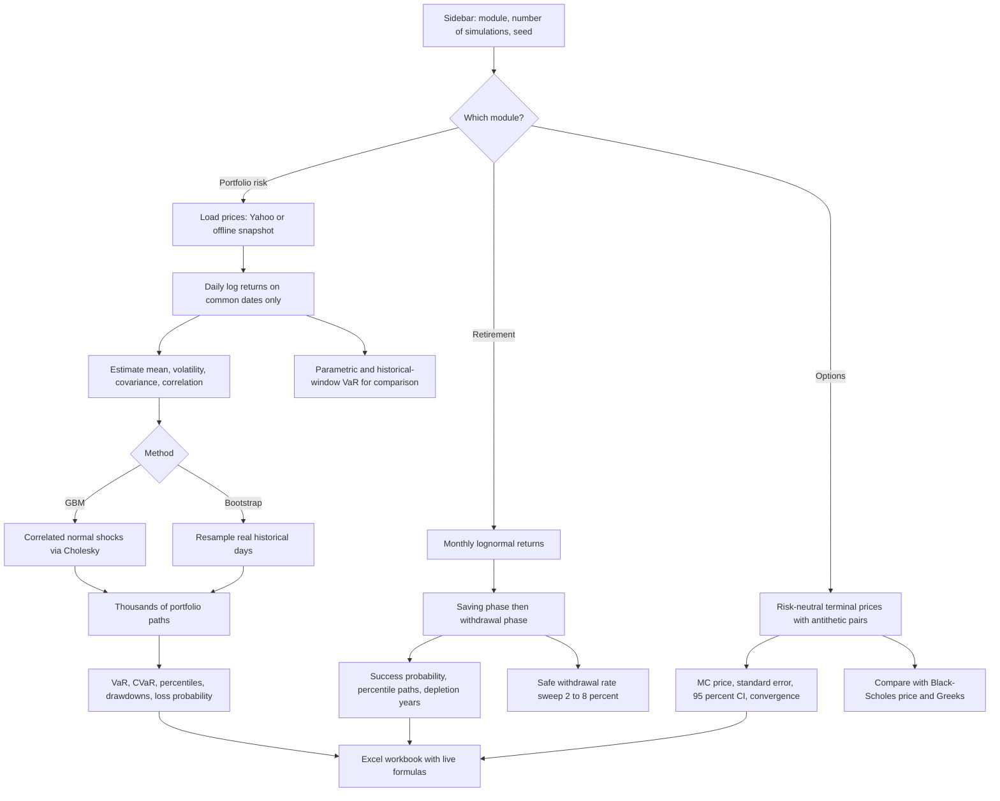

---

## 🎓 Lessons: every concept, from zero

Each lesson works the same way: **an everyday analogy → the real formula the code uses → a small worked example.**

### Lesson 1: What is a Monte Carlo simulation? 🎰

**Wait, why is it named after a casino?** Great question! Monte Carlo is the famous casino town in Monaco, and the method is all about **rolling dice** (random numbers) over and over. The idea was popularised by scientists in the 1940s.

**The analogy:** suppose you want to know how long your commute takes. One day it's 25 minutes, another 40 because of rain and traffic. Instead of guessing one number, you could imagine **10,000 different mornings**, each with random traffic, and look at all of them: "most days 28–35 minutes, but 1 day in 20 it takes over 45." That is exactly Monte Carlo.

**The recipe the app follows:**

1. Describe the randomness (how much prices move, how they move together).
2. Draw random numbers and build one possible future (a "path").
3. Repeat thousands of times (1,000 to 50,000; default 10,000).
4. Summarise all the outcomes: averages, percentiles, worst cases, probabilities.

**How accurate is it?** The error of a Monte Carlo average shrinks like $1/\sqrt{N}$:

```math
SE = \frac{s}{\sqrt{N}}
```

where $s$ is the standard deviation of the outcomes and $N$ the number of simulations. **Worked example:** going from 10,000 to 40,000 simulations makes the error only **half** as big ($\sqrt{4} = 2$). Four times the work for twice the precision, which is why smart tricks like antithetic variates (Lesson 14) are so welcome.

**And the seed?** Computers make "random" numbers from a starting number called the **seed**. Same seed → same numbers → same results. The app's default is seed 42 with "Fixed random seed" ticked, so anyone can reproduce your numbers.

### Lesson 2: Returns, log returns and volatility 📈

**What is a return?** It is how much a price changed, in percent. If a share goes from 100 to 105, the **simple return** is 5%.

**And a log return?** It's the natural logarithm of the price ratio:

```math
r_t = \ln\left(\frac{P_t}{P_{t-1}}\right)
```

**Why bother?** Log returns **add up over time**: the log return over a week is simply the sum of the daily ones. That makes simulation much easier. The app uses daily log returns for estimation and simulation, and converts back with $e^{r} - 1$ only when values are added up.

**Worked example:** 100 → 105 → 99.75.
- Simple returns: +5%, then −5%. Adding them gives 0%, but you actually lost 0.25%! ❌
- Log returns: $\ln(1.05) = 0.04879$ and $\ln(0.95) = -0.05129$. Sum = −0.00250, and $`e^{-0.0025} - 1 = -0.25\%`$. ✅

**What is volatility?** It's the **standard deviation** of returns, a measure of how bumpy the ride is. A calm lake vs a stormy sea. 🌊

**Annualising (252 trading days a year):**

```math
\mu_{year} = 252 \times \mu_{day} \qquad \sigma_{year} = \sqrt{252} \times \sigma_{day}
```

**Why the square root?** Because random daily wiggles partly cancel each other out, risk grows with the *square root* of time, not with time itself.

**Worked example from the offline snapshot (SPY, 5 years to 2026-09-30):** the mean log return is 12.67% a year, so $`0.1267 / 252 = 0.0503\%`$ a day. The volatility is 17.14% a year, so $`0.1714 / \sqrt{252} = 1.08\%`$ a day. For AGG (bonds) the volatility is only 6.14% a year. Stocks are the stormy sea, bonds the calm lake. 🏖️

### Lesson 3: Geometric Brownian motion, the random walk of prices 🚶

**What is "geometric Brownian motion" (GBM)?** Scary name, simple idea! Imagine a slightly drunk person walking home: on average they drift toward home (the **drift**), but each step wobbles randomly (the **volatility**). GBM says a price does the same, in *percentage* steps, so it can never go below zero.

Each simulated day, the log return of each asset is:

```math
r = m + \sigma \, Z, \qquad Z \sim N(0, 1)
```

and the price moves as $`P_{t+1} = P_t \, e^{r}`$.

**Wait, what's the "−σ²/2" I keep hearing about?** Ooh, good one, and it's a classic bug that was actually fixed in this project! If the *average simple* return (the arithmetic drift) is $\mu$, the average *log* return is lower:

```math
E[\ln \text{return}] = \left(\mu - \tfrac{\sigma^2}{2}\right)\Delta t
```

The app estimates the mean of historical **log** returns, which **already includes** the $-\sigma^2/2$, so it uses that directly as the daily drift $m$, with no second correction. The Inputs tab shows both: the mean log return and the "GBM drift μ" = mean log return + σ²/2.

**Worked example (snapshot SPY):** mean log return 12.67% + $`0.1714^2 / 2 = 1.47\%`$ → arithmetic μ ≈ **14.14%** a year, which is exactly what the app shows. Subtracting σ²/2 a second time would have understated the return by about 1.5 points (bug #1 in the review notes below).

**What's the "Zero (risk only)" expected-return option?** It sets the drift so that the expected growth is zero (the code uses $m = -\sigma^2/2$ per day for each asset). That isolates pure risk, without the historical return flattering the results.

### Lesson 4: Correlation and the Cholesky trick 🤝

**What is correlation?** It measures how much two things move together, from −1 (perfect opposites) to +1 (perfect twins). Umbrellas and sunglasses sales: negative. Ice cream and sunscreen: positive. 🍦☀️

**Why does it matter?** Diversification! If stocks and bonds don't crash together, a mix of them is less risky than either alone. In the snapshot, SPY and AGG have a correlation of only **0.22**.

**But random number generators produce independent numbers. How does the app make them move together?** With the **Cholesky decomposition**, a neat bit of matrix algebra. It finds a matrix $L$ with:

```math
L L^{\mathsf{T}} = \Sigma
```

where $\Sigma$ is the covariance matrix of daily log returns. Then independent shocks $z$ become correlated shocks $z L^{\mathsf{T}}$.

**Worked example (illustrative, 2 assets, correlation 0.5, unit volatility):**

```math
L = \begin{pmatrix} 1 & 0 \\ 0.5 & \sqrt{0.75} \end{pmatrix}
```

So with independent draws $z_1, z_2$: asset 1 gets $e_1 = z_1$, and asset 2 gets $`e_2 = 0.5\,z_1 + 0.866\,z_2`$. Asset 2 "borrows" half of asset 1's shock, which creates exactly a 0.5 correlation. 🪄 If $z_1 = 1$ and $z_2 = -1$: $e_1 = 1$ and $e_2 = 0.5 - 0.866 = -0.366$.

The tests check that simulated correlations recover the input to ±0.01. If the covariance matrix is only semi-definite (for example a zero-volatility asset), the engine uses an eigenvalue factor instead, which gives the same covariance.

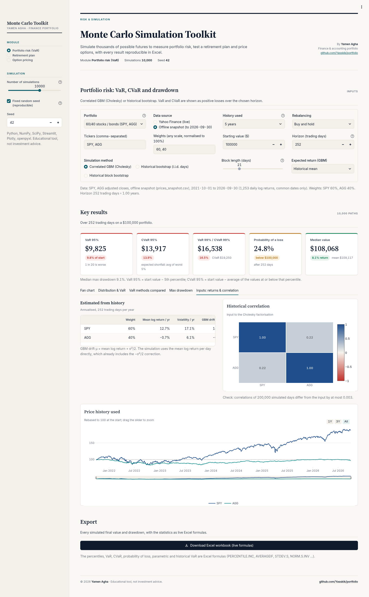

### Lesson 5: Historical bootstrap, replaying real days 🔁

**Is there a way that doesn't assume a bell curve?** Yes! Real markets have **fat tails**: big crashes happen more often than a normal distribution predicts. The **bootstrap** avoids that assumption.

**The analogy:** write each real trading day of the last 5 years on a card (all assets' returns for that date on the same card), put the cards in a hat, and draw 252 cards **with replacement** to build one possible year. Repeat 10,000 times. 🎩

- **Historical bootstrap (i.i.d. days):** each day is drawn independently. Keeps cross-asset correlation and fat tails, but breaks **volatility clustering** (calm and stormy periods come in streaks in real life).
- **Historical block bootstrap:** draw **blocks of consecutive days** (5–63 days, default 21 ≈ a month). It is "circular": a block that runs off the end wraps around to the start. This keeps short-term streaks.

**Worked example (illustrative):** with a block length of 21 and a horizon of 252 days, each path is built from $\lceil 252 / 21 \rceil = 12$ randomly chosen blocks of 21 consecutive real days.

### Lesson 6: Buy and hold vs daily rebalancing ⚖️

**What does rebalancing mean?** You start 60% stocks / 40% bonds. If stocks rise, they become, say, 65% of the portfolio.

- **Buy and hold** (default): you do nothing; the weights drift with prices. The engine buys units at t = 0 and lets each asset grow on its own.
- **Daily to target:** every day you sell a bit of the winner and buy the loser to get back to exactly 60/40. The engine grows the whole portfolio by $\sum_i w_i (e^{r_i} - 1)$ each day.

**Worked example (illustrative):** 100,000 split 60,000 / 40,000. Stocks +10%, bonds 0%. Buy and hold: 66,000 + 40,000 = 106,000, now 62.3% / 37.7%. Daily rebalancing would move 2,400 back into bonds to restore 63,600 / 42,400 = 60/40.

### Lesson 7: VaR and CVaR, how bad can it get? 😱

**Wait, what is VaR?** Great question! **Value at Risk** answers: *"In a bad-but-not-catastrophic scenario, how much could I lose?"* The 95% VaR is the loss that is exceeded only in the worst 5% of outcomes.

**The analogy:** if your commute takes more than 45 minutes on only 1 day in 20, then 45 minutes is your "95% commute VaR". 🚗

**And CVaR?** **Conditional VaR** (also called Expected Shortfall) asks the follow-up: *"And on those really bad days, how bad is it on average?"* It's always at least as big as VaR, and many regulators now prefer it because it looks *inside* the tail.

The app's definitions (losses are shown as **positive** numbers over the chosen horizon):

```math
\text{Loss} = V_0 - V_{final}
```

```math
VaR_{\alpha} = \text{the } \alpha\text{-quantile of the losses}
```

```math
CVaR_{\alpha} = \text{average of all losses} \ge VaR_{\alpha}
```

The quantile uses linear interpolation, exactly like Excel's `PERCENTILE.INC`. Equivalently, VaR 95% = start value − 5th percentile of final values.

**Worked example (illustrative, 20 outcomes, 90% level to keep it small).** Start: 100,000. The 20 simulated final values (in thousands) are 82, 88, 91, 94, 96, 98, 99, 100, 101, 103, 104, 105, 106, 108, 110, 111, 113, 115, 118, 124.

1. Losses, worst first: 18,000, 12,000, 9,000, 6,000, ...
2. The 90% quantile of the losses with linear interpolation sits 10% of the way from 9,000 to 12,000: **VaR 90% = 9,300**.
3. Losses at or beyond 9,300: 12,000 and 18,000 → **CVaR 90% = 15,000**.
4. Final values below 100,000: 7 of 20 → **probability of a loss 35%**.

**The real thing (60/40 sample):** 95% VaR **9,825**, 95% CVaR **13,917**. In words: "in 1 year out of 20, this 100,000 portfolio loses at least 9,825, and in those bad years the average loss is 13,917."

**Can VaR be negative?** Yes: a negative VaR means even the bad case is a gain (possible with a strong drift and a short horizon).

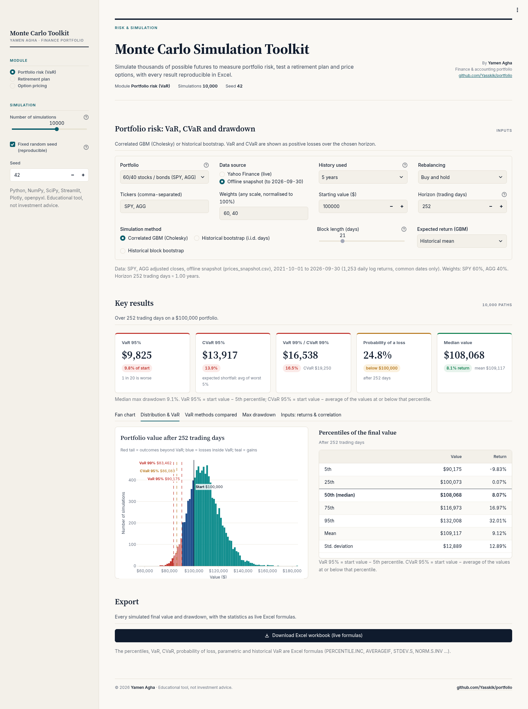

### Lesson 8: Three other ways to measure VaR 🔬

**Is Monte Carlo the only way to get VaR?** No, and the app compares four methods side by side in the **VaR methods compared** tab:

1. **Monte Carlo** (Lesson 7), with your chosen method.
2. **Parametric (lognormal):** assume the horizon log return is normal with mean $H\mu$ and standard deviation $`\sqrt{H}\,\sigma`$, using the mean and sd of historical **daily-rebalanced** portfolio log returns:

```math
VaR_{\alpha} = 1 - e^{H\mu - z_{\alpha}\sigma\sqrt{H}}
```

```math
CVaR_{\alpha} = 1 - \frac{e^{H\mu + \frac{1}{2}\sigma^2 H}\;\Phi\!\left(-z_{\alpha} - \sigma\sqrt{H}\right)}{1 - \alpha}
```

where $z_{0.95} = 1.645$ and $\Phi$ is the standard normal CDF.

3. **Historical windows:** look at **every overlapping H-day window** in actual history. With 5 years and H = 252 there are 1,002 windows (they overlap heavily). It needs at least 100 windows, otherwise n/a.
4. **Historical 1-day × √H:** the "square-root-of-time rule" from risk textbooks. Shown for reference only; it ignores the drift.

**Worked example (snapshot 60/40, 252 days, computed with the engine):** daily μ = 0.000304, daily σ = 0.006989.
- $H\mu = 252 \times 0.000304 = 0.0767$ and $\sigma\sqrt{H} = 0.006989 \times 15.875 = 0.1109$
- $VaR_{95} = 1 - e^{0.0767 - 1.645 \times 0.1109} = 1 - e^{-0.1058} = $ **10.04%**

| Method | VaR 95% | CVaR 95% |
|---|---:|---:|
| Monte Carlo (GBM) | 9.83% | 13.92% |
| Parametric (lognormal) | 10.04% | 14.04% |
| Historical windows (1,002) | 12.75% | 14.75% |
| 1-day × √H | 17.03% | n/a |

See how the √T rule is much more pessimistic? It ignores the positive drift over a whole year. Comparing methods is how a risk analyst sanity-checks a model. 🧐

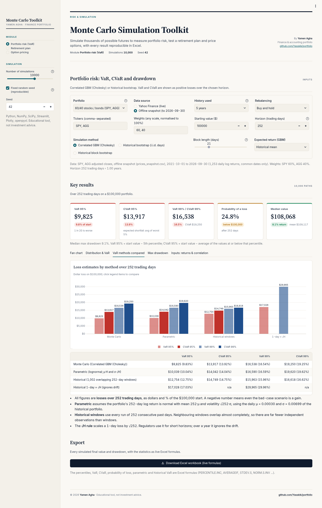

### Lesson 9: Maximum drawdown, the scariest ride 🎢

**What is a drawdown?** The fall from the highest point so far. Think of a roller coaster: the drawdown is how far you drop from the last peak. The **maximum drawdown** is the biggest drop on the whole ride.

```math
DD_t = 1 - \frac{V_t}{\max_{s \le t} V_s} \qquad MDD = \max_t DD_t
```

**Worked example (illustrative path):** 100 → 110 → 99 → 105 → 120 → 96.
- From the peak of 110 down to 99: $`1 - 99/110 = 10\%`$
- From the new peak of 120 down to 96: $`1 - 96/120 = 20\%`$
- **Max drawdown = 20%**, even though the path ends only 4% below where it started!

That's why drawdown matters: a portfolio can end the year with a gain but still give you a terrifying mid-year drop. The app computes it **per path** and shows the median (9.1% for the 60/40 sample), the 95th percentile ("1 path in 20 falls more than", 17.2%) and the worst simulated path (31.5%).

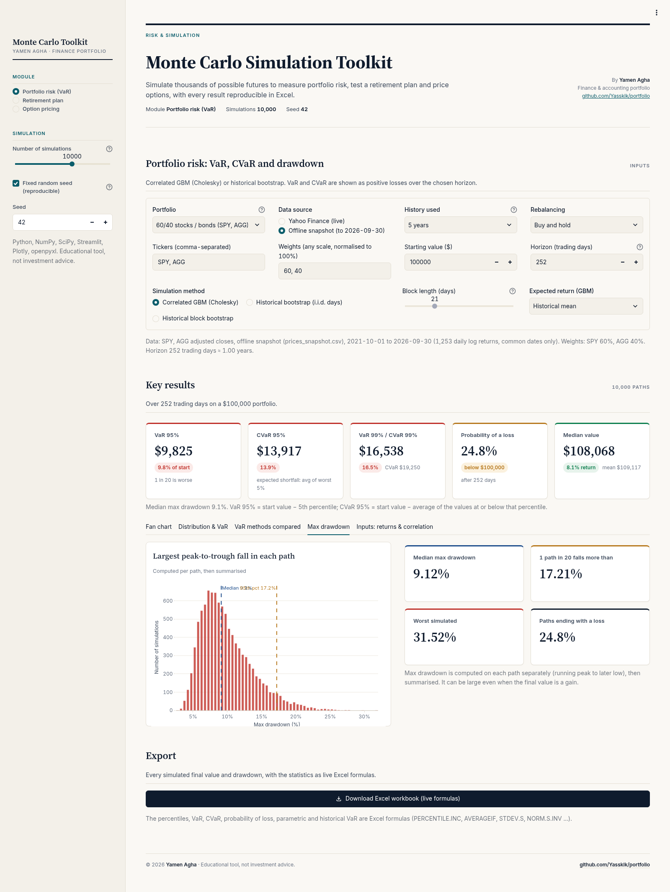

### Lesson 10: Retirement, saving then spending 👵

**How does the retirement module work?** Picture a bathtub. 🛁 During your working years you pour water in (contributions) and the water level rises with the market. In retirement you pull the plug a little each month (withdrawals). The question: **does the tub run dry before the end?**

The engine simulates **monthly** steps:

- **Accumulation:** each month the balance grows, then the contribution is added (end of month).
- **Retirement:** the monthly withdrawal is taken at the **start** of the month, then the rest grows. The annual withdrawal is paid in 12 equal parts and **raised by inflation once a year**.

**What return does each month get?** The expected return you enter is an **arithmetic annual** rate (expected growth factor $1 + r$). Monthly log returns are drawn as:

```math
\ln(\text{growth}) \sim N\!\left(\frac{\ln(1+r) - \sigma^2/2}{12},\ \frac{\sigma}{\sqrt{12}}\right)
```

**Worked example (defaults r = 7%, σ = 15%):**
1. $\ln(1.07) = 0.067659$
2. $\sigma^2/2 = 0.01125$
3. Monthly drift $= (0.067659 - 0.01125)/12 = 0.0047007$, monthly vol $= 0.15/\sqrt{12} = 0.0433$
4. The **median** annual return is $e^{12 \times 0.0047007} - 1 =$ **5.80%**, lower than 7%. That gap is the "volatility drag", and the app shows it.

**The no-volatility check.** With σ = 0 the result equals Excel's `FV` at the monthly rate $(1+r)^{1/12} - 1$. For the defaults that "deterministic" nest egg is **1,054,414**, but the *median* simulated nest egg is only **889,155**, because of volatility drag.

**What does "Withdrawal is in today's money" do?** Off (default): the first retirement year withdraws exactly the amount you typed (60,000). On: the amount is first grown by inflation until retirement, so 60,000 today becomes $60{,}000 \times 1.025^{25} \approx$ **111,237** in year 1 of retirement.

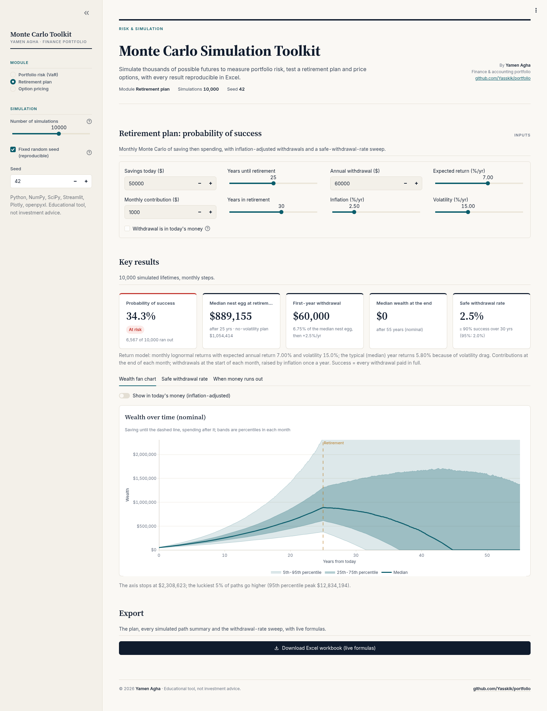

### Lesson 11: Probability of success and the 4% rule 🎯

**When does a plan "succeed"?** Only if **every withdrawal is paid in full** for the whole retirement. A path fails in the first month its balance is below the withdrawal due, and stays at 0 after that.

```math
P(\text{success}) = \frac{\text{paths that paid every withdrawal}}{\text{all paths}}
```

**Worked example (defaults, engine):** 3,433 of 10,000 paths succeed → **34.3%**. Ouch! 😬 Why so low? The first withdrawal (60,000) is $`60{,}000 / 889{,}155 = 6.75\%`$ of the median nest egg. The app colours this card green at ≥ 90%, amber at ≥ 75% and red below. For failed paths, the median depletion time is about 38.7 years from today, i.e. about 13–14 years into retirement. The **When money runs out** tab shows the histogram.

**What is the 4% rule?** A famous rule of thumb (Bengen 1994; the Trinity study): withdraw 4% of your nest egg in year 1, then raise it with inflation every year, and your money historically lasted about 30 years. The **safe-withdrawal-rate sweep** tests this on your own assumptions:

- Rates from 2% to 8% in 0.5% steps (13 rates)
- Starting nest egg = the median nest egg from the main simulation
- The same random numbers for every rate ("common random numbers"), so the curve is smooth and never rises with the rate
- Up to 5,000 simulations (the app uses the smaller of your setting and 5,000)

**Worked example (defaults, engine):**

| Withdrawal rate | First-year withdrawal | Success |
|---:|---:|---:|
| 2.0% | 17,783 | 97.3% |
| 2.5% | 22,229 | 94.0% |
| 3.0% | 26,675 | 87.4% |
| 3.5% | 31,120 | 79.3% |
| **4.0%** | **35,566** | **69.9%** |
| 5.0% | 44,458 | 50.4% |
| 6.0% | 53,349 | 33.6% |
| 8.0% | 71,132 | 12.9% |

The **Safe withdrawal rate** card shows the highest rate with ≥ 90% success: **2.5%** here (or "< 2%" if even 2% fails). With a 7% expected return and 15% volatility, the 4% rule is less safe than its reputation! 🤓

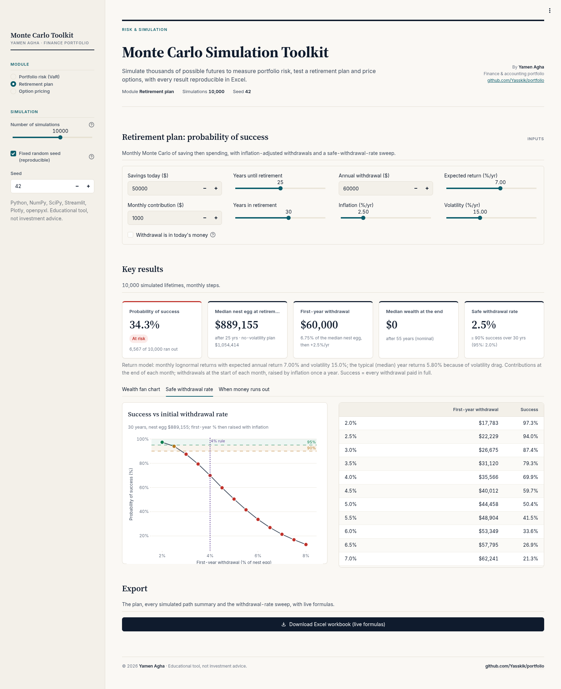

### Lesson 12: Options, the right but not the obligation 🎟️

**What is an option?** Imagine paying a small deposit to reserve a concert ticket at today's price of 100, with the right (but not the duty) to buy it in a year. If the ticket price jumps to 130, you use your right and save 30. If it drops to 80, you just walk away and lose only the deposit. That deposit is the **option price** (the premium).

- A **call** is the right to **buy** at the strike price $K$.
- A **put** is the right to **sell** at $K$.
- **European** means you can only use it on the expiry date $T$ (the only type this app prices).

Payoffs at expiry:

```math
\text{Call} = \max(S_T - K,\ 0) \qquad \text{Put} = \max(K - S_T,\ 0)
```

**Worked example:** strike 100. If the share ends at 125.86, the call pays 25.86 and the put pays 0. If it ends at 84.37, the call pays 0 and the put pays 15.63.

**What are r and q?** $r$ is the continuously compounded risk-free interest rate, and $q$ is the continuous dividend yield (the app's default is 0).

### Lesson 13: Black-Scholes, the famous formula 🏅

**Is there an exact answer?** For European options, yes! Fischer Black, Myron Scholes and Robert Merton found a closed-form formula (Nobel Prize 1997). The app uses the Black-Scholes-Merton version with a dividend yield:

```math
d_1 = \frac{\ln(S/K) + (r - q + \sigma^2/2)\,T}{\sigma\sqrt{T}}, \qquad d_2 = d_1 - \sigma\sqrt{T}
```

```math
C = S e^{-qT} N(d_1) - K e^{-rT} N(d_2)
```

```math
P = K e^{-rT} N(-d_2) - S e^{-qT} N(-d_1)
```

where $N(\cdot)$ is the standard normal cumulative distribution (Excel: `NORM.S.DIST(x, TRUE)`).

**Worked example (the textbook case: S = K = 100, r = 5%, σ = 20%, T = 1, q = 0):**
1. $d_1 = \dfrac{0 + (0.05 + 0.02) \times 1}{0.2} = 0.35$
2. $d_2 = 0.35 - 0.2 = 0.15$
3. $N(0.35) = 0.63683$ and $N(0.15) = 0.55962$
4. $e^{-0.05} = 0.951229$
5. $C = 100 \times 0.63683 - 100 \times 0.951229 \times 0.55962 = 63.683 - 53.232 =$ **10.4506** ✅
6. The put is **5.5735**.

**Put-call parity check** (the Excel sheet has this too): $C - P = S e^{-qT} - K e^{-rT}$, and $10.4506 - 5.5735 = 4.8771 = 100 - 95.1229$. ✅

**Edge cases handled:** at $T \le 0$ the price is just the payoff; at $\sigma = 0$ the price is the discounted forward payoff $\max(S e^{-qT} - K e^{-rT}, 0)$ for a call.

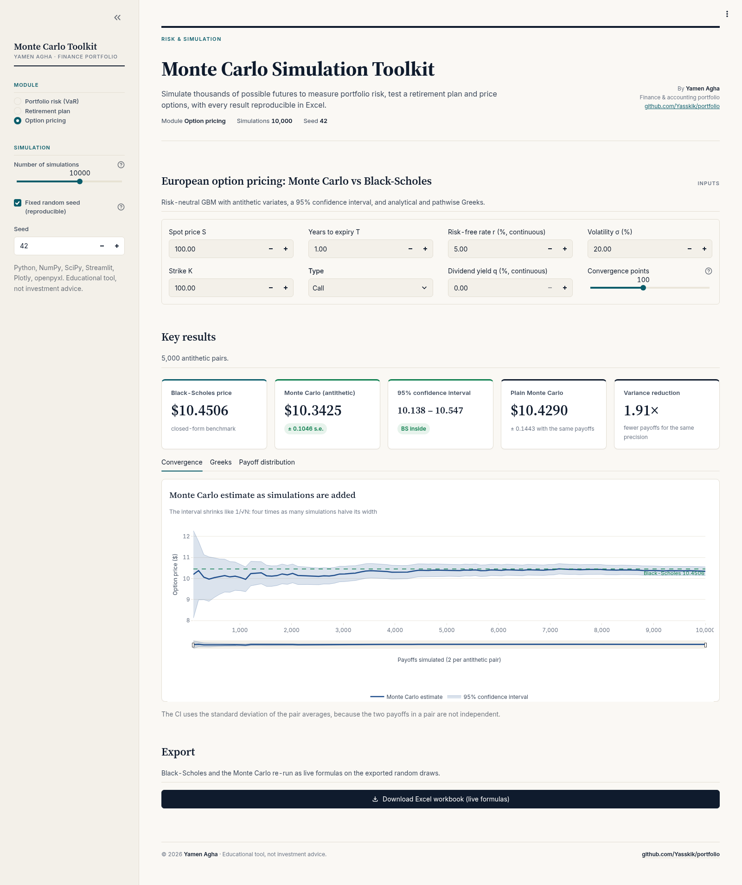

### Lesson 14: Pricing an option by Monte Carlo, with antithetic variates 🪞

**If Black-Scholes is exact, why simulate?** Because most real-world options (with odd payoffs, path dependence and so on) have **no** formula. Monte Carlo works for anything. Here, Black-Scholes is the answer key that proves the simulation is right. 🗝️

**The risk-neutral recipe:**

```math
S_T = S \, e^{(r - q - \sigma^2/2)\,T + \sigma\sqrt{T}\,Z}
```

```math
\text{Price} \approx e^{-rT} \times \text{average of the payoffs}
```

**What are antithetic variates?** A clever trick for free accuracy. For every random draw $Z$, also use its mirror image $-Z$. If one path is unusually lucky, its twin is unusually unlucky, so their average is much more stable. 👯

**Worked example (one antithetic pair, textbook inputs, $Z = 1$):**
- Drift: $(0.05 - 0.02) \times 1 = 0.03$; vol: $0.2 \times 1 = 0.2$
- $Z = +1$: $S_T = 100 e^{0.23} = 125.86$, discounted payoff $= 25.86 \times 0.951229 = 24.60$
- $Z = -1$: $S_T = 100 e^{-0.17} = 84.37$, payoff 0
- Pair average: **12.30**. Average thousands of these pairs and you approach 10.45.

**How does the app measure accuracy honestly?** Because the two members of a pair are linked, the standard error and 95% CI are computed on the **pair averages** (which are independent):

```math
SE = \frac{s_{pairs}}{\sqrt{m}}, \qquad CI_{95} = \hat{C} \pm 1.96 \times SE
```

with $m$ = number of pairs = simulations ÷ 2. For comparison, a **plain** estimator uses a *separate, independent* random stream of the same size. The **variance reduction** ratio is:

```math
VR = \frac{\operatorname{Var}(\text{plain payoff})}{2\,\operatorname{Var}(\text{pair average})}
```

**Worked example (textbook case, seed 42, 10,000 simulations = 5,000 pairs):** antithetic price **10.3425** with SE 0.1046, so the 95% CI is $10.3425 \pm 1.96 \times 0.1046 = [10.1376,\ 10.5474]$, which contains Black-Scholes' 10.4506 ✅. The plain estimate is 10.4290 with a bigger SE of 0.1443, and VR = **1.91×**: the antithetic method needs about half as many payoff evaluations for the same precision. About 43.8% of all simulated paths pay nothing (they end below the strike).

**The convergence chart** shows the running estimate and its 95% band narrowing as simulations are added, with the Black-Scholes line for reference.

### Lesson 15: The Greeks 🇬🇷

**Why Greek letters?** They measure how sensitive the option price is to each input, like the dials on a car dashboard. 🚘

| Greek | Question it answers | Textbook call value | App unit |
|---|---|---:|---|
| **Delta** Δ | If S rises by 1, how much does the option price change? | +0.6368 | per 1 of S |
| **Gamma** Γ | How fast does delta itself change? | 0.0188 | per 1 of S |
| **Vega** ν | If volatility rises 1 point, price change? | 0.3752 | per 1 vol point |
| **Theta** Θ | How much value is lost per day as time passes? | −0.0176 | per calendar day |
| **Rho** ρ | If the interest rate rises 1%, price change? | +0.5323 | per 1% rate |

Formulas for a call (from `black_scholes_greeks`):

```math
\Delta = e^{-qT} N(d_1) \qquad \Gamma = \frac{e^{-qT}\,\varphi(d_1)}{S\sigma\sqrt{T}} \qquad \nu = S e^{-qT}\varphi(d_1)\sqrt{T}
```

```math
\Theta = -\frac{S e^{-qT}\varphi(d_1)\,\sigma}{2\sqrt{T}} - rKe^{-rT}N(d_2) + qSe^{-qT}N(d_1) \qquad \rho = KTe^{-rT}N(d_2)
```

where $\varphi$ is the standard normal density. In the engine vega is per 1.00 of volatility, theta per year and rho per 1.00 of rate; the app divides by 100, 365 and 100 for the friendlier units. **Worked example:** the raw theta is −6.4140 per year, so per day it is $-6.4140 / 365 = -0.0176$. Your option loses about 1.8 cents of value every day just from time passing. ⏳

**Monte Carlo Greeks too!** The app also estimates delta and vega by the **pathwise** method (differentiating each simulated payoff). For the textbook case: MC delta 0.6381 vs 0.6368, and MC vega 0.3685 vs 0.3752 per vol point. Close, with the gap being Monte Carlo noise.

**Edge cases:** at σ = 0 or T = 0, delta becomes the exercise indicator (1 or 0 for an in- or out-of-the-money call), and gamma and vega are 0.

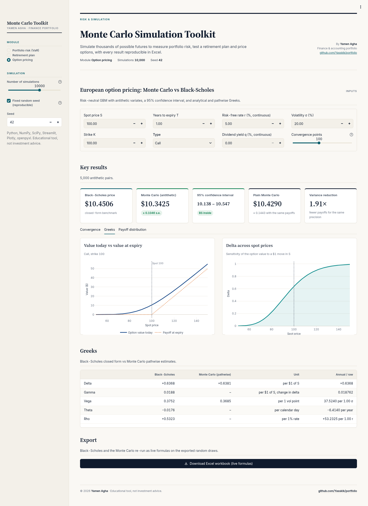

---

## 🖥️ Tour of the app, module by module

**Sidebar (shared by all modules):** the **Module** picker (Portfolio risk (VaR), Retirement plan, Option pricing), **Number of simulations** (1,000 / 2,500 / 5,000 / 10,000 / 25,000 / 50,000; default 10,000), **Fixed random seed** (on) and **Seed** (42). The header shows the module, the simulations and the seed.

### 1. Portfolio risk (VaR) 📉

- **Inputs box:** preset, data source, history length, rebalancing, tickers, weights, starting value, horizon, method, block length and expected return. A caption confirms the exact data used (tickers, source, dates, number of daily returns, normalised weights).
- **Key results (5 cards):** VaR 95%, CVaR 95%, VaR 99% / CVaR 99%, Probability of a loss, Median value (with its return).
- **Five tabs:**
  1. **Fan chart:** 5–95% and 25–75% percentile bands across all paths each day, plus 40 grey individual paths. Drag the slider to zoom.
  2. **Distribution & VaR:** histogram of final values with VaR/CVaR lines and a percentile table.
  3. **VaR methods compared:** the four-method table and bar chart (Lesson 8).
  4. **Max drawdown:** the distribution of the largest fall in each path, with cards for the median, the "1 path in 20" value, the worst path and the share of paths ending with a loss.
  5. **Inputs: returns & correlation:** annualised mean log return, volatility and GBM drift μ per ticker; the correlation heatmap (the input to Cholesky); and the rebased price history with 1Y / 3Y / All buttons.
- **Export:** an Excel workbook with live formulas.
- **Memory guard:** if simulations × (horizon + 1) would exceed 15 million values, the app reduces the number of paths and tells you.

| Fan chart | VaR methods compared |
|---|---|
|  |  |

| Distribution & VaR | Max drawdown |
|---|---|
|  |  |

### 2. Retirement plan 👵

- **Inputs box:** savings, contribution, years to and in retirement, withdrawal, inflation, return, volatility and the "today's money" checkbox.
- **Key results:** Probability of success (green/amber/red), Median nest egg at retirement, First-year withdrawal, Median wealth at the end, Safe withdrawal rate.
- **Three tabs:** **Wealth fan chart** (with a "Show in today's money" toggle), **Safe withdrawal rate** (the success-vs-rate curve) and **When money runs out** (the year failed simulations run dry).
- **Export** button.

| Retirement fan chart | Safe withdrawal rate |
|---|---|
|  |  |

### 3. Option pricing 🎟️

- **Inputs box:** spot, strike, expiry, type, rate, dividend yield, volatility and convergence points.
- **Key results:** Black-Scholes price, Monte Carlo (antithetic), 95% confidence interval, Plain Monte Carlo and Variance reduction.
- **Three tabs:** **Convergence** (running estimate with 95% band), **Greeks** (value today vs at expiry, delta across spot prices, and the Greeks table: Black-Scholes vs MC pathwise, friendly and raw units) and **Payoff distribution** (histogram of the paths that pay out, with the share that pay zero).
- **Export** button.

| Option pricing | Greeks |
|---|---|
|  |  |

---

## 🎚️ Every input field explained

### Sidebar

| Field | Default | What it does |
|---|---|---|
| Module | Portfolio risk (VaR) | Which simulator to show |
| Number of simulations | 10,000 | 1,000 to 50,000. More = smaller error (∝ 1/√N), slower |
| Fixed random seed | on | Same seed → same results |
| Seed | 42 | Any integer from 0 to 2³¹ − 1 |

### Portfolio risk

| Field | Default | What it means |
|---|---|---|
| Portfolio (preset) | 60/40 stocks / bonds (SPY, AGG) | Others: Growth + gold (SPY 40, QQQ 40, GLD 20), Diversified (SPY 30, VEA 15, TLT 25, IEF 15, GLD 15), 100% S&P 500 (SPY), Custom (SPY 35, QQQ 25, TLT 25, GLD 15) |
| Data source | Yahoo Finance (live) | Or "Offline snapshot (to 2026-09-30)" for reproducible results |
| History used | 5 years | 1, 2, 3, 5 or 10 years of prices to estimate returns and correlations |
| Rebalancing | Buy and hold | Or "Daily to target" (Lesson 6) |
| Tickers | from the preset | Comma-separated symbols; unknown ones are reported and dropped |
| Weights | from the preset | Any scale (e.g. 60, 40 or 3, 2); normalised to 100%; negatives rejected; one per ticker |
| Starting value | 100,000 | 1,000 to 1 billion |
| Horizon (trading days) | 252 | 1 to 756. 252 ≈ 1 year, 21 ≈ 1 month, 5 ≈ 1 week |
| Simulation method | Correlated GBM (Cholesky) | Or historical bootstrap (i.i.d. days) or block bootstrap (Lessons 3–5) |
| Block length (days) | 21 | 5 to 63; block bootstrap only |
| Expected return (GBM) | Historical mean | Or "Zero (risk only)"; GBM only |

### Retirement plan

| Field | Default | Range | What it means |
|---|---|---|---|
| Savings today | 50,000 | 0 to 1 billion | Starting balance |
| Monthly contribution | 1,000 | 0 to 10 million | Added at the end of each saving month |
| Years until retirement | 25 | 0 to 50 | Saving phase (0 = already retired) |
| Years in retirement | 30 | 1 to 50 | Spending phase |
| Annual withdrawal | 60,000 | 0 to 100 million | Year-1 spending, raised by inflation yearly |
| Inflation (%/yr) | 2.5 | 0 to 10 | Raises withdrawals; deflates the "today's money" view |
| Expected return (%/yr) | 7.0 | −5 to 15 | Arithmetic annual expected return |
| Volatility (%/yr) | 15.0 | 0 to 40 | Bumpiness of annual returns |
| Withdrawal is in today's money | off | on/off | Grow the withdrawal by inflation until retirement first |

### Option pricing

| Field | Default | What it means |
|---|---|---|
| Spot price S | 100 | Today's share price |
| Strike K | 100 | The agreed buy/sell price |
| Years to expiry T | 1.0 | 0.01 to 30 years |
| Type | Call | Call or put |
| Risk-free rate r (%, continuous) | 5.0 | −5 to 25 |
| Dividend yield q (%, continuous) | 0.0 | 0 to 20 |
| Volatility σ (%) | 20 | 0.1 to 300 |
| Convergence points | 100 | 20 to 200 points on the convergence chart |

---

## 📏 Conventions, so every number can be checked

| Item | Convention used |
|---|---|
| Returns | Daily **log returns** r = ln(Pₜ/Pₜ₋₁) are used for estimation and simulation. Simple returns appear only when values are added up (e^r − 1). |
| Annualisation | **252 trading days**: mean × 252, volatility × √252. A 1-year horizon is 252 steps. |
| GBM drift | If the arithmetic drift is μ, a log return per day is N((μ − σ²/2)Δt, σ²Δt). The mean of historical **log** returns already equals μ − σ²/2, so it is used as the daily drift directly (no second σ²/2 correction). The app shows both the log mean and the arithmetic μ. |
| Correlation | Daily shocks are z·Lᵀ, with L the Cholesky factor of the daily covariance of log returns. Simulated correlations recover the input (tested to ±0.01). If the matrix is only semi-definite (e.g. a zero-volatility asset), an eigenvalue factor gives the same covariance. |
| Rebalancing | Default **buy and hold**: units bought at t = 0, weights drift with prices. Optional **daily** rebalancing to the target weights. |
| Bootstrap | Whole days (all assets on the same date) are resampled with replacement, so cross-asset correlation and fat tails are kept. **i.i.d. days** break volatility clustering; the **circular block bootstrap** (blocks of 5–63 days, default 21) keeps short-term dependence. |
| VaR / CVaR | Shown as **positive losses**, in dollars and as % of the starting value, **over the chosen horizon** (default 252 trading days = 1 year). VaR_α is the α-quantile of the loss distribution (linear interpolation, the same as Excel `PERCENTILE.INC`). CVaR_α is the average loss in the scenarios at or beyond VaR_α. A negative VaR would mean that even the bad case is a gain. |
| Parametric VaR | The portfolio's H-day log return is N(Hμ, √H σ), with μ and σ the mean and sd of the historical daily portfolio log returns (daily rebalanced). VaR = 1 − e^(Hμ − zσ√H). CVaR has a closed form for the lognormal. |
| Historical VaR | Every overlapping H-day window of actual history. It needs at least 100 windows, otherwise n/a. With 5 years and H = 252 there are 1,002 windows, but they overlap heavily. The **√T rule** (1-day historical VaR × √H) is shown for reference; it ignores the drift. |
| Max drawdown | Per path: the largest fall from a running peak, as a positive fraction. The app shows its median, 95th percentile and maximum. |
| Retirement returns | The expected return is an **arithmetic annual** rate: the expected growth factor is 1 + r. Monthly log returns are N((ln(1+r) − σ²/2)/12, σ/√12). With 7% / 15% the median year returns 5.80%. With zero volatility the result equals Excel `FV((1+r)^(1/12)−1, …)`. |
| Retirement timing | Contributions at the **end** of each month. Withdrawals at the **start** of each month: 1/12 of the annual amount, which rises by inflation **once a year**. The amount is the first-year withdrawal in money of that year, or optionally in today's money. |
| Success | A plan succeeds only if **every withdrawal is paid in full** for the whole retirement. A path fails in the first month its balance is below the withdrawal due, and stays at 0. |
| SWR sweep | As in the 4% rule: first-year withdrawal = rate × nest egg (default: the median nest egg), then raised by inflation. The same random numbers are used for every rate, so the curve is smooth and never rises with the rate. |
| Option MC | Risk-neutral S_T = S·e^((r − q − σ²/2)T + σ√T Z), payoff discounted by e^(−rT). The **antithetic** estimator averages each pair (Z, −Z); its standard error and the 95% CI (±1.96 SE) are computed on the pair averages, which are independent. The plain estimator uses a separate, independent random stream. Variance reduction = Var(plain payoff) / (2·Var(pair average)). |
| Greeks | Black-Scholes-Merton. In the engine vega is per 1.00 of volatility, theta per year and rho per 1.00 of rate. The app and Excel also show vega per vol point, theta per calendar day (÷365) and rho per 1%. At σ = 0 or T = 0, delta is the exercise indicator. |
| Missing data | **Never invented.** Tickers with no data are reported and dropped. Only dates on which every ticker has a price are used; nothing is forward- or back-filled. Fewer than 60 common returns stops the simulation with a message. Yahoo's still-moving bar for today is dropped while the US market is open. |
| Seed | The same seed gives the same results in every module. |

---

## 📗 The Excel workbooks, sheet by sheet

Each module has its own **Download Excel workbook (live formulas)** button. Think of the workbook as the app's "show your work" page: the random draws are exported as values (so results stay reproducible), and **every statistic on top of them is a live Excel formula** you can click into.

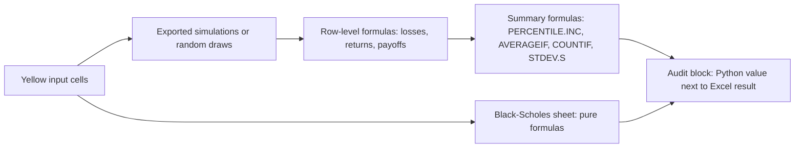

Inputs are blue on yellow. Every sheet ends with an **audit block** that shows the Python value next to the Excel formula result.

| Workbook | Sheets and formulas |
|---|---|
| Portfolio | **Summary**: inputs, then `AVERAGE`, `MEDIAN`, `STDEV.S`, `MIN`/`MAX`, `PERCENTILE.INC` of all final values; probability of loss with `COUNTIF`; VaR = V₀ − `PERCENTILE.INC`; CVaR with `AVERAGEIF`; drawdown statistics; parametric VaR with `NORM.S.INV`/`NORM.S.DIST`; historical-window VaR; asset statistics and `CORREL` from the History sheet. **Simulations**: every final value and max drawdown, with loss and return formulas. **History**: prices, `LN` returns, portfolio log return and H-day window returns. **Sample Paths**. |
| Retirement | **Summary**: inputs, monthly drift/vol, median annual return, first withdrawal and an `FV` deterministic check; success probability (`COUNTIF`), nest-egg and terminal-wealth percentiles. **Simulations** (per path), **Withdrawals** (formula schedule), **Percentiles by Year**, **Withdrawal Rates**. |
| Options | **Black-Scholes**: d1, d2, N(d1), N(d2), call, put, a put-call parity check and all Greeks for both calls and puts, all live formulas. **Monte Carlo**: the exported standard-normal draws z; S_T, payoffs and pair averages as formulas; price, SE and 95% CI. **Convergence**. |

Change an input on the Black-Scholes sheet and every price and Greek updates. On the simulation sheets the random draws are exported values, so the statistics stay reproducible.

**Verification.** `scripts/verify_excel.py` builds 10 scenarios, recalculates them in headless LibreOffice and compares every summary cell and every row-level formula column with Python. The scenarios are:

- **4 portfolios:** the 60/40 sample; 4 assets with daily rebalancing over 63 days; a 21-day block bootstrap; a single ticker with an i.i.d. bootstrap.
- **3 retirement plans:** the sample above, the same with the withdrawal in today's money, and an already-retired 4% rule.
- **3 options:** the textbook call and put, and an out-of-the-money call with a dividend.

Result: **47,233 values compared, 0 mismatches, 0 error cells.** The Black-Scholes sheet gives call 10.4505836, put 5.5735260, delta 0.63683, gamma 0.018762, vega 0.37524 per vol point and theta −0.01757 per day for the textbook case.

**How to read the audit block:** each sheet ends with the Python value next to the Excel formula result. If you haven't changed anything, they match, which proves the spreadsheet and the app compute the same thing.

---

## 🧭 How to read the results and make a decision

**Portfolio risk:**
1. Start with the **fan chart**: the wider the bands, the riskier the portfolio.
2. Read **VaR 95%** as "a bad year, 1 in 20" and **CVaR 95%** as "the average of those bad years". Ask yourself: *could I live with losing that amount without panic-selling?*
3. Check **Probability of a loss**: for the 60/40 sample, about 1 path in 4 ends below the start after a year.
4. Look at **max drawdown**: even winning years can include painful dips.
5. Compare the **VaR methods**: if they disagree a lot, the result depends heavily on assumptions, so be humble.
6. Try the **bootstrap** methods to see the effect of fat tails, and **Zero (risk only)** to strip out the historical return.

**Retirement plan:**
- **≥ 90% success** (green) is a common comfort level; **75–90%** (amber) is borderline; **below 75%** (red) means change the plan.
- Levers to pull: save more, retire later, spend less, or accept more volatility for more return. Watch the success probability respond.
- Compare your first-year withdrawal rate with the **safe withdrawal rate** card.

**Option pricing:**
- If the **95% CI contains the Black-Scholes price**, the simulation is behaving. (By design, about 1 run in 20 will miss.)
- Use **more simulations** to narrow the CI; use the **variance reduction** ratio to see how much antithetics helped.
- Use the **Greeks** to understand risk: delta for direction, vega for volatility, theta for time decay.

---

## ⚠️ Limitations and common mistakes

**Limitations (what the model does *not* do):**
- **GBM assumes normal log returns**, which understate fat tails and crashes. The bootstrap helps but can only replay what happened in the chosen history.
- **The past is not the future**: estimated returns, volatilities and correlations change over time. A 5-year window that was a bull market will look rosy.
- Constant parameters: no volatility regimes, no changing correlations (beyond what the block bootstrap keeps).
- **Costs, taxes and fees are not modelled.**
- Retirement returns are i.i.d. lognormal months with one constant expected return and volatility; there is no glide path, no pension income, no variable spending rules.
- Options: **European only**, constant r, q and σ; no early exercise, no volatility smile.
- Live Yahoo results change as new prices arrive; use the offline snapshot for reproducible numbers.

**Common beginner mistakes:**
- ❌ **Reading VaR as the worst case.** It's the threshold of the worst 5% (or 1%); CVaR tells you what lies beyond it, and the true worst can be far worse.
- ❌ **Mixing horizons.** VaR here is over the chosen horizon (default 252 days = 1 year), not per day.
- ❌ **Confusing the median and the mean.** The median final value (half the paths above, half below) is usually below the mean, because good outcomes stretch further than bad ones.
- ❌ **Thinking 7% expected means 7% typical.** With 15% volatility, the median year is 5.80% (volatility drag).
- ❌ **Using too few simulations** and over-reading small differences. Check the standard error.
- ❌ **Forgetting inflation** in retirement. A fixed 60,000 shrinks in real terms; the app raises it by inflation each year.
- ❌ **Treating one seed as the truth.** Change the seed and see how much the numbers move.

---

## ❓ FAQ

**Why do I get different numbers from the table above?** You are probably on the live Yahoo source, where the data window moves every day. Choose the offline snapshot, 5 years, seed 42 and 10,000 simulations to reproduce it.

**Why are VaR numbers positive if they are losses?** Convention: the app reports losses as positive amounts, which is how risk reports usually show them. A negative VaR would mean even the bad case is a gain.

**Why is CVaR always bigger than VaR?** CVaR averages the losses *beyond* VaR, so it must be at least as large.

**What happens if a ticker has no data?** It is reported and dropped, the other weights are rescaled, and nothing is invented. Only dates on which every ticker has a price are used, and fewer than 60 common daily returns stops the simulation with a message.

**Why does the retirement median nest egg differ from the "no-volatility" FV?** Volatility drag: with random returns, the typical (median) path compounds more slowly than the expected return suggests.

**Why does the Monte Carlo option price not equal Black-Scholes exactly?** Random sampling error. The 95% CI tells you how far off it might be; more simulations shrink it like $1/\sqrt{N}$.

**Why is the plain MC estimator on a separate random stream?** So the comparison of standard errors is fair. Using the same draws made the two estimates identical in the first version (bug #2 below).

**Why does the safe-withdrawal curve never go up?** Every rate reuses the same random numbers, so a higher withdrawal can only make the same paths worse.

**Can I trust the Excel file?** It was recalculated in LibreOffice for 10 scenarios: 47,233 values compared, 0 mismatches. And the audit blocks let you check it yourself.

---

## 📖 Glossary

| Term | Plain-English meaning |
|---|---|
| **Annualise** | Convert a daily figure to a yearly one (×252 for means, ×√252 for volatility) |
| **Antithetic variates** | Pairing each random draw Z with −Z to reduce noise |
| **Arithmetic return** | The ordinary average percentage return |
| **Black-Scholes** | The closed-form formula for European option prices |
| **Block bootstrap** | Resampling runs of consecutive historical days |
| **Bootstrap** | Building new scenarios by resampling real historical data |
| **Call / Put** | The right to buy / sell at the strike price |
| **Cholesky decomposition** | A matrix "square root" used to create correlated random numbers |
| **Confidence interval** | A range that should contain the true value with a stated probability (95% here) |
| **Correlation** | How much two assets move together (−1 to +1) |
| **Covariance matrix** | The table of how each pair of assets varies together |
| **CVaR / Expected Shortfall** | The average loss in the scenarios at or beyond VaR |
| **Drift** | The average direction of a random walk |
| **Drawdown** | The fall from the highest value so far |
| **European option** | Can only be exercised on the expiry date |
| **Fan chart** | A chart of percentile bands spreading out over time |
| **Fat tails** | Extreme outcomes happen more often than a bell curve predicts |
| **GBM** | Geometric Brownian motion: a random walk in percentage terms |
| **Greeks** | Sensitivities of an option price: delta, gamma, vega, theta, rho |
| **Log return** | ln(P_t / P_{t−1}); adds up over time |
| **Monte Carlo** | Estimating outcomes by simulating many random scenarios |
| **Nest egg** | Savings at the moment of retirement |
| **Percentile** | The value below which a given % of outcomes fall |
| **Rebalancing** | Trading back to target weights |
| **Risk-neutral** | The pricing world where all assets grow at the risk-free rate |
| **Safe withdrawal rate** | The highest first-year withdrawal % with acceptable success (≥ 90% here) |
| **Seed** | The starting number that makes "random" results reproducible |
| **Standard error** | The typical size of the Monte Carlo estimation error |
| **Strike** | The fixed price in an option contract |
| **VaR** | The loss exceeded only in the worst (1 − α) of scenarios |
| **Variance reduction** | Techniques that give the same precision with fewer simulations |
| **Volatility** | The standard deviation of returns: how bumpy the ride is |
| **Volatility drag** | Why the typical compounded return is below the average return |

---

## ✨ Features

- **Portfolio risk**
  - Any tickers and weights (weights in any scale are normalised to 100%; negative weights are rejected), with presets
  - Data from Yahoo Finance (adjusted closes) or an offline 10-year snapshot of SPY, AGG, BND, QQQ, TLT, GLD, IEF and VEA
  - Three methods: correlated GBM (Cholesky), i.i.d. historical bootstrap, and block bootstrap
  - Historical or zero expected return, and buy-and-hold or daily rebalancing
  - Fan chart (5–95% and 25–75% bands), histogram of final values with VaR/CVaR lines, percentile table, probability of loss
  - VaR and CVaR at 95% and 99%, in dollars and percent, compared with parametric (lognormal), historical-window and √T VaR
  - Max-drawdown distribution, computed per path; estimated returns, volatilities and the correlation matrix
- **Retirement plan**
  - Monthly simulation of saving and spending, with a contribution step-up and the withdrawal stated in today's or future money
  - Probability of success, percentile paths in nominal or today's money, and when failed plans run out
  - Safe-withdrawal-rate sweep from 2% to 8%
- **Option pricing**
  - Black-Scholes-Merton price and Greeks (with dividend yield)
  - Monte Carlo with antithetic variates, plus an independent plain estimator for comparison
  - Convergence chart with 95% confidence bands, payoff histogram, and pathwise MC delta and vega
- **Seed, number of simulations (1,000–50,000) and horizon controls**, and an Excel download for every module.
- **64 automated tests**, including LibreOffice recalculation checks.

---

## 🛠️ Review notes: bugs fixed

The first version had the following problems, which I found and fixed in a quant model review:

1. **GBM drift was corrected twice.** The mean of historical *log* returns (which already includes −σ²/2) was used as μ, and σ²/2 was subtracted again. For SPY-like volatility, this understated the annual return by about 1.5 percentage points and overstated VaR.
2. **The "standard MC" price used the same draws as the antithetic price**, so the two estimates were identical (10.41005) and the comparison of standard errors was meaningless. The plain estimator now uses an independent stream.
3. **Invented data.** An unknown ticker was silently replaced by **synthetic random prices**. A good + bad ticker pair crashed the app, and missing prices were back-filled. Now failed tickers are reported, only common dates are used, and nothing is filled.
4. **Greeks were all zero at σ = 0 or T = 0.** Delta is now the exercise indicator, with the correct theta and rho limits.
5. **Retirement return convention.** 7% was used as a continuous drift, so the expected annual growth was 7.29% rather than 7%. It is now arithmetic (expected growth 1 + r), with the same zero-volatility result as Excel `FV`.
6. **Historical VaR** was the 1-day VaR × √H, ignoring drift, but labelled "historical". It is now computed on real H-day windows, and the √T rule is shown separately. **Parametric VaR** used a linear approximation; it is now lognormal with the correct H and √H scaling.
7. **Safe-withdrawal-rate sweep** fixed the nest egg but re-simulated accumulation for every rate. Each rate now runs on the same decumulation random numbers, so the curve is monotone.
8. **Fractional history lengths crashed** the data loader (`DateOffset` with a non-integer year).
9. **Memory**: 50,000 sims × 756 days × 4 assets allocated about 151 million floats at once. The simulation now steps day by day (memory O(sims × days)) and the app caps very large runs.
10. **App issues**:
    - the payoff histogram line labelled "Mean payoff" was really the Black-Scholes price
    - the variance-reduction label described a standard error, and the median was labelled "Expected Return"
    - no data date was shown
    - option defaults were q = 1% and σ = 25% instead of the textbook case
    - the 60/40 preset used BND instead of AGG
    - an unused run button, deprecated Streamlit arguments, marketing-style branding
11. **The Excel export** wrote static values with only a few formulas over at most 10,000 endpoints, and had no Black-Scholes formulas. During the rewrite I also caught two Excel pitfalls: newer functions need the `_xlfn.` prefix in the file (otherwise `#NAME?`), and in Excel `-x^2` means `(-x)^2`, so `EXP(-d1^2/2)` is wrong. The density is now `NORM.S.DIST(d1, FALSE)`.

Each fix has a regression test in `tests/test_regressions.py`.

---

## 🚀 Quick start

```bash
git clone https://github.com/Yasskik/portfolio.git
cd portfolio/finance/monte-carlo-simulator
python3 -m venv .venv
source .venv/bin/activate          # Windows: .venv\Scripts\activate
pip install -r requirements.txt
streamlit run app.py               # opens http://localhost:8501
```

Other useful commands (LibreOffice is needed for the recalculation checks):

```bash
python scripts/make_examples.py    # rebuilds and verifies the three example workbooks
python scripts/verify_excel.py     # 10 scenarios: LibreOffice recalculation vs Python
python scripts/update_snapshot.py  # refreshes data/prices_snapshot.csv from Yahoo Finance
```

## 🧰 Tech stack

| Tool | Used for |
|---|---|
| Python 3 | The simulation engine (`montecarlo.py`) |
| NumPy | Random numbers, vectorised simulation, quantiles |
| SciPy | The normal distribution (`norm.cdf`, `norm.pdf`, `norm.ppf`) |
| pandas | Price data and tables |
| yfinance | Live adjusted closes from Yahoo Finance |
| Streamlit | The web app |
| Plotly | Interactive charts |
| openpyxl | Excel workbooks with live formulas |
| LibreOffice (headless) | Recalculating the workbooks to verify them |
| pytest | Automated tests |

## 🧪 Tests

```bash
pytest -q
```

There are 64 tests. They cover:

- the GBM drift (no double Itô correction), 252-day annualisation and correlation recovery through Cholesky
- zero-volatility assets, a single ticker, weight normalisation, buy-and-hold vs daily rebalancing
- missing data: unknown tickers, gaps and network errors (mocked Yahoo), short histories
- VaR and CVaR against the closed-form lognormal values, sign conventions, horizon scaling, overlapping windows
- max drawdown on hand-made paths, i.i.d. and block bootstraps
- Black-Scholes textbook values, Greeks against finite differences, put-call parity, σ = 0 and T = 0 limits
- the antithetic CI on pair averages, an independent plain estimator, 95% CI coverage over 200 seeds
- seed reproducibility and speed with 10,000+ simulations
- retirement return convention, inflation schedule, success definition, the requested sample and the SWR sweep
- the workbooks (formulas present) and their LibreOffice recalculation (skipped if LibreOffice isn't installed)
- smoke tests that run all three modules of the Streamlit app

## 🗂️ Project structure

```text
monte-carlo-simulator/
├── app.py                 # Streamlit user interface (portfolio risk, retirement, option pricing)
├── ui_theme.py            # Vendored copy of the shared design system (../_shared/)
├── montecarlo.py          # Engine: data loading, GBM/Cholesky, bootstrap, VaR/CVaR, drawdown, retirement, Black-Scholes, MC
├── excel_export.py        # Excel workbooks with live formulas (openpyxl)
├── data/                  # prices_snapshot.csv: adjusted closes 2016-09-30 to 2026-09-30
├── examples/              # Portfolio, retirement and option workbooks (recalculated and verified)
├── scripts/               # lo_recalc.py, verify_excel.py, make_examples.py, update_snapshot.py
├── tests/                 # pytest suite (engine, regressions, Excel, LibreOffice recalculation, app smoke test)
├── docs/screenshots/      # Screenshots used in this README
├── GUIDE.md / GUIDE.pdf   # Beginner's guide to Monte Carlo, VaR, retirement planning and options
├── .streamlit/config.toml # Light theme generated from the ui_theme.py tokens
├── requirements.txt
└── LICENSE
```

## 📜 Disclaimer, author and license

This is an educational portfolio project, **not investment advice**. Monte Carlo results are only as good as their assumptions: normal (GBM) returns understate fat tails, past returns and correlations do not predict the future, and costs, taxes and fees are not modelled.

**Yamen Agha**, accounting student at Aleppo University. Released under the [MIT License](LICENSE).
