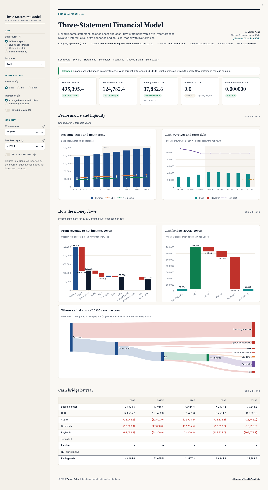
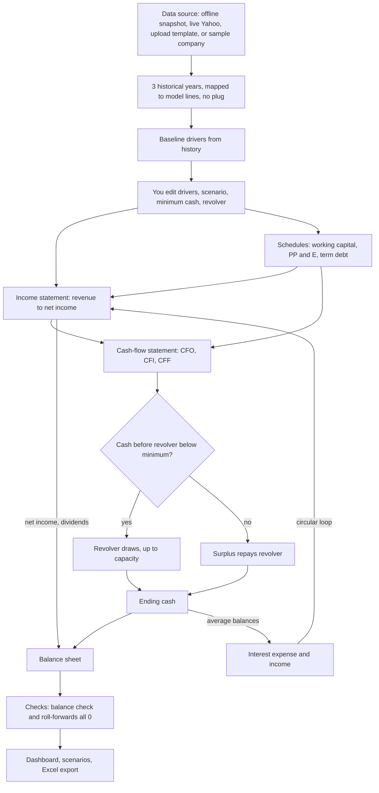
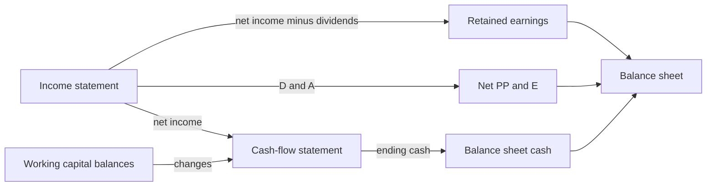
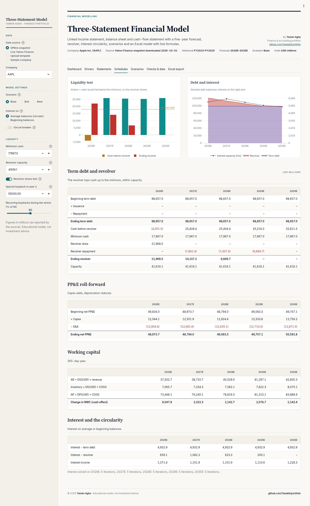
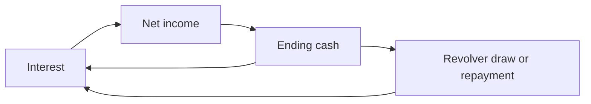
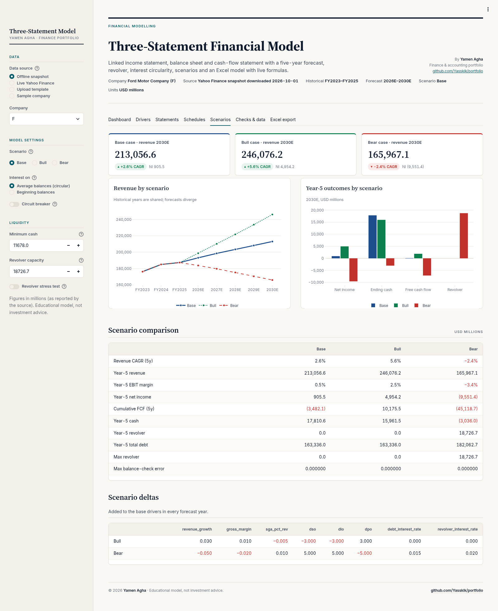
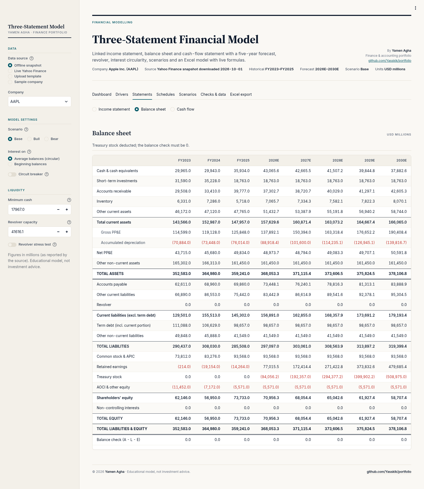
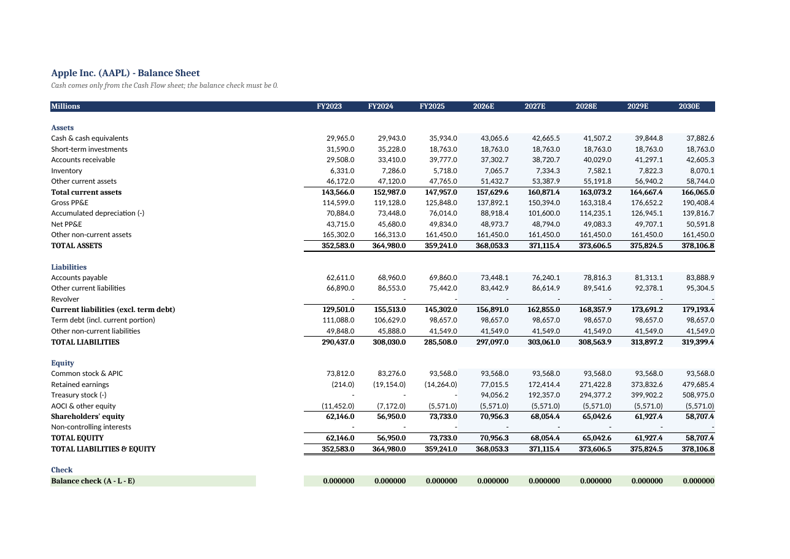

# 📊 Three-Statement Financial Model

[](https://www.python.org/) [](https://streamlit.io/) [](examples/AAPL_base_case.xlsx) [](tests/) [](LICENSE)

> Part of [Yamen Agha's portfolio](../../README.md) · [Finance projects](../README.md)

**Live demo:** [yamen-three-statement.streamlit.app](https://yamen-three-statement.streamlit.app/)
[](https://yamen-three-statement.streamlit.app/)

> The free app may take ~30 seconds to wake up if it has been idle.

**One-line pitch:** an integrated model where the **income statement, balance sheet and cash-flow statement** are wired together like gears, so one change ripples through all three, the balance sheet balances **without a plug**, and an automatic credit line (the "revolver") steps in when cash runs low. 🔗



📘 Want a gentler path with a hands-on Excel exercise? Read the beginner's guide: [GUIDE.md](GUIDE.md) ([PDF version](GUIDE.pdf)), with an [exercise solution](examples/exercise_solution.xlsx). Ready-made workbooks are in [examples/](examples/).

---

## 📚 Table of contents

1. [What is this, in one breath?](#-what-is-this-in-one-breath)
2. [Why should I care?](#-why-should-i-care)
3. [The big picture](#%EF%B8%8F-the-big-picture)
4. [Lessons: every concept, from zero](#-lessons-every-concept-from-zero)
5. [A full walk-through: one forecast year, line by line](#-a-full-walk-through-one-forecast-year-line-by-line)
6. [Tour of the app, tab by tab](#%EF%B8%8F-tour-of-the-app-tab-by-tab)
7. [Every input explained](#%EF%B8%8F-every-input-explained)
8. [The Excel export, sheet by sheet](#-the-excel-export-sheet-by-sheet)
9. [Sample results](#-sample-results)
10. [How to read the results](#-how-to-read-the-results)
11. [Limitations and common mistakes](#%EF%B8%8F-limitations-and-common-mistakes)
12. [FAQ](#-faq)
13. [Glossary](#-glossary)
14. [Features](#-features)
15. [Conventions](#-conventions-so-every-number-can-be-checked)
16. [Review notes: bugs fixed](#-review-notes-bugs-fixed)
17. [Quick start](#-quick-start), [Tech stack](#-tech-stack), [Tests](#-tests), [Project structure](#%EF%B8%8F-project-structure), [License](#-disclaimer-author-and-license)

---

## 🫁 What is this, in one breath?

Every company publishes three reports: the **income statement** (did we make a profit?), the **balance sheet** (what do we own and owe?), and the **cash-flow statement** (where did the cash actually go?). This app takes **3 real historical years** of those reports (from Yahoo Finance, an offline snapshot, your own template, or a fictional sample company) and **forecasts 5 years** from simple, editable "drivers" such as growth, margins and collection days. The statements are linked: profit flows into equity, cash comes only from the cash-flow statement, and if cash would drop below a safety level, a **revolver** borrows automatically. The model then proves itself: **assets − liabilities − equity = 0** every year.

## 🤔 Why should I care?

Great question! The three-statement model is the **foundation of almost every financial model** in banking, private equity, corporate finance and audit:

- 🧱 A DCF, an LBO and a merger model are all built **on top of** a three-statement model.
- 🧠 Building one proves you truly understand accounting: every debit has a credit, every profit lands somewhere.
- 🚨 It answers real questions: *"Can this company pay its dividends? Will it run out of cash in a bad year? How much would it need to borrow?"*
- 🎓 For an accounting student, it is the bridge between "I can prepare statements" and "I can **forecast** them".

---

## 🗺️ The big picture



**The loop at the bottom is the famous "circularity":** interest depends on cash and debt, which depend on net income, which depends on interest. 🔄 Lesson 8 explains how the model solves it.

---

## 🎓 Lessons: every concept, from zero

### Lesson 1: The three statements 📄📄📄

**Wait, why three statements? Isn't one enough?** Great question! Each one answers a different question:

| Statement | Question it answers | Analogy (your personal life) |
|---|---|---|
| **Income statement** | Did we earn more than we spent *this year*? | Your salary minus your monthly bills |
| **Balance sheet** | What do we own and owe *on one day*? | A photo of your bank account, car, and loan on 31 December |
| **Cash-flow statement** | Where did the *actual cash* come from and go? | Your bank statement: every real deposit and withdrawal |

The balance sheet always obeys the accounting equation:

```math
Assets = Liabilities + Equity
```

That's why the model's **balance check** is:

```math
Balance\ check = Total\ assets - (Total\ liabilities + Total\ equity) \;=\; 0
```

### Lesson 2: How the statements connect 🔗

**So how are they "linked"?** Think of three gears:

1. **Net income** (bottom of the income statement) → top of the cash-flow statement **and** into **retained earnings** on the balance sheet.
2. **D&A** is an expense on the income statement but no cash leaves, so the cash-flow statement adds it back, and it reduces **net PP&E** on the balance sheet.
3. **Working capital** changes on the balance sheet (receivables, inventory, payables) appear in the cash-flow statement.
4. **Ending cash** from the cash-flow statement *is* the cash line on the balance sheet. No other source. No plug. 🚫🔌



**What's a "plug"?** A fake number forced into the balance sheet to make it balance. Beginners' models often do this ("cash = whatever makes it balance"). This model does **not**: cash comes only from the cash-flow statement, so a balance check of 0 is a *real* proof that everything is linked correctly.

### Lesson 3: Drivers, the knobs of the model 🎛️

**How does a model "forecast"? Does it guess every line?** No! It uses **drivers**: a few simple ratios that generate every line. The defaults come from the 3 historical years (`baseline_drivers()` in `model.py`):

| Driver | How the default is set |
|---|---|
| Revenue growth | Average historical growth (clipped to −20%..30%), faded ×1.0, 0.9, 0.8, 0.75, 0.75 over the 5 years |
| Gross margin, SG&A %, R&D %, other operating items %, other current assets/liabilities % | 3-year average as % of revenue |
| D&A % | D&A ÷ **beginning** net PP&E, averaged |
| Capex % | Average capex ÷ revenue (clipped 0..50%) |
| Tax rate | Average effective rate of years with positive pre-tax income and a tax charge; **21%** if no such year (disclosed) |
| DSO / DIO / DPO | Averages: AR/revenue×365, inventory/COGS×365, AP/COGS×365 |
| Dividend payout, buybacks | Average % of net income to common (clipped 0..150%) |
| Interest rate on debt | Interest ÷ average term debt; **5%** if not reported (disclosed) |
| Interest rate on cash | Interest income ÷ average cash + ST investments; **3%** if not reported (disclosed) |
| Revolver rate | Debt rate + 1 percentage point |
| Minimum cash | **50%** of the latest cash balance (an assumption, disclosed) |
| Revolver capacity | **10%** of the latest revenue (an assumption, disclosed) |

Every fallback is listed in the app under *Drivers → How the defaults were set*.

### Lesson 4: The income statement forecast 🧾

**How do we get from sales to profit?** Step by step, top to bottom (`_forecast_year()`):

```math
\begin{aligned}
Revenue_t &= Revenue_{t-1} \times (1 + growth_t) \\
COGS_t &= Revenue_t \times (1 - gross\ margin_t) \\
Gross\ profit_t &= Revenue_t - COGS_t \\
EBITDA_t &= Gross\ profit_t - SG\&A_t - R\&D_t - Other\ operating\ items_t \\
EBIT_t &= EBITDA_t - D\&A_t \\
EBT_t &= EBIT_t - Interest\ expense_t + Interest\ income_t + Other\ non\text{-}operating_t \\
Tax_t &= \max(0,\ EBT_t \times tax\ rate_t) \\
Net\ income_t &= EBT_t - Tax_t \\
NI\ to\ common_t &= Net\ income_t - NCI\ share_t
\end{aligned}
```

**Why `max(0, ...)` on tax?** If the company makes a loss, the model books **no tax credit** (no loss carry-forwards are modelled). Simple and conservative.

**What is the "Other operating items / D&A reclassification" line?** Yahoo's COGS and operating expenses already *include* D&A. The model shows D&A on its own line and adds it back through this line, so EBIT always equals the company's **reported** operating income. No double counting. For Apple this driver is negative (about −3% of revenue) for exactly that reason.

### Lesson 5: Working capital and "days" ⏳

**What are DSO, DIO and DPO?** They measure *time*:

- 🧾 **DSO** (days sales outstanding): how many days customers take to pay you.
- 📦 **DIO** (days inventory outstanding): how many days goods sit on the shelf.
- 💸 **DPO** (days payables outstanding): how many days *you* take to pay suppliers.

🍞 **Analogy: a bakery.** If customers pay after 30 days, the bakery has a month of sales "stuck" with customers. If it pays the flour supplier after 60 days, it holds the supplier's money for two months. Good for cash!

```math
AR = \frac{DSO}{365} \times Revenue \qquad Inventory = \frac{DIO}{365} \times COGS \qquad AP = \frac{DPO}{365} \times COGS
```

Other current assets and other current liabilities are a % of revenue.

**And how does that hit cash?** An **increase in an asset uses cash**, an **increase in a liability provides cash**:

```math
\Delta NWC\ cash\ effect = -\Delta AR - \Delta Inv - \Delta Other\ CA + \Delta AP + \Delta Other\ CL
```

**Worked example (illustrative):** revenue 1,000, DSO 36.5 → AR = 36.5 / 365 × 1,000 = **100**. If AR last year was 80, AR rose by 20, so cash from operations falls by **20** (customers owe you more, you haven't got the cash yet).

### Lesson 6: PP&E and depreciation 🏭

**What is PP&E?** Property, plant and equipment: buildings, machines, computers. Each year you buy more (capex) and the old ones wear out (depreciation).

```math
Net\ PPE_t = Net\ PPE_{t-1} + Capex_t - D\&A_t
\qquad D\&A_t = rate_t \times Net\ PPE_{t-1}
```

D&A is a % of **beginning** net PP&E by default (you can switch to % of revenue in the Excel file's *D&A basis* switch), and it is **capped** so net PP&E can never go negative. Gross PP&E and accumulated depreciation are shown as memo lines when they were reported.

**Worked example (illustrative):** beginning net PP&E 300, D&A rate 15% → D&A = **45**. Capex 60 → ending net PP&E = 300 + 60 − 45 = **315**.

### Lesson 7: Debt and the revolver 💳

**What's the difference between term debt and a revolver?**

- 🏦 **Term debt** is a normal loan: you choose issuances and mandatory repayments per year. Repayment is **capped at the balance** (you can't repay more than you owe).
- 💳 **A revolver** (revolving credit facility) is like a **credit card for companies**: borrow when short, repay when flush, up to a limit (capacity).

The revolver logic, exactly as in the code:

```math
\text{If } Cash_{pre} < Min\ cash: \quad Draw = \min(Min\ cash - Cash_{pre},\ Capacity - Revolver_{beg})
```

```math
\text{Otherwise:} \quad Repay = \min(Revolver_{beg},\ Cash_{pre} - Min\ cash)
```

where $Cash_{pre}$ = beginning cash + CFO + CFI + financing before the revolver (debt, dividends, buybacks, NCI distributions).

**Worked example (illustrative):** minimum cash 100, capacity 50, revolver starts at 0.

| Year | Cash before revolver | What happens | Ending cash | Ending revolver |
|---|---|---|---|---|
| 1 | 70 | gap 30, room 50 → **draw 30** | 100 | 30 |
| 2 | 160 | surplus 60 → **repay 30** (all of it) | 130 | 0 |
| 3 | 20 | gap 80, but room only 50 → **draw 50** | 70 | 50 |

In Year 3 cash is **30 below the minimum**: a **funding shortfall**. The model does **not** hide it. It shows a warning ("revolver capacity exhausted - cash is ... below the minimum") and, in Excel, the *Checks* sheet says **SHORTFALL**. The balance sheet still balances, because the shortfall is real, not plugged.



### Lesson 8: Interest and the circularity 🔄 (with the circuit breaker!)

**Wait, why is interest "circular"?** Great question! The model charges interest on the **average** of beginning and ending balances (more accurate than beginning only, because debt and cash change during the year):

```math
Interest_{term} = r_{debt} \times \frac{Debt_{beg} + Debt_{end}}{2}
\qquad
Interest_{income} = r_{cash} \times \frac{(Cash + STI)_{beg} + (Cash + STI)_{end}}{2}
```

(The revolver uses the same average logic at its own rate.) But the *ending* cash depends on net income, which depends on interest! 🐍 The snake eats its tail:



**How does the model solve it?** By **fixed-point iteration**: guess, compute, update the guess, repeat until the answer stops changing.

1. Start with ending balances = beginning balances.
2. Compute interest → net income → cash → revolver → new ending balances.
3. Compare the new net interest with the previous one. Stop when the change ≤ **1e-9 × max(1, |net interest|)** (relative tolerance), or after **100 iterations**.
4. Run one final pass so every line is consistent with the converged balances.

**Worked example (illustrative):** beginning cash 100, 5% interest on average cash, 25% tax, and all other flows would leave ending cash at 150 before interest income. So $End = 150 + 0.75 \times Interest$.

| Iteration | Guess of ending cash | Interest income = 5% × average | New ending cash |
|---|---|---|---|
| 1 | 100.00 | 5% × 100.00 = 5.0000 | 153.7500 |
| 2 | 153.75 | 5% × 126.875 = 6.3438 | 154.7578 |
| 3 | 154.7578 | 6.3689 | 154.7767 |
| 4 | 154.7767 | 6.3694 | 154.7771 |
| 5 | 154.7771 | 6.3694 | 154.7771 ✅ converged |

Real companies usually converge in a handful of iterations (Apple: 4-5 per year; the fictional sample company: 6-7). The *Schedules* tab tells you how many.

**What's the circuit breaker? 🔌** A safety switch. If iteration ever fails to converge (the final pass error is above 1e-6 relative), the model **automatically** switches that year to **beginning balances** (no circularity) and warns you: *"interest iteration did not converge; circuit breaker used beginning balances."* You can also switch it on manually (sidebar toggle *Circuit breaker*, or choose *Beginning balances* for interest). In Excel, the *Circuit breaker* cell on *Assumptions* does the same: if errors ever spread through the loop, set it to 1, recalculate, then set it back to 0.

### Lesson 9: Equity roll-forward 🧮

**Where does profit go on the balance sheet?**

```math
RE_t = RE_{t-1} + NI\ to\ common_t - Dividends_t
\qquad
Treasury\ stock_t = Treasury\ stock_{t-1} + Buybacks_t
```

```math
Shareholders\ equity = Common\ stock\ \&\ APIC + RE - Treasury\ stock + AOCI\ \&\ other
```

- Dividends = payout % × NI to common, and **0 when NI is negative**. Same for % buybacks; extra buyback **amounts** are added on top.
- Buybacks accumulate in **treasury stock**, which is deducted from equity.
- Common stock, AOCI, short-term investments and other non-current lines are held flat.
- **Non-controlling interests (NCI)** receive their share of net income and distribute it, so NCI stays flat.

### Lesson 10: Scenarios 🌤️⛈️

**What if things go better or worse?** Bull and Bear add fixed **deltas** to the base drivers in every forecast year (`SCENARIO_DELTAS`):

| Driver | Bull | Bear |
|---|---|---|
| Revenue growth | +3 pp | −5 pp |
| Gross margin | +1 pp | −2 pp |
| SG&A % of revenue | −0.5 pp | +1 pp |
| DSO | −3 days | +5 days |
| DIO | −3 days | +5 days |
| DPO | +3 days | −5 days |
| Term debt interest rate | | +1.5 pp |
| Revolver interest rate | | +2 pp |

Days, SG&A % and interest rates never go below 0.



### Lesson 11: Checks, the model's lie detector 🕵️

Every forecast year, the model computes independent ties that **must all be 0** (`integrity_checks()`):

| Check | What it proves |
|---|---|
| Balance check (A − L − E) | The accounting equation holds |
| Cash: BS − CFS ending cash | Balance sheet cash really comes from the cash-flow statement |
| RE roll-forward | Retained earnings = prior + NI to common − dividends |
| PP&E roll-forward | Net PP&E = prior + capex − D&A |
| Debt roll-forward | Term debt + revolver change = issuance − repayment + revolver change |
| NWC change: BS vs CFS | The working-capital cash effect matches the balance sheet changes |

For historical years, the reported totals are kept, and if the company's reported balance sheet does not balance, the difference is **shown, never plugged**.

---

## 🚶 A full walk-through: one forecast year, line by line

Let's follow the **fictional sample company** (sidebar → *Sample company*, data in [`templates/sample_historical.csv`](templates/sample_historical.csv)) from FY2025 to **2026E**, with the default drivers. These numbers were computed by running `model.py` on that file.

**Starting point (FY2025):** revenue 1,250; COGS 675; cash 190; net PP&E 335; term debt 160; AR 135; inventory 75; AP 96; retained earnings 356.

**Default drivers (from the 3 years):** growth 11.80%, gross margin 45.51%, SG&A 11.74%, R&D 4.90%, D&A 15.44% of beginning PP&E, capex 5.32%, tax 21.0%, DSO 39.8, DIO 40.4, DPO 52.6, payout 16.27%, buybacks 37.43% of NI, debt rate 7.21%, cash rate 4.50%, minimum cash 95 (50% of 190), revolver capacity 125 (10% of 1,250).

| Step | Calculation | 2026E |
|---|---|---|
| Revenue | 1,250 × 1.1180 | 1,397.5 |
| COGS | 1,397.5 × (1 − 45.51%) | 761.5 |
| Gross profit | 1,397.5 − 761.5 | 636.0 |
| SG&A / R&D | 11.74% / 4.90% of revenue | 164.0 / 68.5 |
| EBITDA | 636.0 − 164.0 − 68.5 | 403.5 |
| D&A | 15.44% × 335 (beginning PP&E) | 51.7 |
| EBIT | 403.5 − 51.7 | 351.8 |
| Interest on term debt | 7.21% × average(160, 160) | 11.5 |
| Interest income | 4.50% × average(190, 286.9) | 10.7 |
| EBT | 351.8 − 11.5 + 10.7 | 351.0 |
| Tax | 21% × 351.0 | 73.7 |
| **Net income** | 351.0 − 73.7 | **277.3** |
| AR / inventory / AP | 39.8/365 × 1,397.5 / 40.4/365 × 761.5 / 52.6/365 × 761.5 | 152.3 / 84.2 / 109.6 |
| Change in NWC (cash) | all working-capital movements | −8.8 |
| **CFO** | 277.3 + 51.7 − 8.8 | **320.2** |
| CFI (capex) | 5.32% × 1,397.5 | −74.3 |
| Dividends / buybacks | 16.27% / 37.43% × 277.3 | −45.1 / −103.8 |
| Cash before revolver | 190 + 320.2 − 74.3 − 45.1 − 103.8 | 286.9 |
| Revolver | 286.9 ≥ 95 minimum, nothing owed | 0 |
| **Ending cash** | | **286.9** |
| Net PP&E | 335 + 74.3 − 51.7 | 357.6 |
| Retained earnings | 356 + 277.3 − 45.1 | 588.1 |
| Treasury stock | 0 + 103.8 | 103.8 |
| **Total assets = L + E** | | **1,008.8 = 1,008.8** ✅ |
| Balance check | | **0.0** |
| Iterations | interest on average cash is circular | 7 |

Notice the interest income uses the **ending** cash 286.9, which itself depends on the interest income. That's the circularity, solved in 7 iterations. 🎉

---

## 🖥️ Tour of the app, tab by tab

The **sidebar** has: *Data* (source and company), *Model settings* (scenario, interest method, circuit breaker), and *Liquidity* (minimum cash, revolver capacity, revolver stress test). The header shows the company, source, historical and forecast years, scenario and units (millions).

### 1. Dashboard 🏠


- A green **Balanced** message with the largest difference (or a red error), plus warnings (capacity exhausted, breaker tripped, historical imbalance).
- **KPIs for Year 5:** revenue with CAGR, net income with margin, ending cash vs minimum, revolver with peak and capacity, and the **balance check** (A − L − E).
- Charts: revenue, EBIT and net income (forecast shaded); cash, revolver and term debt vs the minimum-cash line; a **waterfall from revenue to net income**; a **5-year cash bridge**; a **Sankey** of where each dollar of Year-5 revenue goes (shown only when all flows are positive); and a cash bridge table by year.

### 2. Drivers 🎛️
An editable table: every driver for every forecast year (percentages in %). A **Reset drivers to the historical baseline** button, and *How the defaults were set* listing every assumption and fallback.

### 3. Statements 📄
Pick Income statement, Balance sheet or Cash flow. Historical and forecast columns side by side; costs negative in parentheses; `n/a` where a line was not reported.



### 4. Schedules 📅
A liquidity test chart (amber bars = cash would fall below the minimum, so the revolver draws), a debt and interest chart, and tables for term debt and revolver, PP&E roll-forward, working capital and interest, with a caption listing **how many iterations** each year took (or "beginning balances (no circularity)").


### 5. Scenarios 🌦️
KPI cards for Base, Bull and Bear (Year-5 revenue, CAGR, net income), revenue by scenario, Year-5 outcomes (net income, cash, FCF, revolver), a comparison table (CAGR, Year-5 revenue, EBIT margin, net income, cumulative FCF, cash, revolver, total debt, max revolver, max balance-check error), and the deltas table.


### 6. Checks & data ✅
The integrity checks (all must be 0), the historical balance check from reported totals, data warnings, and **which source line fed each model line**.

### 7. Excel export 📗
Downloads `<TICKER>_<Scenario>_three_statement_model.xlsx` for the scenario selected.



---

## 🎚️ Every input explained

**Sidebar**

| Input | What it does | Default |
|---|---|---|
| Data source | Offline snapshot (AAPL, MSFT, KO, T, F), Live Yahoo Finance, Upload template, Sample company | Offline snapshot |
| Company / Ticker / file | Which company to load. Live Yahoo needs at least 3 fiscal years with both an income statement and a balance sheet | first snapshot ticker / AAPL |
| Scenario | Base, Bull or Bear (deltas from Lesson 10) | Base |
| Interest on | Average balances (circular) or Beginning balances | Average |
| Circuit breaker | Forces beginning balances | Off |
| Minimum cash | The revolver draws whenever cash would fall below this | 50% of latest cash |
| Revolver capacity | Maximum the revolver can lend | 10% of latest revenue |
| Revolver stress test | Adds a one-off special buyback in Year 1 | Off |
| Special buyback in year 1 | Size of the stress buyback | ≈ 13.2% of last revenue, rounded to thousands (55,000 for Apple) |
| Recurring buybacks during the stress | % of NI bought back every year during the stress | 80% |

**Drivers tab (one value per forecast year):** revenue growth; gross margin; SG&A %, R&D %, other operating items % of revenue; D&A % of beginning net PP&E; capex % of revenue; tax rate on EBT; DSO, DIO, DPO; other current assets % and other current liabilities % of revenue; dividend payout and buybacks (% of NI to common); additional buybacks (amount); NCI share of net income; other non-operating income (amount); term debt issuance and mandatory repayment (amounts); interest rates on term debt, cash & ST investments, and the revolver.

**Validation:** days, capex %, D&A %, tax rate, payout, buybacks, debt issuance and repayment cannot be negative; growth must be above −100%; minimum cash and capacity cannot be negative. An invalid value shows "Invalid driver: ..." instead of a crash.

**Upload template rules** (see [templates/README.md](templates/README.md)): exactly 3 year columns, exact labels (unknown rows are listed and ignored), required lines (revenue, operating income, pre-tax income, NI to common, cash, total assets, total liabilities, total shareholders' equity), totals kept as entered, no plugs, outflows negative on the cash-flow statement.

---

## 📗 The Excel export, sheet by sheet

The workbook is a **live model**: every forecast cell is a formula linked to *Assumptions*, and **iterative calculation is switched on** (100 iterations, delta 1e-9) for the interest circularity.

| Sheet | What's inside | How to use it |
|---|---|---|
| **Assumptions** | Switches in column C: minimum cash, revolver capacity, *Interest on average balances* (1/0), *Circuit breaker* (1/0), *D&A basis* (1 = % of beginning net PP&E, 0 = % of revenue). Drivers per forecast year in F:J, with the **historical value of each driver in C:E** for reference | Change any yellow input (blue text); the statements recalculate |
| **Income Statement** | Historical: reported. Forecast: formulas | Read revenue → net income |
| **Balance Sheet** | Cash linked from the Cash Flow sheet; balance check row | The check must be 0 |
| **Cash Flow** | Indirect method; historical with disclosed "other" lines | Follow where cash went |
| **Schedules** | PP&E roll-forward, term debt, revolver (beginning cash, CFO, CFI, financing before revolver, cash before revolver, minimum cash, undrawn capacity, draw, repayment), interest with an "average balances in use" flag | See the revolver logic cell by cell |
| **Checks** | Balance check, cash tie, RE, PP&E and debt roll-forwards, *largest absolute check (must be 0)*, and "Revolver capacity exhausted?" (**ok** / **SHORTFALL**) | Your audit page |
| **Data Sources** | Source, warnings, and the line mapping | Where every number came from |

**Example workbooks:**

| File | What it shows |
|---|---|
| [AAPL_base_case.xlsx](examples/AAPL_base_case.xlsx) | Apple base case, average-balance interest with iterative calculation |
| [AAPL_revolver_stress.xlsx](examples/AAPL_revolver_stress.xlsx) | The revolver draws 21,968.5 in 2026E and is repaid by 2029E |
| [F_bear_capacity_exceeded.xlsx](examples/F_bear_capacity_exceeded.xlsx) | Ford bear case: the revolver hits its cap, and *Checks* shows "SHORTFALL" |
| [exercise_solution.xlsx](examples/exercise_solution.xlsx) | Solution of the hands-on exercise in the guide |

**Verification** ([docs/excel_verification.txt](docs/excel_verification.txt)):
- `scripts/verify_excel.py` builds 33 workbooks: 5 companies × 3 scenarios × (iterative, circuit breaker), plus the Apple stress and beginning-balance cases.
- LibreOffice recalculates each one headless, with iteration on and full recalculation passes.
- **24,378 values were compared with Python: 0 mismatches** (largest relative difference 2.3e-10), 0 error cells, and the balance-check row is **0.000000** in every year of every workbook.

Note: LibreOffice's plain `--convert-to` does not iterate a circular model to convergence, so `scripts/lo_recalc.py` runs a full recalculation macro instead (like pressing F9 in Excel).

---

## 🏆 Sample results

Offline Yahoo Finance snapshot downloaded 2026-10-01, default drivers (from the 3 historical years), USD millions. (Re-checked by running `model.py` on the snapshot.)

| Case | Result |
|---|---|
| **Apple (AAPL), base case**, FY2023–FY2025 history, forecast 2026E–2030E | Revenue 416,161 → **495,395.4** in 2030E (growth 4.2% fading to 3.2%; CAGR 3.5%). Net income to common **124,782.4**. Ending cash **37,882.6**. Revolver 0. **Balance check 0.000000** in every year. Interest converges in 4–5 iterations a year. |
| **Apple revolver stress**: one-off 55,000 special buyback in 2026E, recurring buybacks 80% of NI | Cash before the revolver falls to **−4,001.5**, so the revolver **draws 21,968.5** to keep the minimum cash of 17,967. It is repaid 7,861.4 / 7,437.4 / 6,669.7 in 2027E–2029E and is **zero by 2029E**. Revolver interest is 659.1 in 2026E (6% on the average balance). 2030E cash 25,811.5. The balance check is 0 every year. |
| **Ford (F), bear case** (growth −5 pp, margin −2 pp, worse working-capital days, rates +1.5 / +2 pp) | Pre-tax losses every year, so **tax is 0** (no tax credit is booked). The revolver hits its **18,726.7 cap in 2028E**. Cash then falls below the 11,678 minimum and is −3,036.0 in 2030E. The app flags this as *"revolver capacity exhausted"*. The model still balances: a shortfall is shown, never plugged. |
| **Scenarios, AAPL 2030E** | Bear / Base / Bull revenue 386,794.9 / 495,395.4 / 571,440.4. Net income 84,457.5 / 124,782.4 / 152,621.5. |
| All 5 snapshot companies (AAPL, MSFT, KO, T, F) × 3 scenarios | Historical balance sheets balance on reported totals (difference 0.0). Every forecast year balances (< 1e-6), and all roll-forward ties are 0. |

Apple no longer reports interest expense or interest income separately, so the model uses a disclosed 5% debt rate and a 3% cash rate. Every fallback is listed in the app under *Drivers → How the defaults were set*.

**Why does the Apple stress revolver draw 21,968.5?** Cash before the revolver is −4,001.5 and the minimum is 17,967, so the gap is 17,967 − (−4,001.5) = **21,968.5**, well within the 41,616.1 capacity. Exactly Lesson 7's formula. 🎯

---

## 🧭 How to read the results

1. **Check the green "Balanced" message first.** If it is red, something is wrong (it shouldn't happen; please open an issue).
2. **Read every warning.** "Revolver capacity exhausted" means the company would need **more financing than the model allows**: cut dividends or buybacks, raise term debt (issuance driver), or raise capacity.
3. **Watch the revolver peak.** A revolver that draws and is repaid quickly is a short liquidity squeeze; one that keeps growing is a structural cash problem.
4. **Compare Bull / Base / Bear.** If even the Bear case keeps cash above the minimum, the company is resilient.
5. **Look at the cash bridge.** Is CFO enough to fund capex plus payouts? If not, where does the cash come from?
6. **Question the drivers.** Defaults are only historical averages. Ask: is that margin sustainable? Are those buybacks realistic?

---

## ⚠️ Limitations and common mistakes

**Simplifications the model makes on purpose:**
- Exactly 3 historical years and 5 forecast years; a 365-day year.
- No tax loss carry-forwards (tax = 0 on a loss, no credit).
- No PP&E disposals; D&A capped so PP&E can't go negative.
- Short-term investments, other non-current assets/liabilities, common stock, AOCI and NCI are held flat.
- Yahoo Finance data is standardised and can differ from the company's filings; check important numbers against the 10-K.
- Live Yahoo needs at least 3 fiscal years with both an income statement and a balance sheet.

**Common beginner mistakes:**
- ❌ **Plugging cash** to force balance. Here, cash comes only from the cash-flow statement.
- ❌ **Double counting D&A** when COGS already includes it (see Lesson 4).
- ❌ **Wrong working-capital signs.** An increase in receivables *uses* cash.
- ❌ **Forgetting the circularity** or turning on average interest in Excel without iterative calculation. The exported file already has it switched on.
- ❌ **Using Yahoo's "EBIT" line**, which includes non-operating items (for KO FY2025 it is 17,652 vs operating income 14,911).
- ❌ **Ignoring the shortfall flag.** A balanced balance sheet with negative cash still means the company runs out of money.

---

## ❓ FAQ

**Why does cash go negative in the Ford bear case if the model "balances"?** Balancing means the accounting is consistent, not that the company is healthy. The negative cash is the real funding gap after the revolver hit its cap, and it's flagged.

**Why does the revolver draw when the company is profitable?** Because payouts (dividends + buybacks) or capex exceed operating cash. Profit ≠ cash!

**What's the difference between "Beginning balances" and the circuit breaker?** Both compute interest on beginning balances (no circularity). The breaker is a safety switch; it also trips automatically if iteration fails.

**Why is the "Other operating items" driver negative for Apple?** It contains the D&A reclassification: D&A is shown separately but is already inside Yahoo's COGS/opex, so it is added back here.

**Can I use my own company?** Yes: download the blank template in the sidebar, fill 3 years (one unit, e.g. millions), and upload.

**Why does tax show 0?** Pre-tax income is negative, and the model books no tax credit on a loss.

---

## 📖 Glossary

| Term | Meaning |
|---|---|
| **AOCI** | Accumulated other comprehensive income: equity items like FX translation gains |
| **APIC** | Additional paid-in capital: money shareholders paid above par value |
| **Balance check** | Total assets − (total liabilities + total equity); must be 0 |
| **Capex** | Capital expenditure: cash spent on PP&E |
| **CFO / CFI / CFF** | Cash from operating / investing / financing activities |
| **Circuit breaker** | A switch that forces beginning-balance interest to break the circular reference |
| **Circularity** | A loop where a result depends on itself (interest ↔ cash) |
| **COGS** | Cost of goods sold |
| **D&A** | Depreciation & amortization |
| **DSO / DIO / DPO** | Days sales outstanding / days inventory outstanding / days payables outstanding |
| **EBIT / EBITDA** | Operating income / operating income + D&A |
| **EBT** | Earnings before tax (pre-tax income) |
| **FCF** | Free cash flow = CFO − capex |
| **Fixed-point iteration** | Repeating a calculation, feeding the answer back in, until it stops changing |
| **Indirect method** | Cash-flow statement starting from net income and adjusting for non-cash items |
| **Minimum cash** | Safety cash balance the revolver protects |
| **NCI** | Non-controlling interests: the part of a subsidiary owned by outsiders |
| **NWC** | Net working capital: operating current assets − operating current liabilities |
| **Plug** | A forced number that makes a balance sheet balance artificially (not used here) |
| **PP&E** | Property, plant and equipment |
| **Retained earnings (RE)** | Accumulated profits not paid out as dividends |
| **Revolver** | Revolving credit facility: a company credit line, drawn and repaid as needed |
| **Roll-forward** | Beginning balance + additions − reductions = ending balance |
| **Scenario delta** | A fixed amount added to a base driver for Bull or Bear |
| **Term debt** | A loan with scheduled issuances and repayments |
| **Treasury stock** | Shares the company bought back, deducted from equity |

---

## ✨ Features

- **Data sources:**
  - an offline Yahoo Finance snapshot (AAPL, MSFT, KO, T, F), so it works without internet
  - live Yahoo Finance for any ticker
  - a CSV/Excel upload template (blank and sample files in [templates/](templates/))
  - a small fictional sample company
- **Transparent historical mapping:** a *Checks & data* tab shows which Yahoo line fed each model line, the warnings, and the reported balance check for each historical year.
- **Drivers:** editable for each of the 5 forecast years:
  - revenue growth, gross margin, SG&A / R&D / other operating items % of revenue
  - D&A % of beginning net PP&E, capex % of revenue, tax rate
  - DSO, DIO, DPO
  - other current assets / liabilities % of revenue
  - dividend payout and buybacks (% of NI), extra buyback amounts, NCI share
  - debt issuance and repayment, interest rates on term debt, cash and the revolver
  - minimum cash and revolver capacity
- **Schedules:**
  - PP&E roll-forward (gross, accumulated depreciation, net)
  - working capital
  - term debt (repayment capped at the balance)
  - revolver: draws to minimum cash up to capacity, repays from surplus cash, flags a shortfall
  - interest
- **Circularity:** interest on average balances, solved by fixed-point iteration (relative tolerance 1e-9). Two alternatives:
  - a *beginning-balances* option
  - a *circuit breaker* that forces beginning balances, and trips automatically if iteration fails
- **Scenarios:** Base / Bull / Bear as additive deltas on the base drivers, with a comparison table and chart.
- **Revolver stress test** toggle (one-off special buyback).
- **Excel export:**
  - Assumptions, Income Statement, Balance Sheet, Cash Flow, Schedules, Checks and Data Sources sheets
  - live formulas, iterative calculation on, and a circuit-breaker switch in the file

| Balance sheet (no plug, check row = 0) | Revolver stress: draw and repayment |
|---|---|
|  |  |

| Scenarios (Ford: bear case exhausts the revolver) | Excel export, recalculated in LibreOffice |
|---|---|
|  |  |

## 📏 Conventions (so every number can be checked)

| Item | Convention |
|---|---|
| Operating income (EBIT) | Yahoo **"Operating Income"**, not Yahoo's "EBIT" line (which adds non-operating items: for KO FY2025 it is 17,652 vs operating income 14,911) |
| D&A on the income statement | Yahoo's COGS and opex already include D&A. D&A is shown on its own line and added back through *"Other operating items / D&A reclassification"*, so EBIT always equals reported operating income (no double count). |
| Cash and short-term investments | Cash = "Cash And Cash Equivalents". ST investments = (cash + ST investments) − cash, so nothing is counted twice. Interest income is earned on both. |
| Total liabilities and equity | "Total Liabilities Net Minority Interest". Shareholders' equity = "Stockholders Equity". NCI = "Total Equity Gross Minority Interest" − shareholders' equity. |
| Other lines | Residuals from reported totals, shown as disclosed "other" lines (e.g. AOCI & other equity = equity − common stock − RE + treasury stock). There is **no hidden plug**: if a reported balance sheet does not balance, the difference is shown. |
| Working capital | 365-day year: AR = DSO/365 × revenue; inventory = DIO/365 × COGS; AP = DPO/365 × COGS. An increase in an asset is a cash outflow; an increase in a liability is an inflow. |
| PP&E | Ending = beginning + capex − D&A. D&A = rate × beginning net PP&E (capped so PP&E cannot go negative). |
| Equity | RE = prior RE + NI to common − dividends. Buybacks are accumulated in treasury stock (deducted from equity). Total equity is the same as if shares were retired against retained earnings. Common stock and AOCI are held flat. |
| Tax | Tax = max(0, EBT × rate): no tax credit on a loss. The default rate is the average effective rate of the historical years with positive EBT and a tax charge. |
| Dividends and buybacks | % of net income to common, and 0 when NI is negative. NCI receives its share of NI and distributes it. |
| Revolver | If cash before the revolver < minimum cash: draw min(gap, capacity − balance). Otherwise repay min(balance, surplus). |
| Interest | Rate × average of beginning and ending balance (or the beginning balance). The revolver rate defaults to the debt rate + 1 pp. |
| Defaults that are assumptions | Minimum cash 50% of the latest cash; revolver capacity 10% of the latest revenue; 5% debt rate or 3% cash rate if the company does not report interest. All are disclosed in the app. |

## 🔧 Review notes: bugs fixed

The first version had the following problems, which I found and fixed in a review as an accountant / model reviewer:

1. **The forecast balance sheet never balanced for real companies.** Equity was modelled as common stock + retained earnings only, so AOCI, treasury stock and minority interest disappeared. The check was off every year:

   | Company | Error every year |
   |---|---|
   | AAPL | −5,571 |
   | MSFT | −3,284 |
   | KO | −47,867 |
   | T | +105,103 |
   | F | +13,430 |

   Equity now has every component, and NCI has its own roll-forward.
2. **Hidden historical plug.** Historical equity was forced to total assets − total liabilities ("reconciled minority interest/OCI into equity"). Reported totals are now kept, and any difference is shown.
3. **Invented data and defaults:**
   - built-in "verified" sample data that was rounded or made up (Microsoft entirely)
   - gross PP&E set to net PP&E × 1.5
   - a silent 21% tax rate

   Real data is now kept in an offline snapshot, missing lines are shown as n/a, and every fallback is disclosed.
4. **The income statement did not foot.** D&A was subtracted although it is already inside Yahoo's COGS and opex (a double count), EBITDA came from "Normalized EBITDA", and other non-operating items were missing, so EBIT − interest ≠ pre-tax income.
5. **Accumulated depreciation** came from Yahoo with a negative sign.
6. **The template loader matched labels by substring.** "Senior Debt" picked up the "Senior Debt Issuance" cash-flow row, so the sample's 200 of debt carried no interest. Dividends were not read, so payout fell back to 15%, and "EBIT" could match "EBITDA". Matching is now exact, and unknown rows are reported.
7. **The D&A rate** was calibrated on same-year PP&E but applied to beginning PP&E.
8. **Other fixes:**
   - an unlimited (1e12) revolver
   - interest income on cash only (ignoring short-term investments)
   - an absolute convergence tolerance
   - no warning when the revolver capacity is exhausted
   - a crash when Yahoo had fewer than 3 common years
   - the Excel export now has a real revolver, average-balance interest and a check sheet
   - deprecated Streamlit arguments

Each bug has a regression test in [tests/test_regressions.py](tests/test_regressions.py).

---

## 🚀 Quick start

```bash
git clone https://github.com/Yasskik/portfolio.git
cd portfolio/finance/three-statement-model
python -m venv .venv && source .venv/bin/activate   # Windows: .venv\Scripts\activate
pip install -r requirements.txt
streamlit run app.py
```

Optional scripts:

```bash
python scripts/verify_excel.py        # Excel vs Python, needs LibreOffice (about 1 minute)
python scripts/make_examples.py       # rebuild examples/
python scripts/make_templates.py      # rebuild templates/
python scripts/update_snapshot.py     # refresh the offline Yahoo snapshot (needs internet)
```

## 🧰 Tech stack

| Tool | Used for |
|---|---|
| Python 3 | Everything |
| Streamlit | The interactive app, including the editable driver table |
| pandas / NumPy | Statements and calculations |
| yfinance | Live Yahoo Finance statements (optional; the offline snapshot needs no internet) |
| Plotly | Waterfalls, Sankey, cash and debt charts |
| openpyxl | Live-formula Excel workbook with iterative calculation |
| LibreOffice (headless) | Recalculating the workbooks to verify them |
| pytest | Automated tests |

## 🧪 Tests

`python -m pytest` runs **103 tests**:
- **Data loader (25):**
  - Yahoo mapping against the raw snapshot (operating income, cash vs ST investments, total liabilities, NCI)
  - components that foot to reported totals, and historical balance checks
  - templates: exact matching, unknown rows, missing lines, a non-balancing input shown not plugged
- **Model (38):**
  - every ticker × scenario balances, and all ties are 0
  - cash from the CFS; RE, treasury and PP&E roll-forwards
  - DSO/DIO/DPO bases and signs, D&A cap, tax on losses, debt repayment cap
  - revolver draw, repayment, cap and zero capacity
  - convergence to a fixed point, beginning method and circuit breaker
  - scenario deltas and validation
- **Regressions (22):** one test or more for each bug above.
- **Excel (7):** sheets and iteration settings, every forecast cell a formula, links to Assumptions, and LibreOffice recalculation matching Python (base iterative, revolver stress iterative, Ford bear with breaker). Skipped if LibreOffice isn't installed.
- **App (11):** Streamlit smoke tests for every ticker and scenario, the sample company, the stress toggle, and driver edits.

## 🗂️ Project structure

```text
three-statement-model/
├── app.py                  # Streamlit app (dashboard, drivers, statements, schedules, scenarios, checks, export)
├── ui_theme.py             # Vendored copy of the shared design system (../_shared/)
├── model.py                # forecast engine: drivers, schedules, revolver, circularity, scenarios
├── data_loader.py          # Yahoo mapping, offline snapshot, template loader (no plugs)
├── excel_export.py         # live-formula workbook with iterative calculation
├── data/yahoo_snapshot/    # raw Yahoo statements for AAPL, MSFT, KO, T, F (2026-10-01)
├── templates/              # blank and sample upload templates
├── examples/               # example workbooks (recalculated in LibreOffice)
├── scripts/                # verify_excel, lo_recalc, make_examples, make_templates, make_exercise, update_snapshot
├── tests/                  # 103 tests
├── docs/                   # screenshots and the Excel verification log
├── GUIDE.md / GUIDE.pdf    # beginner's guide
└── requirements.txt
```

## 📜 Disclaimer, author and license

This is an educational portfolio project, **not investment advice**. A forecast is only as good as its drivers. Yahoo Finance data is standardised and can differ from the company's filings, so check important numbers against the 10-K.

**Yamen Agha**, accounting student at Aleppo University. Released under the [MIT License](LICENSE).
